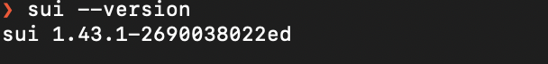
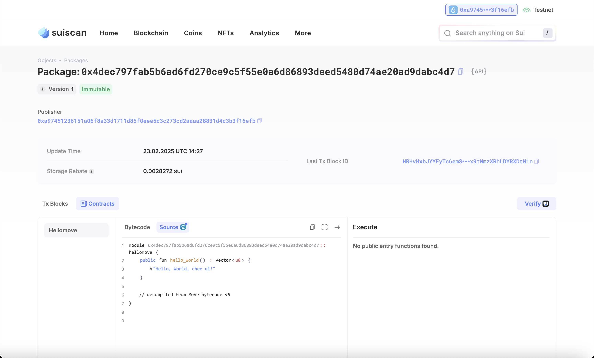

## 基本信息

- Sui 钱包地址: `0xa97451236151a06f8a33d1711d85f0eee5c3c273cd2aaaa28831d4c3b3f16efb`
- github: `https://github.com/chee-qi`

## 个人简介

- 工作经验: 5 年
- 技术栈: `Solidity` `Java` `Js` `React` `Vue` `go`
- 多年 web2 开发经验，对 Move 特别感兴趣，学习 move
- 联系方式: tg: `@cheeqii`

## 任务

## 01 hello move

- [] Sui cli version:
- [] Sui 钱包截图: 
- [] package id:
  0x4dec797fab5b6ad6fd270ce9c5f55e0a6d86893deed5480d74ae20ad9dabc4d7
- [] package id 在 scan 上的查看截图:

## 02 move coin

- [] My Coin package id :
- [] Faucet package id :
- [] 转账 `My Coin` hash:
- [] `Faucet Coin` address1 mint hash:
- [] `Faucet Coin` address2 mint hash:

## 03 move NFT

- [] nft package id :
- [] nft object id :
- [] 转账 nft hash:
- [] scan 上的 NFT 截图:

## 04 Move Game

- [] game package id :
- [] deposit Coin hash:
- [] withdraw `Coin` hash:
- [] play game hash:

## 05 Move Swap

- [] swap package id :
- [] call swap CoinA-> CoinB hash :
- [] call swap CoinB-> CoinA hash :

## 06 Dapp-kit SDK PTB

- [] save hash :

## 07 Move CTF Check In

- [] CLI call 截图 : 
- [] flag hash :

## 08 Move CTF Lets Move

- [] proof :
- [] flag hash :
