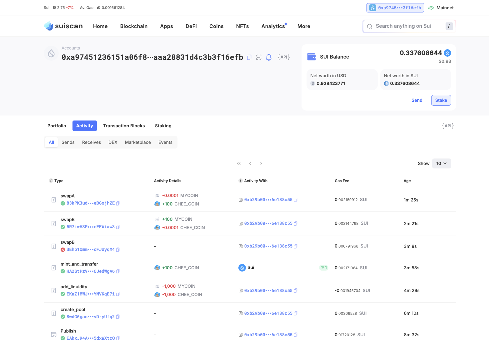

## 基本信息

- Sui 钱包地址: `0xa97451236151a06f8a33d1711d85f0eee5c3c273cd2aaaa28831d4c3b3f16efb`
- github: `https://github.com/chee-qi`

## 个人简介

- 工作经验: 5 年
- 技术栈: `Solidity` `Java` `Js` `React` `Vue` `go`
- 多年 web2 开发经验，对 Move 特别感兴趣，学习 move
- 联系方式: tg: `@cheeqii`

## 任务

## 01 hello move

- [] Sui cli version:
- [] Sui 钱包截图: 
- [] package id:
  0x4dec797fab5b6ad6fd270ce9c5f55e0a6d86893deed5480d74ae20ad9dabc4d7
- [] package id 在 scan 上的查看截图:

## 02 move coin

- [] My Coin package id :
  0xa0ea9faac705ed73e02be8499394b4fa9e4a1ae843ccc7fc35f1ebbd275a2b63
  
- [] Faucet package id :
  0xa3673245fe57b05699f1440e2c3968ca62cf1e177bfb54df3595b9d4d6004398
  
- [] 转账 `My Coin` hash:
  CH2LguYEF8TdhqwGNDoLSpZM2P3QND1hjLawDn3TonVJ
  
- [] `Faucet Coin` address1 mint hash:
  9HdJ4QKfhS9TDDYCDeJvqXtH1rUVxTaxpXZWNHweFnwL
  
- [] `Faucet Coin` address2 mint hash:
  Ayf9oufBYUCxiT4QEwHmJkUM7RLXaQ6cTVxVuZpNEE5Y
  

## 03 move NFT

- [] nft package id :
  0x171ffee01fde57f79e84bd218864f8e3ded52da7ab4a0dd1931c9ea3ed800a42
- [] nft object id :
  0xca2810d1a6525bdb705b460534b2c49299a1e9a98760f058e6a6b806807dad0c
- [] 转账 nft hash:
  3dC25ebLvJxZDnvdenLPQhkJLR6JNXkHu7W4LY84Br1j
- [] scan 上的 NFT 截图:

## 04 Move Game

- [] game package id :
  0xc1a110c53688d31c41a263e3a99e7e0f4ad81fabe4946d55297955c07baa2a04
  
- [] deposit Coin hash:
  9awoX4vsgGqaBmmJphJ8ggvpwmw4y7Dp6hQ2wpgwvjkJ
  
- [] withdraw `Coin` hash:
  3rZwcdhdnuQEdXoxEey9SNbRzVTQD76wuaw5J9ApWGmr
  
- [] play game hash:
  7umxiFjVJmjn2nttAkZ9QxNSHh3fSHkZr1q6fFXPmQyD
  

## 05 Move Swap

- [] swap package id :
  EAkxJ94Aeht7K9pzzLvHG6EmucP92kUx25j95dxWXtcQ

- [] call swap CoinA-> CoinB hash :
  5R7iwH3PWjQH84JMec8NCHRmZki4WMERtPx2nFFWiww3

- [] call swap CoinB-> CoinA hash :
  83kPK3udaU7CeUsKLGtqNQx6ZywSrHtSQ3QGeBGojhZE

## 06 Dapp-kit SDK PTB

- [] save hash :

## 07 Move CTF Check In

- [] CLI call 截图 : 
- [] flag hash :

## 08 Move CTF Lets Move

- [] proof :
- [] flag hash :
