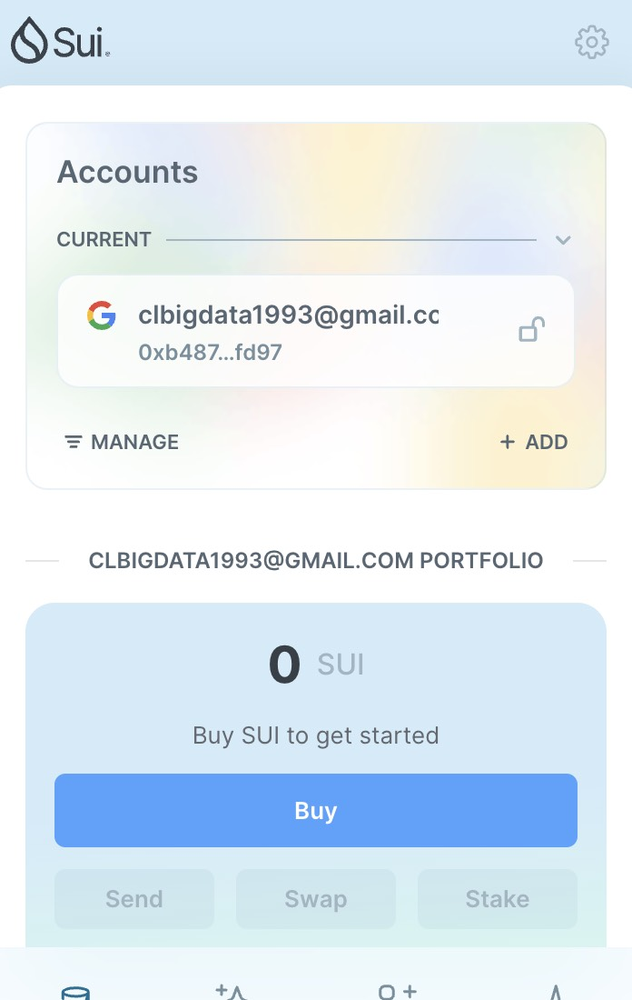
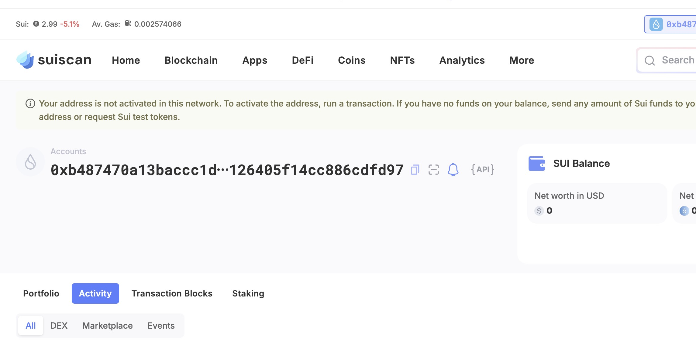
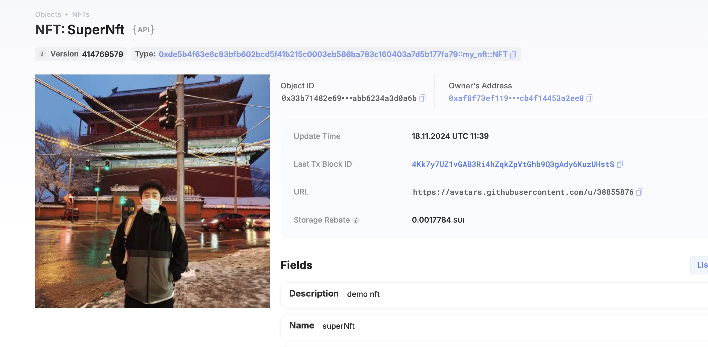

## 基本信息
- Sui钱包地址: `0xb487470a13baccc1dc3099bd68cdb6c861932ebac561126405f14cc886cdfd97`
> 首次参与需要完成第一个任务注册好钱包地址才被合并，并且后续学习奖励会打入这个地址
- github: `chenlong1993`

## 个人简介
- 工作经验: 7年
- 技术栈: `JAVA` `RUST` 
> 7年支付电商开发经验，对区块链以及rust应用有相关经验。
- 
- 联系方式: tg: `@rogers3333` 

## 任务

##   01 hello move  
- [x] Sui cli version: sui 1.37.1-homebrew
- [x] Sui钱包截图: 
- [x] package id: 0xc45b21c8d7002cf5713b46f3fa13bbb53b39adddc40619999eb72c163a7946f5
- [x] package id 在 scan上的查看截图:

##   02 move coin
- [x] My Coin package id : 0xcc190e0be1376b8700c5e1b4b8f95e2b9eb3932bb007b1adfb2bb4c22c3579a4
- [X] Faucet package id : 0xdb51cdf16b04a0a4834cc40e40db3ad9916cb75805ffa1fc8a5dad5cd90712a3
- [X] 转账 `My Coin` hash: GEq3hcAxwWfFuauc4ZZ8mt4wU2ziPM7gmsp1YzPt4bLU
- [X] `Faucet Coin` address1 mint hash: Az5XpxWrRKHk1eJ9DsranJJEzrSmr6UU321yZzFCYtQb
- [X] `Faucet Coin` address2 mint hash: BfH1jyCUeXjzDYvSdrPfwyMBZM97aQSzZBH5ww3rVk7S

##   03 move NFT
- [x] nft package id : 0xde5b4f63e6c83bfb602bcd5f41b215c0003eb586ba783c160403a7d5b177fa79
- [X] nft object id : 0x33b71482e6911a53c4c07340152c9fed3c1a8f0ff75207cab8abb6234a3d0a6b
- [X] 转账 nft  hash:AaPixVHZWUoz63Wpscs7Apq1HbbGKtVF9nCiqeZ7uF1v
- [X] scan上的NFT截图:

##   04 Move Game
- [] game package id :
- [] deposit Coin hash:
- [] withdraw `Coin` hash:
- [] play game hash:

##   05 Move Swap
- [] swap package id :
- [] call swap CoinA-> CoinB  hash :
- [] call swap CoinB-> CoinA  hash :

##   06 Dapp-kit SDK PTB
- [] save hash :

##   07 Move CTF Check In
- [] CLI call 截图 : 
- [] flag hash :

##   08 Move CTF Lets Move
- [] proof : 
- [] flag hash :
