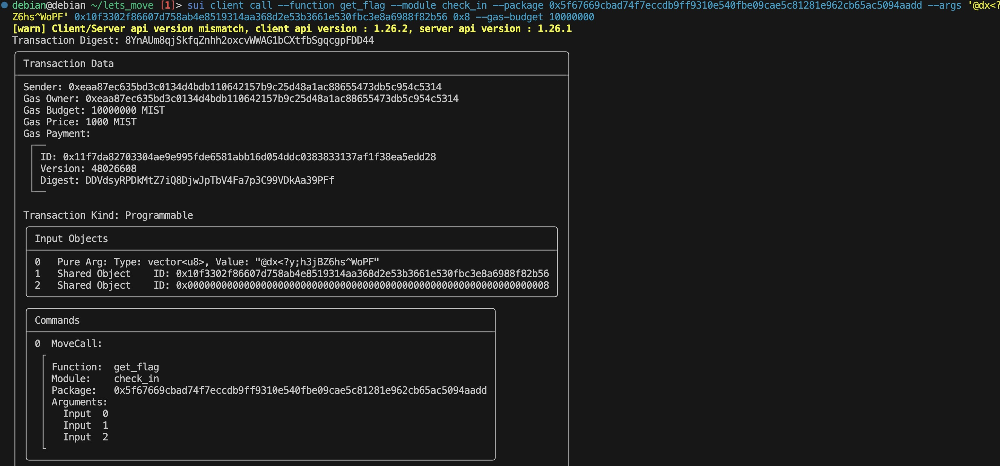

## 基本信息
- Sui钱包地址: `0xeaa87ec635bd3c0134d4bdb110642157b9c25d48a1ac88655473db5c954c5314`
> 首次参与需要完成第一个任务注册好钱包地址才被合并，并且后续学习奖励会打入这个地址
- github: `chenmingnan`

## 个人简介
- 工作经验: 研究生
- 技术栈: `Python`
- 初学 Python，对 move 感兴趣
- 联系方式: tg: `cmn` 

## 任务

##   01 hello move  
- [x] package id: 0x63a38cee199811378decd74e5000899b424756be716de124232b894476ff7bb7

##   02 move coin
- [x] My Coin package id : 0x452ca38d56417a29e8643670a31849211ab97742d99b33ff4599260188e60326
- [x] Faucet package id : 0xbae98367fae50287574e44c87f4d0a11c4a03e777eef2b78460bb0e571a84099
- [x] 转账 `My Coin` hash : 4GcQ5qnMsjNCbPuDHhZYkgoxYqaVg6YnEHkKp2VgR7Uo

##   03 move NFT
- [x] nft package id : 0x8c17d23917938aa01bb61fa9ee8ffab5c999f4ef2b47978ffabe111c5c4827b4
- [x] nft object id : 0x2d577c06661f0ca3633b08872e519a5873f6ff78382407b5563f251f9f48e869
- [x] 转账 nft  hash: 1415tF87kN4rpzqvcGGxK7wEFZamgEsoYUsYH2UKN9XL

##   04 Move Game
- [x] game package id : 0xe11222d024af83247e1f7e5d5f60f36ed68a8d352d374dc4b855e0f427efedf0
- [x] call game hash: EpfyN4umuuo4z33mxvzXMEHUsLxn6TNd5xATdBrq4Xmb

##   05 Move Swap
- [] swap package id :
- [] call swap hash:

##   06 SDK PTB
- [] save hash :

##   07 Move CTF Check In
- [x] CLI call 截图: 
- [x] flag hash: 8YnAUm8qjSkfqZnhh2oxcvWWAG1bcXtfbSgqcgpFDD44

##   08 Move CTF Lets Move
- [x] Proof: `86636586`
- [x] Transaction block: `8vmrR3VdVrnfp1KrtbMGsuPiZ7qm4BaaCRdYTjxLMnFH`