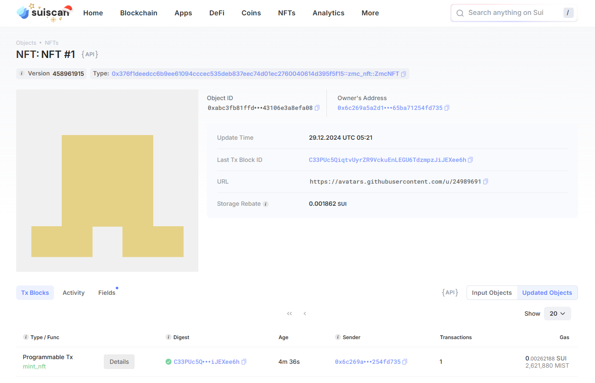
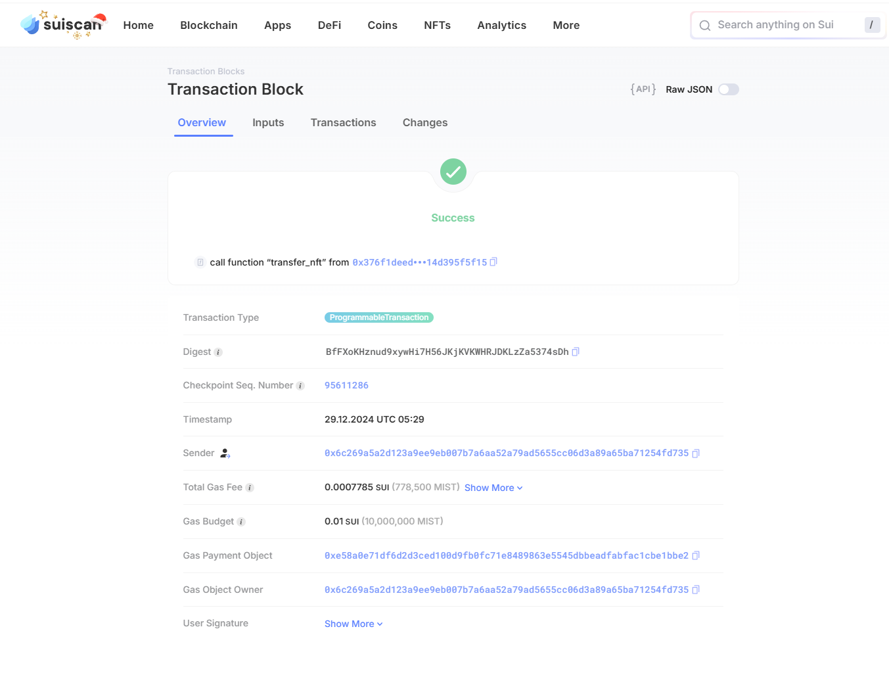

合约发布的tx block是 GVfLgiUVzNdvJHmXu2hZ7YNNm1m1arzszrtjC9MUWfvd
package package id 是 0x376f1deedcc6b9ee61094cccec535deb837eec74d01ec2760040614d395f5f15
mintcap id是 0x3d206203cfa5bdb59e06d8389fb4f712923a80d98c0fed27b4ee0ab3de9e3857

铸造的第一个nft object id  0xabc3fb81ffdb1ee48f13089824e9ea06737b04b04b1b881bb743106e3a8efa08
第一个nft截图: 

转移的tx block是 BfFXoKHznud9xywHi7H56JKjKVKWHRJDKLzZa5374sDh
转移nft截图: 