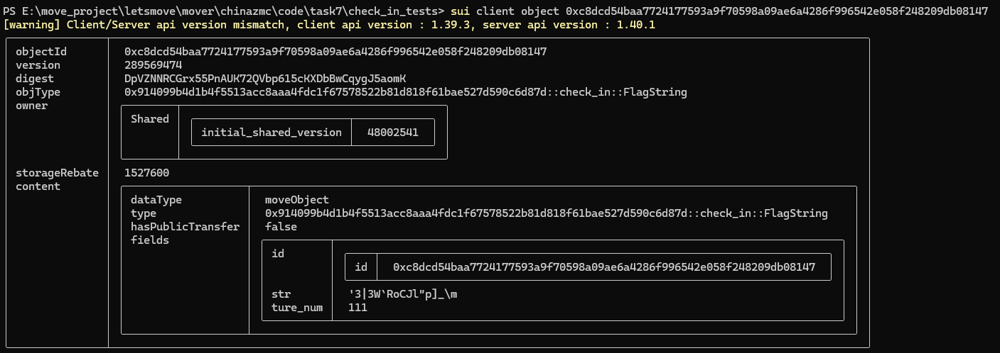
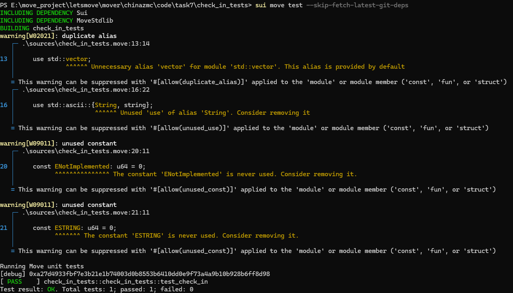
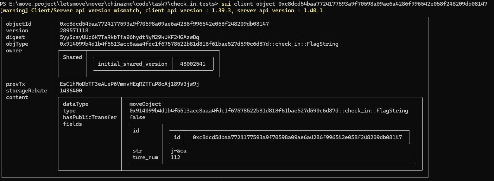

testnet ctf Transaction Digest: EsC1hMoDbTF3eALeP6VmmvHEqRZTFuP8cAj189V3jw9j

获取到的flag: 0xa27d4933fbf7e3b21e1b74003d0b8553b6410dd0e9f73a4a9b10b928b6ff8d98 

ctf开始之前获取str截图: 
执行test获取flag: 
调用的结果: 

最后再获取一次object 