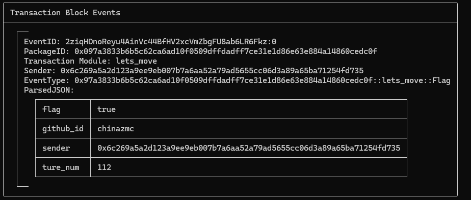

执行的命令为： sui client call --package 0x097a3833b6b5c62ca6ad10f0509dffdadff7ce31e1d86e63e884a14860cedc0f --module lets_move --function get_flag --args '[7, 104, 227, 93, 172, 108, 117, 141]' chinazmc 0x19e76ca504c5a5fa5e214a45fca6c058171ba333f6da897b82731094504d5ab9 0x8 --gas-budget 100000000

Transaction Digest: 2ziqHDnoReyu4AinVc44BfHV2xcVmZbgFU8ab6LR6Fkz

执行结果 