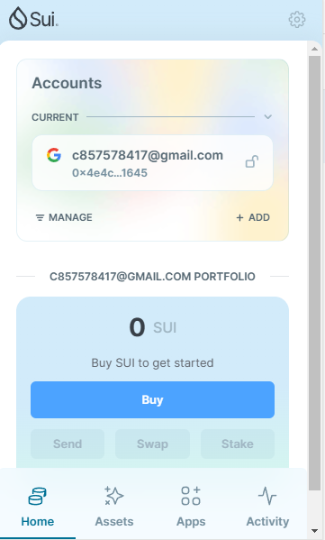
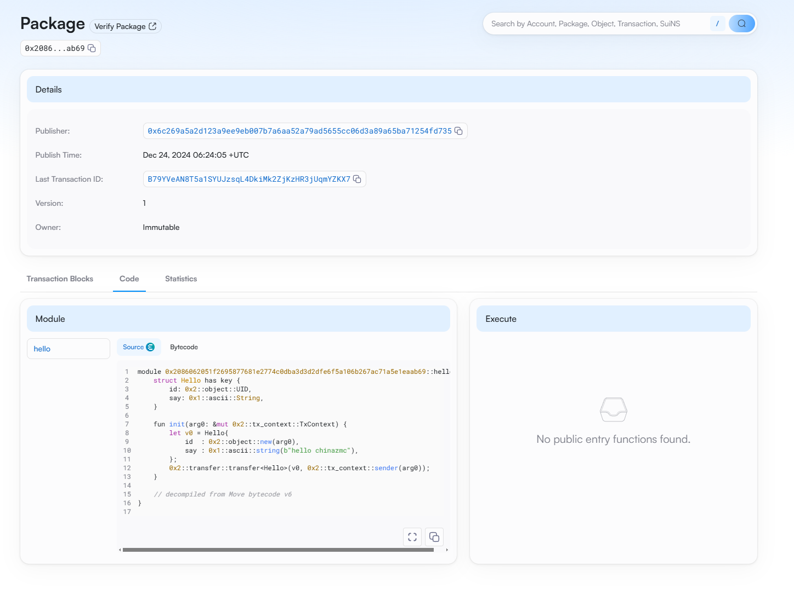

## 基本信息
- Sui钱包地址: `0x4e4c47cae9106a3a3a792447b2163a8f3a7584376ddc5f2458ef75e7319c1645`
> 首次参与需要完成第一个任务注册好钱包地址才被合并，并且后续学习奖励会打入这个地址
- github: `chinazmc`

## 个人简介
- 工作经验: 5年
- 技术栈: `java`,`golang`
> 重要提示 请认真写自己的简介
- 多年web2开发经验，对Move特别感兴趣，想通过Move入门区块链
- 联系方式: wx:Zmcxqbfbsx

## 任务

##   01 hello move
- [&#x2714;] Sui cli version:sui 1.39.3-5d4350d66d2b
- [&#x2714;] Sui钱包截图: 
- [&#x2714;] package id: 0x2086062051f2695877681e2774c0dba3d3d2dfe6f5a106b267ac71a5e1eaab69
- [&#x2714;] package id 在 suivision上的查看截图:

