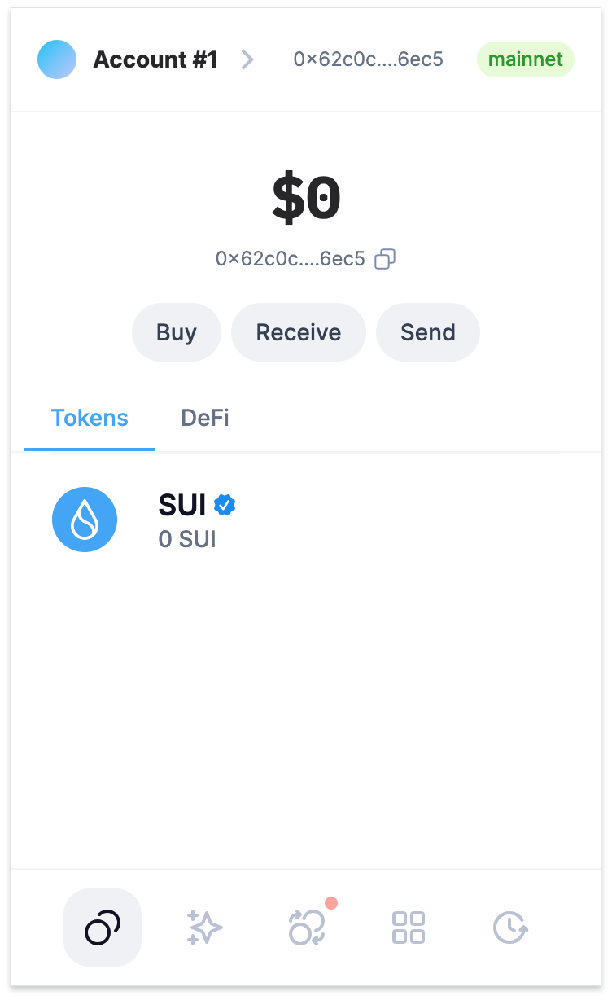
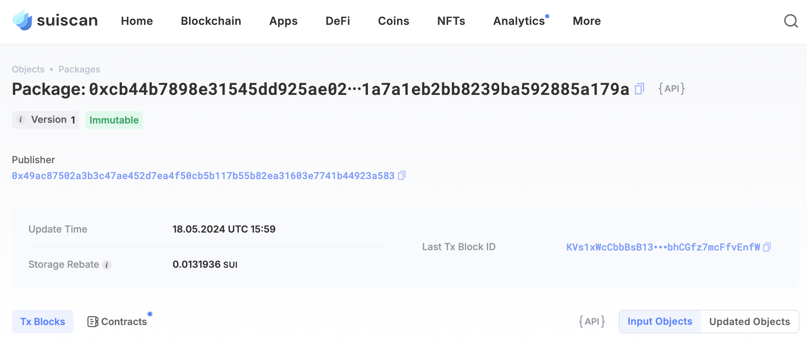

## 基本信息
- Sui钱包地址: `0x62c0cecbe0d2f646bf0b5615b900457adfa2ae3ba26d286c3e76cfc90f216ec5`
> 首次参与需要完成第一个任务注册好钱包地址才被合并，并且后续学习奖励会打入这个地址
- github: `cloud-cottage`

## 个人简介
- 工作经验: 10年
- 技术栈: `Python` `Php` `NODEJS`
> 重要提示 请认真写自己的简介
- 目前在做web3 BD，之前多年web2开发经验，了解过Move，但一直没得机会接触，这次想通过Move入门区块链开发
- 联系方式: tg: `xCatKing` 

## 任务

##   01 hello move  
- [x] Sui cli version: sui 1.44.3-615516edb0ed
- [x] Sui钱包截图: 
- [x] package id: 0xcb44b7898e31545dd925ae02e50a3da3a10f71a7a1eb2bb8239ba592885a179a
- [x] package id 在 scan上的查看截图:

##   02 move coin
- [] My Coin package id : 
- [] Faucet package id : 
- [] 转账 `My Coin` hash:
- [] `Faucet Coin` address1 mint hash:
- [] `Faucet Coin` address2 mint hash:

##   03 move NFT
- [] nft package id :
- [] nft object id : 
- [] 转账 nft  hash:
- [] scan上的NFT截图:

##   04 Move Game
- [] game package id :
- [] deposit Coin hash:
- [] withdraw `Coin` hash:
- [] play game hash:

##   05 Move Swap
- [] swap package id :
- [] call swap CoinA-> CoinB  hash :
- [] call swap CoinB-> CoinA  hash :

##   06 Dapp-kit SDK PTB
- [] save hash :

##   07 Move CTF Check In
- [] CLI call 截图 : 
- [] flag hash :

##   08 Move CTF Lets Move
- [] proof : 
- [] flag hash :

