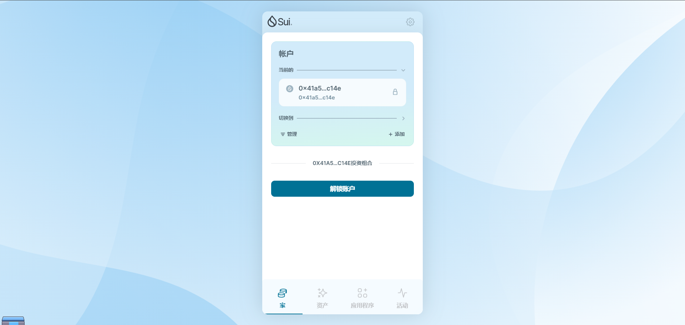
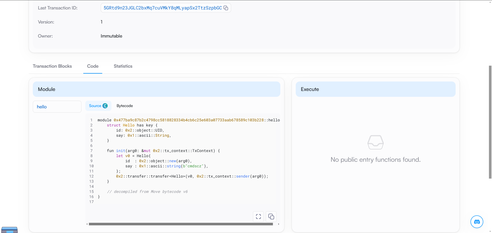
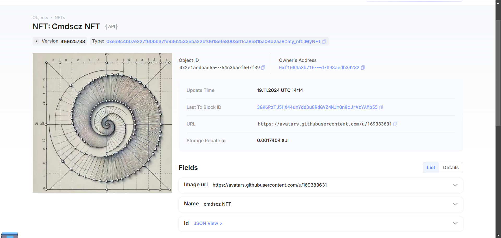

## 基本信息
- Sui钱包地址: `0x41a53fcb05fff6f4c38093b41bf22f711b2fa893019bdabcbf5296d8314ec14e`
> 首次参与需要完成第一个任务注册好钱包地址才被合并，并且后续学习奖励会打入这个地址
- github: `cmdscz`

## 个人简介
- 工作经验: 10000年
- 技术栈: `我是小白`
> 重要提示 请认真写自己的简介
- 多年web2开发经验，想学一门web3开发语言
- 联系方式: tg: `暂时不填上去` 

## 任务

##   01 hello move  
- [✓] Sui cli version: sui 1.37.1-7839b9501066
- [✓] Sui钱包截图: 
- [✓] package id: 0xf1084a3b716eb28351b6f15231a79bb16e2912fde564ef0f3ed7093aedb34282
- [✓] package id 在 scan上的查看截图:

##   02 move coin
- [✓] My Coin package id : 0x539851bd3fa43cd434f05ff588f87eca8db3d3c5007dc5c9093ef5c7028ade62
- [✓] Faucet package id :  0x4f6935e55fd3cbc2db648a636747246b02d2b231d980dc04ad3253db2e2f5c69
- [✓] 转账 `My Coin` hash:5LEVnWMZDUCMY8fzUY9TpXJ18Z6Rx9wU3C1CT3efnG2g
- [✓] `Faucet Coin` address1 mint hash:GNkQxLhYcLLv8fYyAhT6Pk54HqZrwAxnaLotCVMyv3RV
- [✓] `Faucet Coin` address2 mint hash:4h3icoE3ThTUFM8JiG6ZjHtHywNj5pVzxk2xZerGfR61

##   03 move NFT
- [✓] nft package id :0xea9c4b07e227f60bb37fe9362533eba22bf0618efe8003e11ca8e81ba04d2aa8
- [✓] nft object id : 0x2e1aedcad555396f4927b3954829038934f01829f0b58a57e754c3baef507f39
- [✓] 转账 nft  hash: 7vRXbX9e61do8SnuFLePB1jSgubnUHa6WFAHSJZVqY9s
- [✓] scan上的NFT截图:

##   04 Move Game
- [] game package id :
- [] deposit Coin hash:
- [] withdraw `Coin` hash:
- [] play game hash:

##   05 Move Swap
- [] swap package id :
- [] call swap CoinA-> CoinB  hash :
- [] call swap CoinB-> CoinA  hash :

##   06 Dapp-kit SDK PTB
- [] save hash :

##   07 Move CTF Check In
- [] CLI call 截图 : 
- [] flag hash :

##   08 Move CTF Lets Move
- [] proof : 
- [] flag hash :
