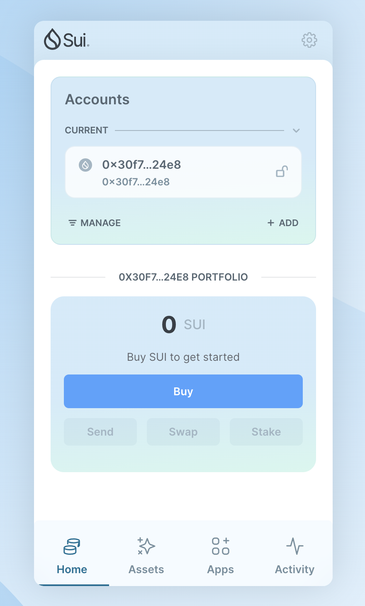
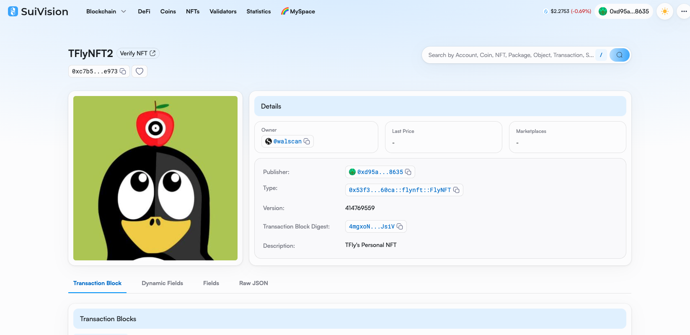
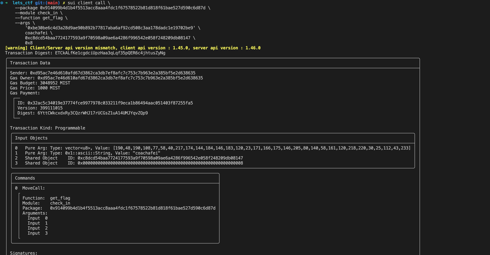

## 基本信息
- Sui钱包地址: `0x30f76f59882927d4ce883c66ebc5b65ddc7e91b763d23d491dc4a426234e24e8`
> 首次参与需要完成第一个任务注册好钱包地址才被合并，并且后续学习奖励会打入这个地址
- github: `coachafei`

## 个人简介
- 工作经验: 11年
- 技术栈: `Python` `Linux`
> 多年IT从业者，一直听说区块链，但是却一直没有真正接触，想通过move开始接触区块链。 
- 
- 联系方式: tg: `fredhands` 

## 任务

##   01 hello move  
- [x] Sui cli version: sui 1.45.0-homebrew
- [x] Sui钱包截图: 

    
- [x] package id: 0xcbb694013c7c846a30899d7882b770b193d461f14266239bce04f1d4172cce3d
- [x] package id 在 scan上的查看截图:

    

##   02 move coin
- [x] My Coin package id : 0xfbac44739874f3881631bc7714e2664592ae668a6a0d73f165893d3eee84b026
- [x] Faucet package id : 0x4c6dc55a1d670c1cf6e5fc05af631f6108bdbc603826aaef1e51abe329a8e1c4
- [x] 转账 `My Coin` hash: 9bahyLNuHcdd31vPAvNLm7tpzJgyg8Fb5EGUiq2ukV2Z
- [x] `Faucet Coin` address1 mint hash: 5p95Cu3QookDx6QsAjWdiyQJXybt2ep22vWnmpfrXELk
- [x] `Faucet Coin` address2 mint hash: A1JqTCEBXx7dcBhStMdQ8kuz4r9kyStCnB3YF6Yo4FyB

##   03 move NFT
- [x] nft package id : 0x53f3a1f472a54e4461890aa7ebc58bce63ee503d26d556799e611e059b9360ca
- [x] nft object id : 0xcf97e0493363a86cc810ce95e27ba381f39028a98b7c5ab52ae49889c7595c4b
- [x] 转账 nft  hash: 4mgxoNxreawwosSLePv8srY6UFCtPVfu1DWeYG5QJsiV
- [x] scan上的NFT截图:

##   04 Move Game
- [x] game package id : 0x2e190d55b00c4cf6b068305530753b149c2e5618ddd39a8ac3cd0b76deec8c35
- [x] deposit Coin hash: 63SGHQ3p6KPHtB38TwNmb2K6VEWc4DAVdVwKrLNJix4C
- [x] withdraw `Coin` hash: 6JdFFEcXpmt3MXpAhQJZRRHZLosJSviJZHde2rsVMhLm
- [x] play game hash: 5kj8WavRcH2MoybBKjW6kJFD7cqPnMqpYvu9XqqFBczU

##   05 Move Swap
- [x] swap package id : 0x1680040322a909a3baca3ce949caa46fa0d94bbf8306f1c136b83b9c2d69cf81
- [x] call swap CoinA-> CoinB  hash : 8z3AMVTYHp9dM9JRnavg39xsgbLTJVQ8vtteHCGyndBs
- [x] call swap CoinB-> CoinA  hash : 3aMALBcDdEKi1wun1TpDds3fjQvcLJgTAeLyEgwd89nJ

##   06 Dapp-kit SDK PTB
- [x] save hash : 5auejAvVFLoS2YxQuoYpxejTmHrrNdjsVjAFJ9kG6kUX

##   07 Move CTF Check In
- [x] CLI call 截图 : 
- [x] flag hash : ETCkALfKe1cgdciUpzHaa3qLqf35pQER6c4jhtusZyNg

##   08 Move CTF Lets Move
- [x] proof : [117, 154, 114, 45, 161, 228, 178, 179]
- [x] flag hash : 2rZiWVo5LYp5aw758KaXSr7qYsJjMamqTmTawRXdyoou
