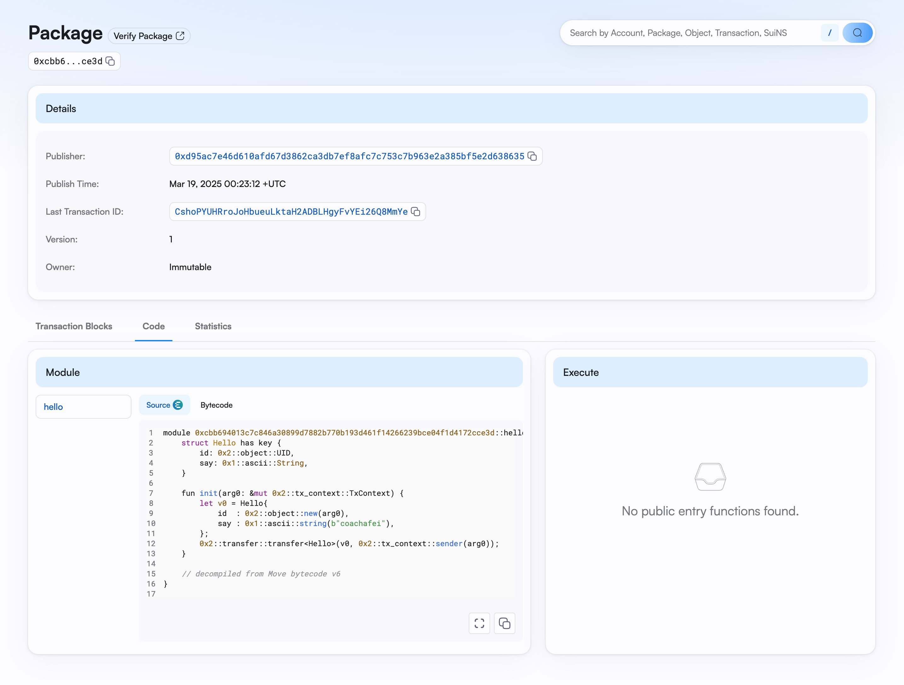

## 基本信息
- Sui钱包地址: `0x30f76f59882927d4ce883c66ebc5b65ddc7e91b763d23d491dc4a426234e24e8`
> 首次参与需要完成第一个任务注册好钱包地址才被合并，并且后续学习奖励会打入这个地址
- github: `coachafei`

## 个人简介
- 工作经验: 11年
- 技术栈: `Python` `Linux`
> 多年IT从业者，一直听说区块链，但是却一直没有真正接触，想通过move开始接触区块链。 
- 
- 联系方式: tg: `fredhands` 

## 任务

##   01 hello move  
- [x] Sui cli version: sui 1.45.0-homebrew
- [x] Sui钱包截图: 

    
- [x] package id: 0xcbb694013c7c846a30899d7882b770b193d461f14266239bce04f1d4172cce3d
- [x] package id 在 scan上的查看截图:

    

##   02 move coin
- [] My Coin package id : 
- [] Faucet package id : 
- [] 转账 `My Coin` hash:
- [] `Faucet Coin` address1 mint hash:
- [] `Faucet Coin` address2 mint hash:

##   03 move NFT
- [] nft package id :
- [] nft object id : 
- [] 转账 nft  hash:
- [] scan上的NFT截图:

##   04 Move Game
- [] game package id :
- [] deposit Coin hash:
- [] withdraw `Coin` hash:
- [] play game hash:

##   05 Move Swap
- [] swap package id :
- [] call swap CoinA-> CoinB  hash :
- [] call swap CoinB-> CoinA  hash :

##   06 Dapp-kit SDK PTB
- [] save hash :

##   07 Move CTF Check In
- [] CLI call 截图 : 
- [] flag hash :

##   08 Move CTF Lets Move
- [] proof : 
- [] flag hash :
