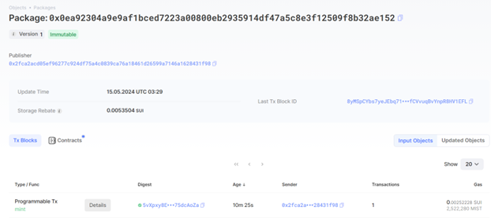
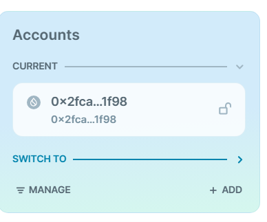
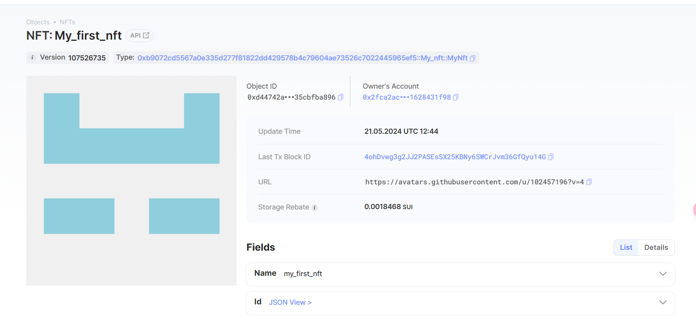

## 基本信息

- Sui 钱包地址: `0x2fca2acd05ef96277c924df75a4c0839ca76a18461d26599a7146a1628431f98`
  > 首次参与需要完成第一个任务注册好钱包地址才被合并，并且后续学习奖励会打入这个地址
- github: `coconal`

## 个人简介

- 工作经验: 0 年
- 技术栈: `JavaScript` `Java` `solidity` `go`
  > 重要提示 请认真写自己的简介
- 区块链本科在读,从 solidity 认识合约,对 Move 特别感兴趣
- 联系方式: tg: `@zzzcoconal`

## 任务

## 01 hello move

- [x] Sui cli version: 0.0.1
- [x] Sui 钱包截图: 
- [x] package id: 0x0ea92304a9e9af1bced7223a00800eb2935914df47a5c8e3f12509f8b32ae152
- [x] package id 在 scan 上的查看截图:

## 02 move coin

- [x] My Coin package id : 0x3a2705ff417830c551a1acf5b8dd8e10fdda161d86c1fd91a02dfa5be1ce257d
- [x] Faucet package id : 0x3996a157d50c751d59e05377102f2e8835ac1a2238de410f4ad2c05f7f1ca6e7
- [x] 转账 `My Coin` hash: 6A3vnFbMvcSZb2JJCZhtRgNDzaizjs3bzijYg7CowhVA
- [x] `Faucet Coin` address1 mint hash: 6hQw5DRwnPZqTbUcKq9xwwZKR6oDwTmEeAr92xdiKTrE
- [x] `Faucet Coin` address2 mint hash: 5wjz3RMsaT5UB6LPG3MQLnPbsaMXS5r1GQ7ofuTmSLHZ

## 03 move NFT

- [x] nft package id : 0xb9072cd5567a0e335d277f81822dd429578b4c79604ae73526c7022445965ef5
- [x] nft object id : 0xd44742ad967a123e0d4d583cfec73c941720a1f3c0bfc64066140e35cbfba896
- [x] 转账 nft hash: 2HcUFToCsdumrkt86jbiySGx4eymJZRJcuGwrhdp1WKD
- [x] scan 上的 NFT 截图:

## 04 Move Game

- [] game package id :
- [] deposit Coin hash:
- [] withdraw `Coin` hash:
- [] play game hash:

## 05 Move Swap

- [] swap package id :
- [] call swap CoinA-> CoinB hash :
- [] call swap CoinB-> CoinA hash :

## 06 SDK PTB

- [] save hash :
