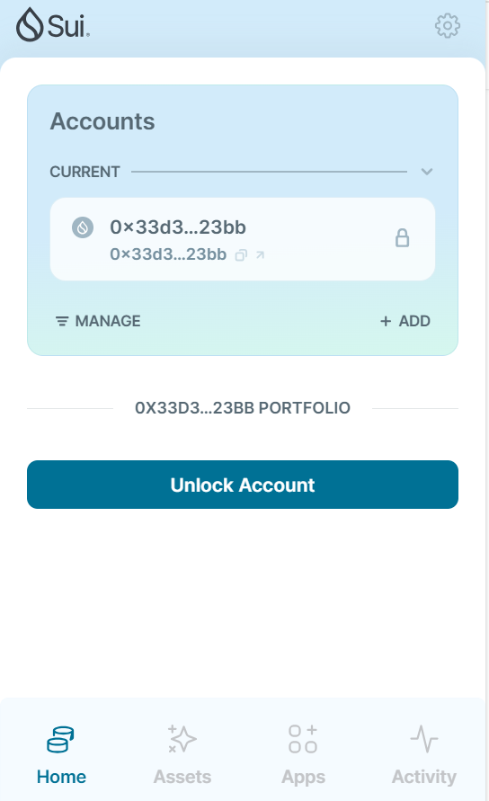
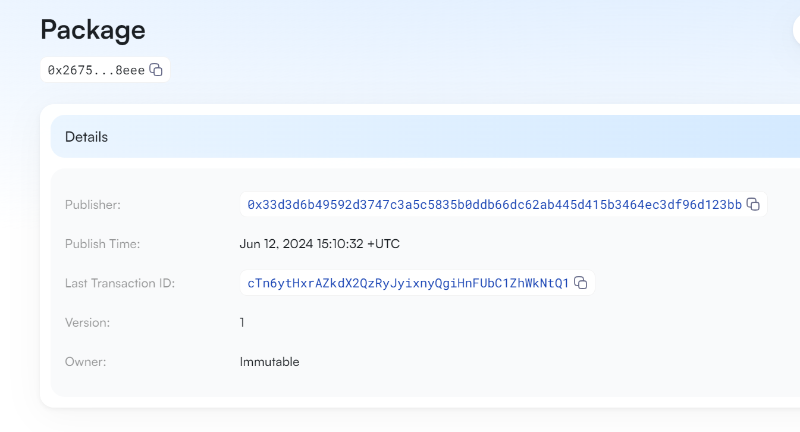
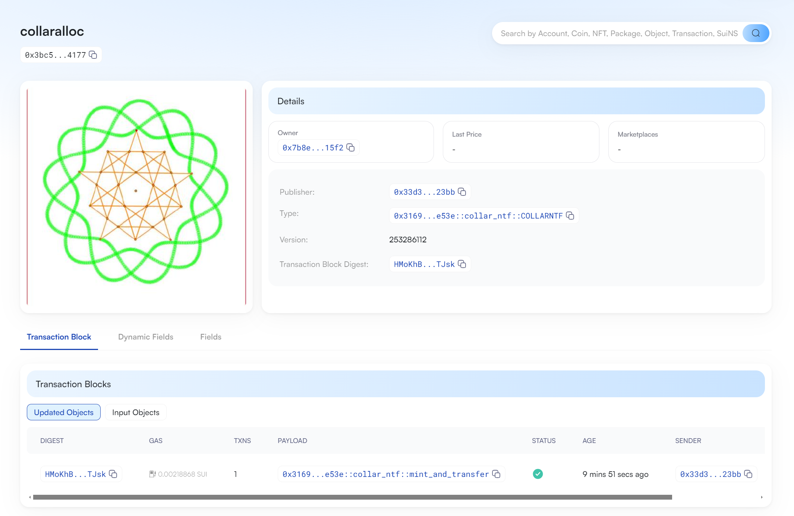
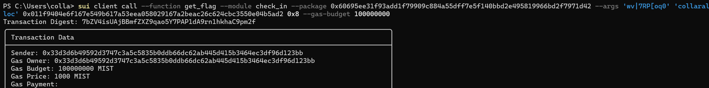

## 基本信息
- Sui钱包地址: `0x33d3d6b49592d3747c3a5c5835b0ddb66dc62ab445d415b3464ec3df96d123bb`
- github: `collaralloc`

## 个人简介
- 工作经验: 3年
- 技术栈: `C/C++`, `Qt`, `Qml`, `C#`, `Python`, `JavaScript`
- 多年游戏引擎全栈开发经验，对Move特别感兴趣，想通过Move入门区块链
- 联系方式: email: `collar@126.com` 

## 任务

##   01 hello move  
- [x] Sui cli version:
- [x] Sui钱包截图: 
- [x] package id: 0x267586e17f4d649a5b2d64dbcd550f08d9c047ffe2a88f661bad0eb107608eee
- [x] package id 在 scan上的查看截图:

##   02 move coin
- [x] My Coin package id : 0x4f77640014bffc1483c0109bd6771a139c66523a057de41ff943e24807e6d5d2
- [x] Faucet package id : 0x4358f2bef8e177509ff5f0ef411a5f9524234e58d3b070dc93e29a94c92594f6
- [x] 转账 `My Coin` hash: Hd6kw8UDeZwmzm1ZJxjN2sHWjMh5QYHXMtYE9js1jUEQ
- [x] `Faucet Coin` address1 mint hash: GFzKzzeGLHssXXbB14X8r77SPSdeTf5hfu2qzVHa6Ko2
- [x] `Faucet Coin` address2 mint hash: 7fZVxf8cnbMiCMTrLpW9nF8B26njnXnNneJ5MbuFmKdn

##   03 move NFT
- [x] nft package id : 0x316933ef9b27c341cfbb4f66f1943b1c1d75d25f571e617b521fb47fb647e53e
- [x] nft object id : 0x3bc521e10ebc916c745275a400d6a572e8fccb8c1335c546619bbe8513964177
- [x] 转账 nft  hash: HMoKhBQhJnLK8doBSpt6dPpgCar4VZdTsY5CpKmfTJsk
- [x] scan上的NFT截图:

##   04 Move Game
- [] game package id :
- [] deposit Coin hash:
- [] withdraw `Coin` hash:
- [] play game hash:

##   05 Move Swap
- [] swap package id :
- [] call swap CoinA-> CoinB  hash :
- [] call swap CoinB-> CoinA  hash :

##   06 Dapp-kit SDK PTB
- [] save hash :

##   07 Move CTF Check In
- [x] CLI call 截图 : 
- [x] flag hash : 7bZV4isUAjBBmfZXZ9qao5Y7PAP1dA9rn1hkhaC9pm2f

##   08 Move CTF Lets Move
- [x] proof : dacd7fa4a7c4faf2
- [x] flag hash : 5AAeXVCQcuSijvcHJz3Qj9VWYQ5RRzbrMUtx7d7ryZkv
