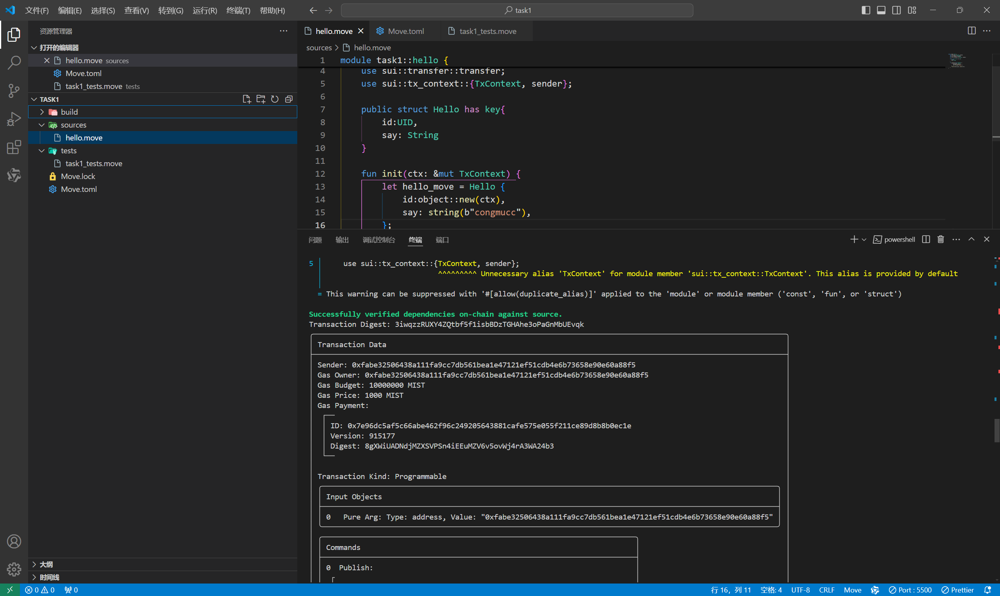
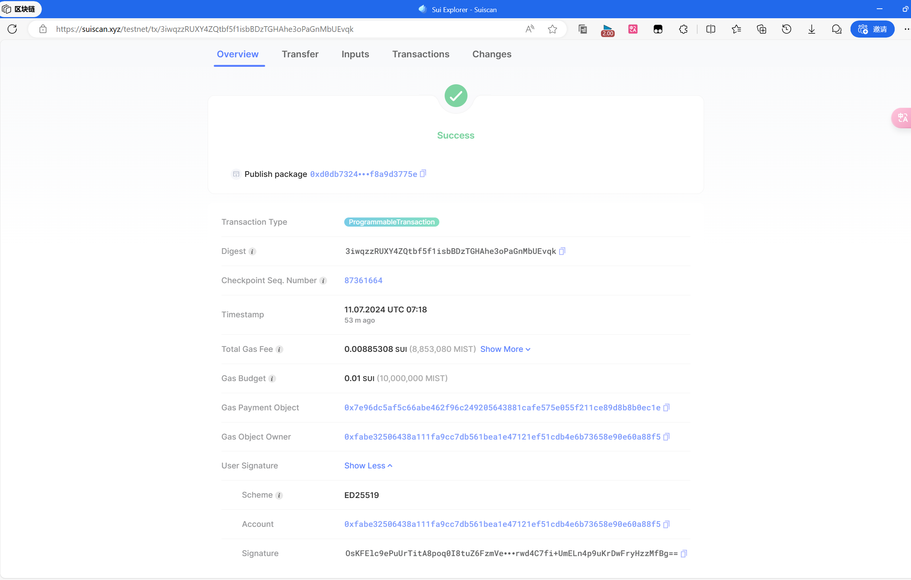
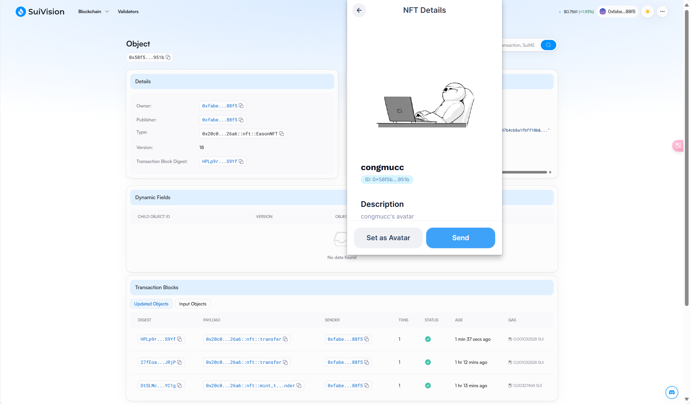

## 基本信息
- Sui钱包地址(奖励地址): `0xfabe32506438a111fa9cc7db561bea1e47121ef51cdb4e6b73658e90e60a88f5`
- github: `congmucc`
- 测试钱包地址：`0xfabe32506438a111fa9cc7db561bea1e47121ef51cdb4e6b73658e90e60a88f5`

## 个人简介
- 工作经验: 半年
- 技术栈: `Rust` `Java` `Go` `Vue`
- 2年web2开发经验，对Move特别感兴趣，想通过Move入门区块链
- 联系方式: wx: `congmucc`

## 任务

##   01 hello move
- [] Sui cli version:
- [] Sui钱包截图: 
- [] package id: `0xd0db7324c0b9905cb7acdef2906b1dd8d5da5a5105249bcbaddddcf8a9d3775e`
- [] package id 在 scan上的查看截图:
> 这个是在testnet，后几个都是在devnet上。

##   02 move coin
- [] My Coin package id :`0xd86f4e6f25a75f60d2b575c1e069838def14ed6178714c7d8ffa5cd8ff28c811`
- [] Faucet package id :`0x20c0f043982643bf2a7b3cf775dfbcc8933301eb3f405586d40b968147c226a6`
- [] 转账 `My Coin` hash: `0x00aa511457d549ea6fee8cf156133f01e6e34cb2493a18819c11609057989f35`
- [] `Faucet Coin` address1 mint hash: `0xa62a3d0a38824f7445af2288502555fb2fa2cef0b658c1632bb03c656de6ca00`

##   03 move NFT
- [] nft package id : `0x20c0f043982643bf2a7b3cf775dfbcc8933301eb3f405586d40b968147c226a6`
- [] nft object id :`0x20c0f043982643bf2a7b3cf775dfbcc8933301eb3f405586d40b968147c226a6`
- [] 转账 nft  hash:`0x58f5b5a1e002c1199d37179fc30e0766bec1737307d69b9361b87d486c0a951b`
- [] scan上的NFT截图:
  
contract_address:
```hash
0x20c0f043982643bf2a7b3cf775dfbcc8933301eb3f405586d40b968147c226a6
```

nft_address:
```hash
0x58f5b5a1e002c1199d37179fc30e0766bec1737307d69b9361b87d486c0a951b
```


##   04 Move Game
- [] game package id :`0x8c643aaa784b3566e85edb2b01cbbee45bd6d0742fc3e4163a569f1325e3a88f`
- [] deposit Coin hash: ``
- [] withdraw `Coin` hash:
- [] play game hash:

##   05 Move Swap
- [] swap package id :
- [] call swap CoinA-> CoinB  hash :
- [] call swap CoinB-> CoinA  hash :

##   06 Dapp-kit SDK PTB
- [] save hash :

##   07 Move CTF Check In
- [] CLI call 截图 : 
- [] flag hash :

##   08 Move CTF Lets Move
- [] proof :
- [] flag hash :

