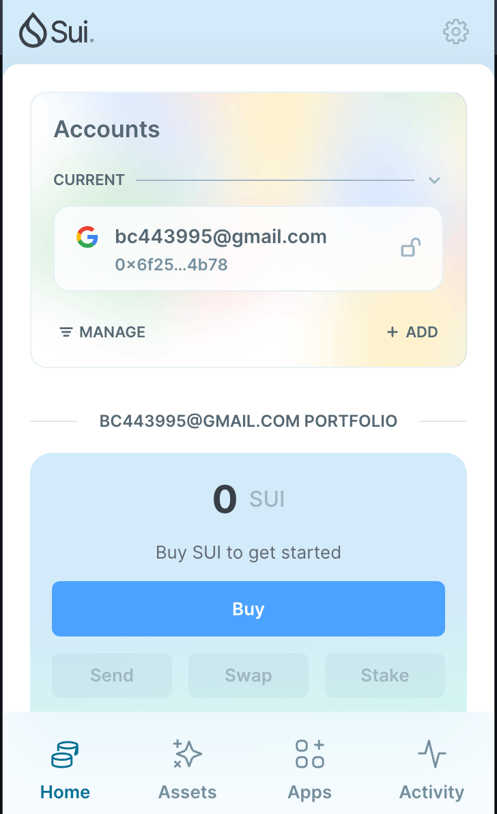
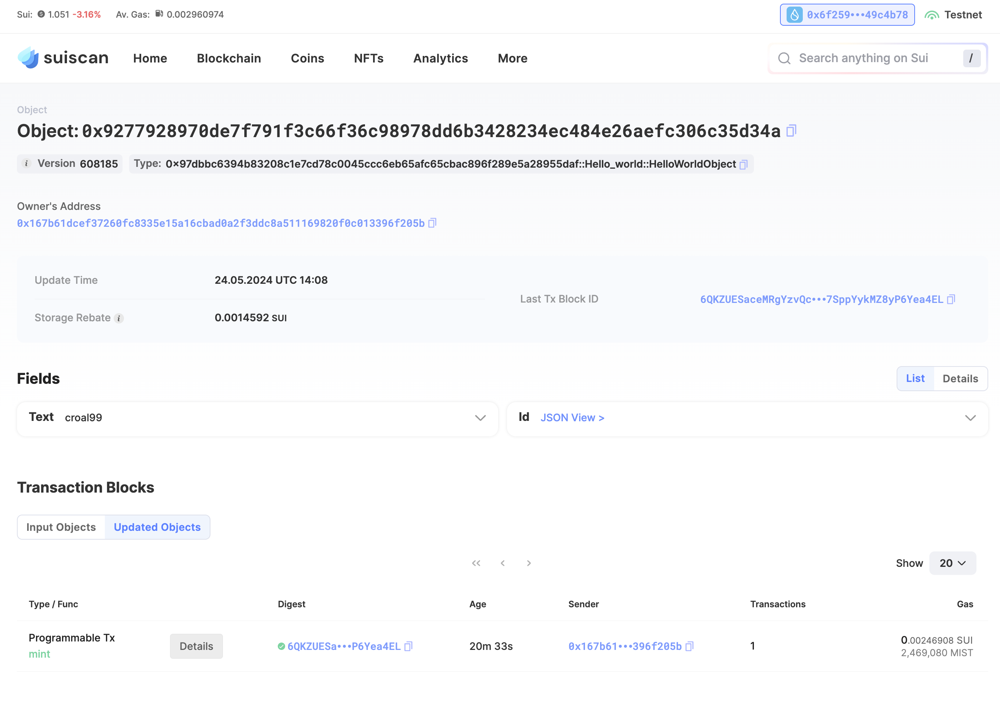
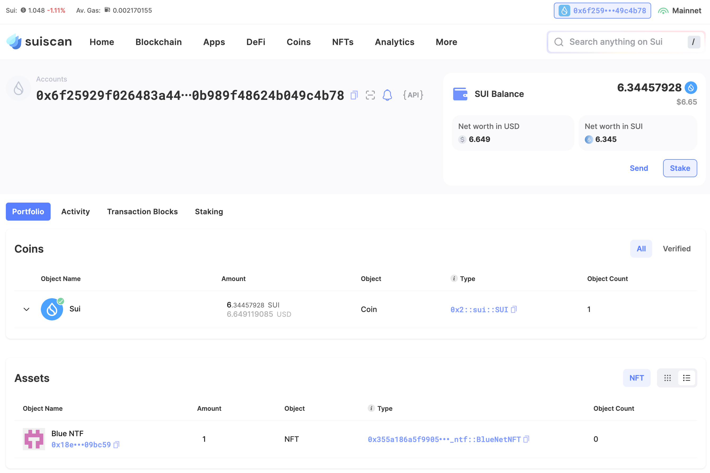
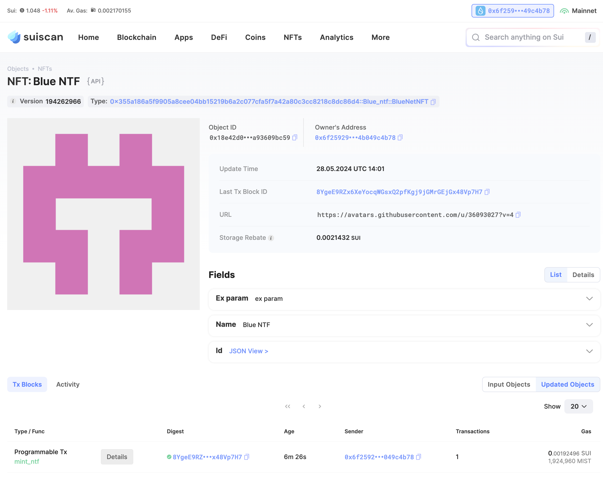
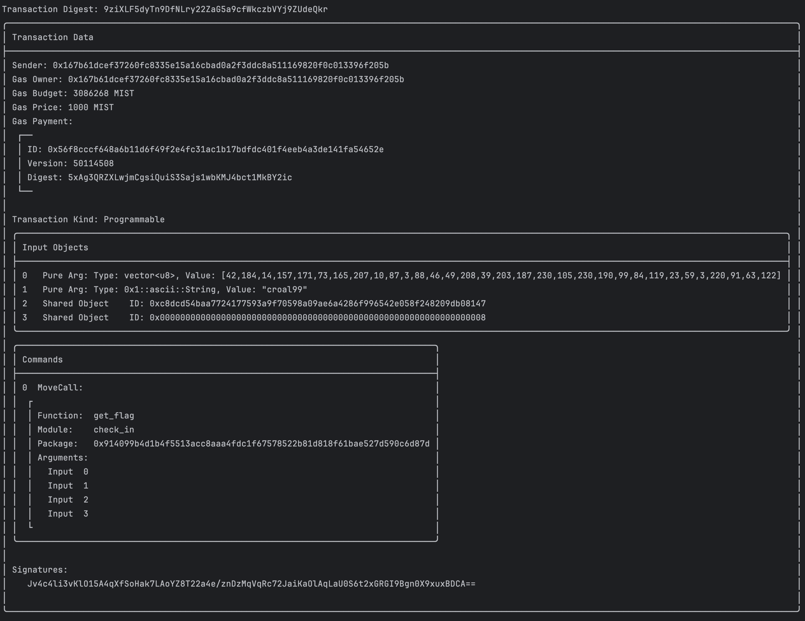
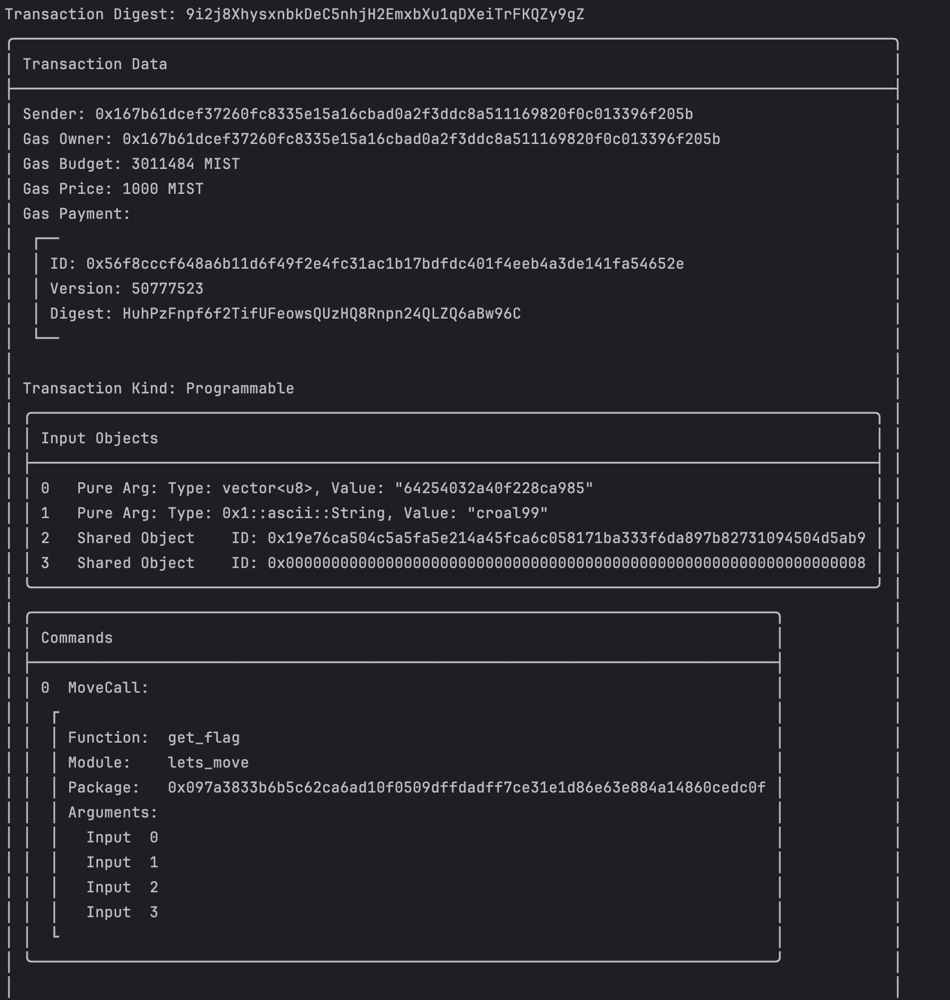

## 基本信息
- Sui钱包地址: `0x6f25929f026483a440f5f16e03661087eb41604528050b989f48624b049c4b78`
> 首次参与需要完成第一个任务注册好钱包地址才被合并，并且后续学习奖励会打入这个地址
- github: `croal99`

## 个人简介
- 工作经验: 18年
- 技术栈: `Rust` `C++` `Java` `Golang` `Python`
> 重要提示 请认真写自己的简介
- 作为一名高级软件工程师，我始终对新技术保持着敏锐的洞察力和浓厚的学习兴趣。近期，我有幸参与到一个基于区块链技术的项目中，这让我有机会深入研究和应用SUI和Move语言。
- 通过这次开发经历，我深刻体会到了区块链技术的魅力和挑战。SUI和Move语言作为区块链领域的重要工具和技术，为我们提供了强大的支持和帮助。在未来的工作中，我将继续深入学习和研究区块链技术，并尝试将其应用到更多的场景中。
- 联系方式: tg: `croal99` 

## 任务

##   01 hello move  
- [x] Sui cli version: sui 1.25.0-homebrew
- [x] Sui钱包截图: 
- [x] package id: 0x9277928970de7f791f3c66f36c98978dd6b3428234ec484e26aefc306c35d34a
- [X] package id 在 scan上的查看截图:

##   02 move coin
- [x] My Coin package id : 0xb9e23639b708f03e0a928c362436406dca9cf4ccc28af29f4388bc3894bcb3cd
- [x] Faucet package id : 0x1034a40b9cc60e947910dea55e8c3a68421460d105bec425328a9f64859238e0
- [x] 转账 `My Coin` hash: 0xacedf7dd91fada351eb9128ea0fe6410df141657b335555370c7491365715321
- [x] `Faucet Coin` address1 mint hash: 9eM8jHTJvq5ZAacBU1HQ9YfHPi2DjxYuF49HoHXWYtj2
- [x] `Faucet Coin` address2 mint hash: 44hPLC6XcGpwKCiZcZ1FjmX7oq2MgWT3fd5JSVYrGJRn

##   03 move NFT
- [x] nft package id : 0x355a186a5f9905a8cee04bb15219b6a2c077cfa5f7a42a80c3cc8218c8dc86d4
- [x] nft object id : 0x2b44b1293e575b831954effa7fb85ac10fd7be22ab4ea29fef71ad6b4e4c17e2
- [x] 转账 nft  hash: G3eCJBsr1fsZp94EEena1TSoe1RBAUtPCRcj7E9YpT6w
- [x] scan上的NFT截图: 

##   04 Move Game
- [x] game package id : 0x898f87e55e4cb51758f6bec2df4c59f5ae2b12b345c764799e62809ea12351fc
- [x] deposit Coin hash: 0xdc78fb5114def8e7d0d01f1af4ced2061e3c5b68aa17d70492ab0d6fcfcaec09
- [x] withdraw `Coin` hash: ERerTRV5dQCht54AYscJT962mgaZ34ar7JPFkX3fiTTL
- [x] play game hash: 7GjU8c14kPYuxDKti2Jz4Hxrb7h29pfK6ntmTM5f6cCV

game 包含自己 github id的元素 **croal99_choice**
```ini
╭────────────────────────────────────────────────────────────────────────────────────────────────────────────────╮
│ Transaction Block Events                                                                                       │
├────────────────────────────────────────────────────────────────────────────────────────────────────────────────┤
│  ┌──                                                                                                           │
│  │ EventID: ERerTRV5dQCht54AYscJT962mgaZ34ar7JPFkX3fiTTL:0                                                     │
│  │ PackageID: 0x898f87e55e4cb51758f6bec2df4c59f5ae2b12b345c764799e62809ea12351fc                               │
│  │ Transaction Module: blue_game                                                                               │
│  │ Sender: 0x167b61dcef37260fc8335e15a16cbad0a2f3ddc8a511169820f0c013396f205b                                  │
│  │ EventType: 0x898f87e55e4cb51758f6bec2df4c59f5ae2b12b345c764799e62809ea12351fc::blue_game::GamingResultEvent │
│  │ ParsedJSON:                                                                                                 │
│  │   ┌────────────────┬──────────┐                                                                             │
│  │   │ croal99_choice │ scissors │                                                                             │
│  │   ├────────────────┼──────────┤                                                                             │
│  │   │ is_win         │ true     │                                                                             │
│  │   ├────────────────┼──────────┤                                                                             │
│  │   │ result         │ You win  │                                                                             │
│  │   ├────────────────┼──────────┤                                                                             │
│  │   │ your_choice    │ paper    │                                                                             │
│  │   └────────────────┴──────────┘                                                                             │
│  └──                                                                                                           │
╰────────────────────────────────────────────────────────────────────────────────────────────────────────────────╯

```


##   05 Move Swap
- [x] swap package id : 0x0c828cead5f0c1a7d88d1304fb91b77e5c72fe738643cfa585b0b069c7e6ad68
- [x] call swap CoinA-> CoinB  hash : 8mvigYSzihVq93jfSFdTnjEbH3X4F2eZSxRG8Asz1Dv2
- [x] call swap CoinB-> CoinA  hash : 7xKtgKZhabCUQbZXaWJm2v5gUWXp1BRqP5dXCRMz4bvH

##   06 Dapp-kit SDK PTB
- [x] save hash : BhuqhPEynVudB23zEkHFzvQUWkYtUUrWvKDt3JfzQe3f

##   07 Move CTF Check In
- [x] CLI call 截图 : 
- [x] flag hash : 9ziXLF5dyTn9DfNLry22ZaG5a9cfWkczbVYj9ZUdeQkr

##   08 Move CTF Lets Move
- [x] CLI call 截图 : 
- [x] proof : 64254032a40f228ca985
- [x] flag hash : 9i2j8XhysxnbkDeC5nhjH2EmxbXu1qDXeiTrFKQZy9gZ
