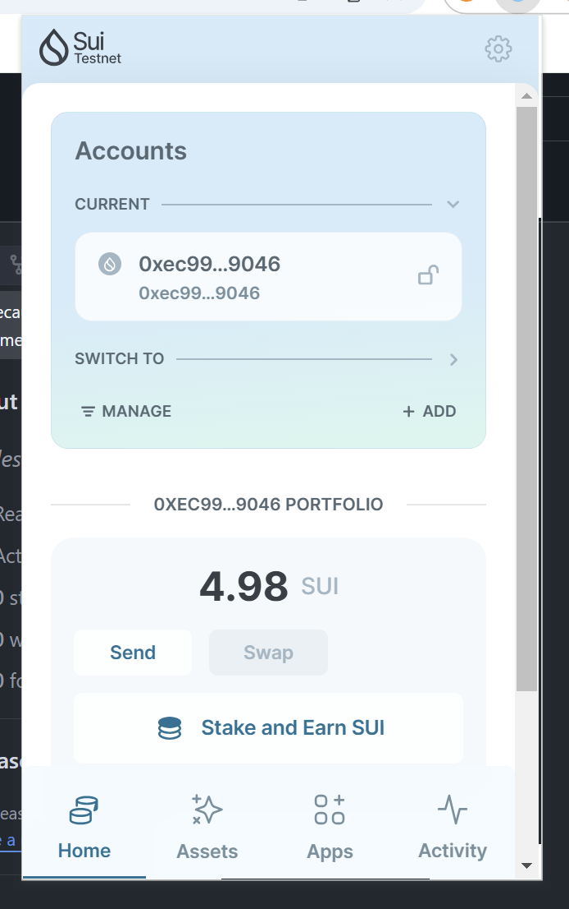
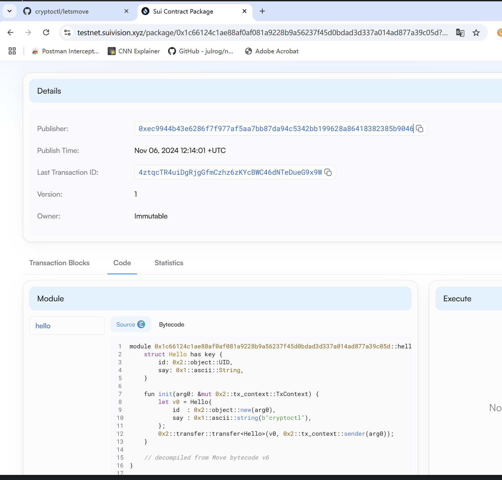
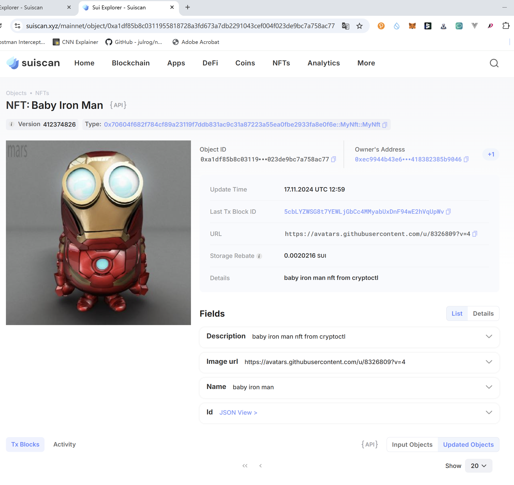

## 基本信息
- Sui钱包地址: `0xec9944b43e6286f7f977af5aa7bb87da94c5342bb199628a86418382385b9046`
> 首次参与需要完成第一个任务注册好钱包地址才被合并，并且后续学习奖励会打入这个地址
- github: `https://github.com/cryptoctl`

## 个人简介
- 工作经验: 20年
  - 技术栈: `Rust` `JAVA` `React` `VUE` `C#` `SQL` 
> 重要提示 请认真写自己的简介
- 多年web2开发经验，但接触区块链比较晚，之前学习过PolkaDot生态的一些知识。想通过深入学习，在block chain领域做一点点简单的项目。
- 联系方式: tg: `https://t.me/polkartio` 

## 任务

##   01 hello move  
- [x] Sui cli version: sui 1.36.1-cf3fee71b907
- [x] Sui钱包截图: 
- [x] package id: 0x1c66124c1ae88af0af081a9228b9a56237f45d0bdad3d337a014ad877a39c05d
- [x] package id 在 scan上的查看截图:

##   02 move coin
- [x] My Coin package id : 0x595755e12a700673fd174e05eac9a6e22cfb5d202de027d5830c256bd20d5b3a . my_coin
- [x] Faucet package id : 0x595755e12a700673fd174e05eac9a6e22cfb5d202de027d5830c256bd20d5b3a . faucet_coin
- [x] 转账 `My Coin` hash: H71uhgXFfiqvEu98FXCcJqnxYqXyrpjKuDA34Nsjjw9c , 5aa9znpV7uskaGRmGKjJkTptrC5RyNn9yu1upUyEQA3C
- [x] `Faucet Coin` address1 mint hash:83vTqouEL7dHRnAttkWfJ46Uu3s52FnwHZo21h38d2E3
- [x] `Faucet Coin` address2 mint hash:DZaoXqAphaeckBKFRTX4DTxVwoBDkEu8QBbvkeVqs8Ms

##   03 move NFT
- [x] nft package id :0x70604f682f784cf89a23119f7ddb831ac9c31a87223a55ea0fbe2933fa8e0f6e
- [x] nft object id : 0xbedae70445cdc744645054a2d342220b4647636a5a6cbc00ee57ed9279d17687
- [x] 转账 nft  hash:8mxiSM4Qon69BZLo3TaKbCJRmXjKfXZF5mHU2G7YEZf8
- [x] scan上的NFT截图:

##   04 Move Game
- [x] game package id :0x76c5be08481759db8a418253eb5fba7c08b2615a94427dc801b375e667442c87
- [x] deposit Coin hash:HLqCXABdnyyB2W7EYK8PoAKjj8MFT64vpXBTdfBvNeGg
- [x] withdraw `Coin` hash:3rKw6dneqLvt2WqjTjvARmwZmFFFdrJPTivMLimWpntn
- [x] play game hash:B8kV437qWqbxq2RDpRaTwfaJnGVWdQmpBiPKrSsK9k4q

##   05 Move Swap
- [x] swap package id :0x298b0a658fd4bffd431f73e54fb5737054d41ea6132e41ca084ffc8d472c13bf
- [x] call swap CoinA-> CoinB  hash : F6jcm1HfvXNChV9skwRnnqhB33boHdArD9BA1fHSmv1m
- [x] call swap CoinB-> CoinA  hash : GtPKN8yMwuJxtjyQ2Ag9c1a79K8ERPe4ka97FG7KDcRF

##   06 Dapp-kit SDK PTB
- [x] save hash :9ZqZjC2LaW5ch4K1n48oKG3Udzpe1BWc7KoJxtUeopYj

##   07 Move CTF Check In
- [] CLI call 截图 : 
- [] flag hash :

##   08 Move CTF Lets Move
- [] proof : 
- [] flag hash :
