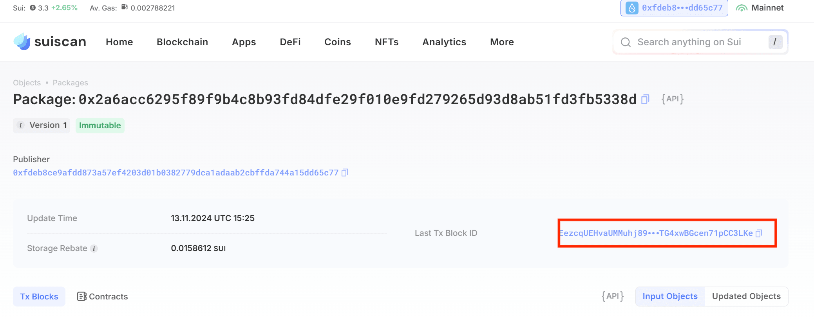
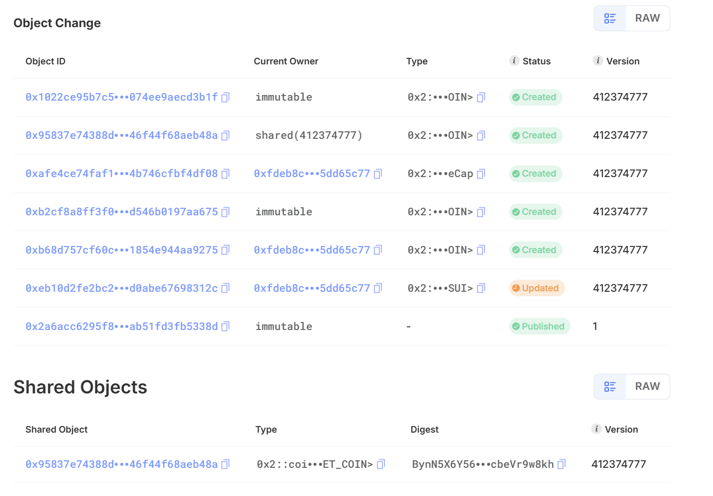
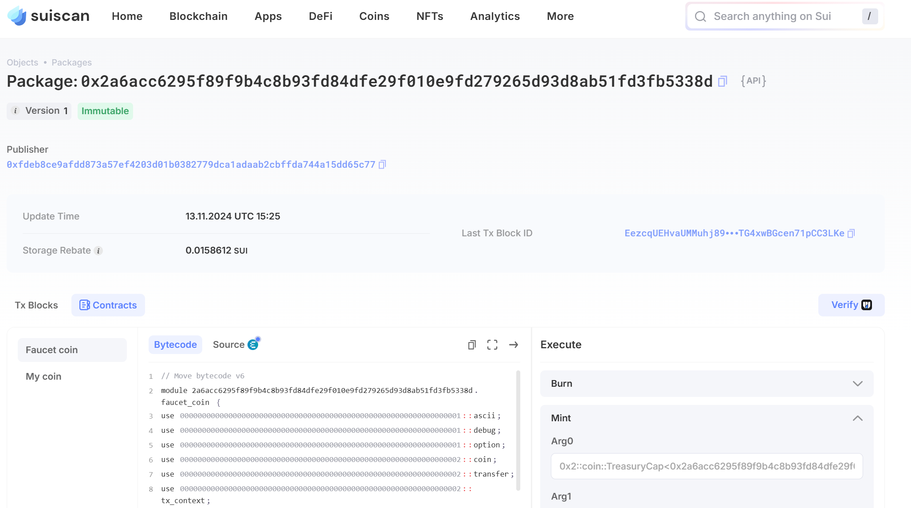

# sui-move基础（三）：letsmove-task2

### 需求

- 完成 Coin相关知识的学习
- 完成 `My Coin` 的学习并部署主网
- 完成 `Faucet Coin` 的学习并部署主网
- 提交 `My Coin` 和 `Faucet Coin` 合约发布 `package id`
- 发送 `My Coin`  给地址 `0x7b8e0864967427679b4e129f79dc332a885c6087ec9e187b53451a9006ee15f2`
- `Faucet Coin` 需要至少用两个地址mint

---

### 注意事项

- 这一节需要在主网上完成，完成上一节之后我们已经获得了一些sui，可以用作gas费。

- 可以使用主钱包转水给测试钱包，但不要在开发和测试环境使用主钱包，可能会导致资金损失。

### 代码展示

首先，我们可以阅读一下教程：

这一task中，要求的my_coin和faucet_coin的代码其实非常相似，我们可以一起讲解

my_coin:

```rust
module move_coin::my_coin {
		use sui::coin::{Self, Coin, TreasuryCap};
		use std::debug;
		use std::ascii::string;

		public struct MY_COIN has drop {}

		fun init(witness: MY_COIN, ctx: &mut TxContext) {
				let (treasury, metadata) = coin::create_currency(
					witness, 
					6,
					b"MOON",
				    b"CTIANMING_MY_COIN",
			   	    b"MOON_COIN",
					option::none(),
					ctx);
				debug::print(&string(b"init MY_COIN"));
				transfer::public_freeze_object(metadata);
				transfer::public_transfer(treasury, ctx.sender())
		}

		public entry fun mint(
				treasury_cap: &mut TreasuryCap<MY_COIN>, 
				amount: u64, 
				recipient: address, 
				ctx: &mut TxContext,
		) {
				debug::print(&string(b"my_coin mint"));
				let coin = coin::mint(treasury_cap, amount, ctx);
				transfer::public_transfer(coin, recipient)
		}

		public entry fun burn(
        	treasury_cap: &mut TreasuryCap<MY_COIN>,
        	coin: Coin<MY_COIN>
    	) {
        	debug::print(&string(b"burn"));
        	coin::burn(treasury_cap, coin);
   		}
}
```

前面的引入crate的操作我们就不再过多赘述，我们来着重看一下init函数：

```rust
fun init(witness: MY_COIN, ctx: &mut TxContext) {
				let (treasury, metadata) = coin::create_currency(
					witness, 
					6,
					b"MOON",
				    b"CTIANMING_MY_COIN",
			   	    b"MOON_COIN",
					option::none(),
					ctx);
				debug::print(&string(b"init MY_COIN"));
				transfer::public_freeze_object(metadata);
				transfer::public_transfer(treasury, ctx.sender())
		}
```

首先，`TxContext` 在sui的库中作如下定义：

```rust
/// Information about the transaction currently being executed.
/// This cannot be constructed by a transaction--it is a privileged object created by
/// the VM and passed in to the entrypoint of the transaction as `&mut TxContext`.
public struct TxContext has drop {
    /// The address of the user that signed the current transaction
    sender: address,
    /// Hash of the current transaction
    tx_hash: vector<u8>,
    /// The current epoch number
    epoch: u64,
    /// Timestamp that the epoch started at
    epoch_timestamp_ms: u64,
    /// Counter recording the number of fresh id's created while executing
    /// this transaction. Always 0 at the start of a transaction
    ids_created: u64,
}
```

很明显，它就是一个用于记录交易发生时的各种信息的结构体，标准库中的注释已经足够清晰。很多时候，我们只要正确安装的sui的环境，就可以在ide或者代码编辑器中按住`ctrl`并通过鼠标点击对应的结构体和函数跳转到相应的代码片段，有时需要安装插件或者先进行一次编译。这一点在rust中也一样。

接下来我们可以重点看一下 `coin::create_currency` 函数：

```rust
// === Registering new coin types and managing the coin supply ===

/// Create a new currency type `T` as and return the `TreasuryCap` for
/// `T` to the caller. Can only be called with a `one-time-witness`
/// type, ensuring that there's only one `TreasuryCap` per `T`.
public fun create_currency<T: drop>(
    witness: T,
    decimals: u8,
    symbol: vector<u8>,
    name: vector<u8>,
    description: vector<u8>,
    icon_url: Option<Url>,
    ctx: &mut TxContext,
): (TreasuryCap<T>, CoinMetadata<T>) {
    // Make sure there's only one instance of the type T
    assert!(sui::types::is_one_time_witness(&witness), EBadWitness);

    (
        TreasuryCap {
            id: object::new(ctx),
            total_supply: balance::create_supply(witness),
        },
        CoinMetadata {
            id: object::new(ctx),
            decimals,
            name: string::utf8(name),
            symbol: ascii::string(symbol),
            description: string::utf8(description),
            icon_url,
        },
    )
}
```

我们来逐一解释一下该函数的参数：
- witness 是一个类型 `T` 的一次性证明者，确保货币只被创建一次。通过 sui::types::is_one_time_witness 进行检查。具体参考：https://move.sui-book.com/programmability/witness-pattern.html
- decimals 指定货币支持的小数位数，定义其精度。
- symbol 是一个字节向量，表示货币的符号，例如 "USD" 或 "BTC"。
- name 指定货币的名称。
- 用于提供货币的描述。
- icon_url 是一个可选的 URL，指向代表货币的图标。
- ctx是交易上下文，提供执行交易所需的信息和能力。

它返回一个`(TreasuryCap<T>, CoinMetadata<T>)`的元组，其中：

```rust
/// Capability allowing the bearer to mint and burn
/// coins of type `T`. Transferable
public struct TreasuryCap<phantom T> has key, store {
    id: UID,
    total_supply: Supply<T>,
}

/// Each Coin type T created through `create_currency` function will have a
/// unique instance of CoinMetadata<T> that stores the metadata for this coin type.
public struct CoinMetadata<phantom T> has key, store {
    id: UID,
    /// Number of decimal places the coin uses.
    /// A coin with `value ` N and `decimals` D should be shown as N / 10^D
    /// E.g., a coin with `value` 7002 and decimals 3 should be displayed as 7.002
    /// This is metadata for display usage only.
    decimals: u8,
    /// Name for the token
    name: string::String,
    /// Symbol for the token
    symbol: ascii::String,
    /// Description of the token
    description: string::String,
    /// URL for the token logo
    icon_url: Option<Url>,
}
```

这两个返回类型同样已经存在非常清晰的注释，`TreasuryCap<T>`是允许铸造和销毁类型 T 的硬币的能力，`CoinMetadata<T>`是关于硬币的元数据，包括其小数位数、名称、符号、描述和图标 URL。

另外，init函数中还调用了两个十分关键的函数：
```rust
/// Freeze `obj`. After freezing `obj` becomes immutable and can no longer be transferred or
/// mutated.
/// The object must have `store` to be frozen outside of its module.
public fun public_freeze_object<T: key + store>(obj: T) {
    freeze_object_impl(obj)
}

/// Transfer ownership of `obj` to `recipient`. `obj` must have the `key` attribute,
/// which (in turn) ensures that `obj` has a globally unique ID. Note that if the recipient
/// address represents an object ID, the `obj` sent will be inaccessible after the transfer
/// (though they will be retrievable at a future date once new features are added).
/// The object must have `store` to be transferred outside of its module.
public fun public_transfer<T: key + store>(obj: T, recipient: address) {
    transfer_impl(obj, recipient)
}
```

简单来说：
- public_freeze_object函数将货币锁定，使得其元数据不得再改变。
- public_transfer将铸币权交给recipient。

***注意这个public_transfer函数，这里将出现my_coin和faucet_coin最大的不同。***

了解了以上内容，init函数对于我们而言就十分清晰了：

*它调用coin::create_currency创建一种新的coin，调用public_freeze_object锁定该coin，并调用public_transfer将铸币权交给recipient。*

接下来的mint函数与burn函数我们不再多言，只需注意：如果需要在sui scan或者其他浏览器直接调用函数，需要加上`entry`。

对于 `faucet_coin` ，有：
```rust
module move_coin::faucet_coin {
		use sui::coin::{Self, Coin,TreasuryCap};
		use std::debug;
		use std::ascii::string;

		public struct FAUCET_COIN has drop {}

		fun init(witness: FAUCET_COIN, ctx: &mut TxContext) {
				let (treasury, metadata) = coin::create_currency(
				witness, 
			    6,
				b"MOON",
			    b"CTIANMING_FAUCET_COIN",
			    b"MOON_COIN",
		        option::none(),
				ctx);
				debug::print(&string(b"init FAUCET_COIN"));
				transfer::public_freeze_object(metadata);
				transfer::public_share_object(treasury)
		}

		public entry fun mint(
				treasury_cap: &mut TreasuryCap<FAUCET_COIN>, 
				amount: u64, 
				recipient: address, 
				ctx: &mut TxContext,
		) {
				debug::print(&string(b"faucet_coin mint"));
				let coin = coin::mint(treasury_cap, amount, ctx);
				transfer::public_transfer(coin, recipient)
		}

		public entry fun burn(
        	treasury_cap: &mut TreasuryCap<FAUCET_COIN>,
        	coin: Coin<FAUCET_COIN>
    	) {
        	debug::print(&string(b"burn"));
        	coin::burn(treasury_cap, coin);
   		}
}
```

很显然，这两种coin的代码十分相似，基本就是一模一样。

唯一的不同在哪里呢？就在于init函数的最后，调用了public_share_object而非public_transfer。

我们看一下public_share_object代码：

```rust
/// Turn the given object into a mutable shared object that everyone can access and mutate.
/// This is irreversible, i.e. once an object is shared, it will stay shared forever.
/// Aborts with `ESharedNonNewObject` of the object being shared was not created in this
/// transaction. This restriction may be relaxed in the future.
/// The object must have `store` to be shared outside of its module.
public fun public_share_object<T: key + store>(obj: T) {
    share_object_impl(obj)
}
```

可以看到，该函数将铸币权分享给所有人——也就是所有地址都可以铸造该coin，而非recipient单一地址。

### 上链与调用

编写完相关代码后，我们需要切换到主网，进行编译与部署。

#### 部署

由于个人觉得sui的一些基础指令较为繁琐，所以编写了一个个人用的Makefile，比较不稳定，但大家如果有兴趣，可以引入自己的项目：
```Makefile
# Sui 项目 Makefile
# 项目路径设置
MOVE_PATH := .
BUILD_PATH := $(MOVE_PATH)/build
SUI_CLI := sui

# 默认网络为 devnet，可通过 `make <target> NETWORK=<network>` 来覆盖
NETWORK := $(or $(NETWORK), mainnet)
GAS_BUDGET := $(or $(GAS_BUDGET), 2000000)

# 默认目标
all: build

# 切换网络
switch:
	@echo "Switching to network: $(NETWORK)..."
	@if [ -z "$(NETWORK)" ]; then \
		echo "Error: No network specified. Please set NETWORK."; \
		exit 1; \
	fi
	$(SUI_CLI) client switch --env $(NETWORK)
	@echo "Switched to network: $(NETWORK)"
	export NETWORK=$(NETWORK)
# 编译 Move 代码
build:
	@echo "Building the Sui Move package..."
	@if [ -n "$(NETWORK)" ] && [ "$(NETWORK)" != "devnet" ]; then \
		echo "Switching to network: $(NETWORK)"; \
		$(SUI_CLI) client switch --env $(NETWORK); \
	elif [ "$(NETWORK)" = "devnet" ]; then \
		echo "Using the current network $(NETWORK)"; \
	fi
	$(SUI_CLI) move build --path $(MOVE_PATH)

# 运行测试
test:
	@echo "Running tests on Sui Move package..."
	@if [ -n "$(NETWORK)" ] && [ "$(NETWORK)" != "devnet" ]; then \
		echo "Switching to network: $(NETWORK)"; \
		$(SUI_CLI) client switch --env $(NETWORK); \
	elif [ "$(NETWORK)" = "devnet" ]; then \
		echo "Using the current network $(NETWORK)"; \
	fi
	$(SUI_CLI) move test --path $(MOVE_PATH)

# 发布合约到 Devnet
publish:
	@echo "Publishing the package to $(SUI_NETWORK)..."
	@if [ -n "$(NETWORK)" ] && [ "$(NETWORK)" != "devnet" ]; then \
		echo "Switching to network: $(NETWORK)"; \
		$(SUI_CLI) client switch --env $(NETWORK); \
	elif [ "$(NETWORK)" = "devnet" ]; then \
		echo "Using the current network $(NETWORK)"; \
	fi
	$(SUI_CLI) client publish --gas-budget $(GAS_BUDGET)

# 清理生成的文件
clean:
	@echo "Cleaning up the build directory..."
	rm -rf $(BUILD_PATH)

# 此命令仅适用于使用 brew 下载 sui 的用户
update:
	@echo "Updating brew and sui"
	brew update
	brew upgrade sui

# 查看合约状态
# 这里我只添加了三个命令，可以根据自己的需要增减
status:
	@echo "Checking the status of the Sui project..."
	$(SUI_CLI) client active-env
	$(SUI_CLI) client active-address
	$(SUI_CLI) client balance

# 帮助信息
help:
	@echo "使用 Makefile 中的以下命令进行常见操作："
	@echo "  make build     - 编译 Move 包"
	@echo "  make test      - 测试 Move 包"
	@echo "  make publish   - 发布合约到网络"
	@echo "  make clean     - 清理生成的文件"
	@echo "  make status    - 查看合约状态"

.PHONY: all build test publish clean status help

```

使用方法：
- 使用sui move new <your_project_name> 创建一个典型的sui项目
- 进入项目目录，新建一个Makefile文件
- 将上面的内容粘贴进入
- 使用 `make <command>` 调用，例如在终端输入 `make build`

#### 调用

首先，由于mint函数需要的第一个参数witness是由init函数创建的，我们需要找到我们的witness对象的object id。合约部署后在终端有许多log，我们在其中就可以找到。

具体方法是根据object type，例如，my_coin的witness的object type为`0x2::coin::CoinMetadata<0x2a6acc6295f89f9b4c8b93fd84dfe29f010e9fd279265d93d8ab51fd3fb5338d::my_coin::MY_COIN>`，而faucet_coin的object type为`0x2::coin::TreasuryCap<0x2a6acc6295f89f9b4c8b93fd84dfe29f010e9fd279265d93d8ab51fd3fb5338d::faucet_coin::FAUCET_COIN>`。

如果感觉麻烦或者不慎关闭了终端导致log丢失(就是我了呜呜TAT)，也可在sui scan直接找到，接下来使用这个办法。

调用步骤：

- 在sui scan 输入自己部署获得的package id 
- 在该页面中找到并点击：

- 在Object Change板块，我们可以看到部署交易时发生改变的objects，我们需要寻找的对象就在其中，而我们本次部署唯一的shared_object更是容易寻找：

- 我们可以看到这里的Type被省略了，难以查看，这时只需点击RAW就可以看到完整的Type，我们记下对应的object id
- 返回上一个页面

- 在Contracts窗口中直接调用即可

若要在终端调用，使用：

```bash
sui client call --package <EXAMPLE> --module 'clock' --function 'access' --args '0x6' --gas-budget <GAS-AMOUNT>
```

以上就是本次教程的全部内容，如果有不懂的部分，请先自行询问AI或者查阅相关资料。

同样欢迎交流，联系方式：yu18209854584(微信)