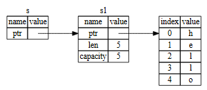

# sui-move进阶：引用

在 Move 中，*引用（References）* 是一种高效且安全的资源访问方式。引用有两种类型：*不可变引用*和*可变引用*。Move 的类型系统通过强制执行所有权规则，防止引用错误，并确保资源的安全使用。

---

## 引用类型

在Move中，引用分为可变引用(mutable reference)和不可变引用(imutable reference)：

### 不可变引用（`&`）
- 只读访问底层值。

### 可变引用（`&mut`）

- 允许通过引用修改底层值。

## 引用操作符

Move 提供了一系列操作符，用于创建、扩展引用以及将可变引用转换为不可变引用。

| **语法**   | **类型**                         | **描述**                                      |
|------------|----------------------------------|-----------------------------------------------|
| `&e`       | `&T`，其中 `e: T` 且 `T` 不是引用类型 | 创建 `e` 的不可变引用                         |
| `&mut e`   | `&mut T`，其中 `e: T` 且 `T` 不是引用类型 | 创建 `e` 的可变引用                           |
| `&e.f`     | `&T`，其中 `e.f: T`               | 创建结构体 `e` 的字段 `f` 的不可变引用         |
| `&mut e.f` | `&mut T`，其中 `e.f: T`           | 创建结构体 `e` 的字段 `f` 的可变引用           |
| `freeze(e)`| `&T`，其中 `e: &mut T`            | 将可变引用 `e` 转换为不可变引用               |

---

与引用(reference)操作符相对的还有解引用(dereference)操作符，我将在后面介绍。

### 创建与扩展引用

#### 创建引用

以下是如何创建引用的示例：

```move
let x = 10;
let ref_x: &u64 = &x;       // 不可变引用
let mut y = 20;
let ref_y: &mut u64 = &mut y; // 可变引用
```

需要注意的是，需要资源本身是可变的，才能创建其可变引用；相应的，也可以创建它的不可变引用。

而如果资源本身是不可变的，则只能创建不可变引用。

#### 扩展引用

扩展引用支持访问结构体的字段：

```move
struct S { f: u64 }
let s = S { f: 10 };
let f_ref1: &u64 = &s.f;     // 直接创建字段的引用
let s_ref: &S = &s;
let f_ref2: &u64 = &s_ref.f; // 从结构体的引用扩展引用
```

#### 多字段引用

如果两个结构体在同一模块中，可以通过多层引用访问嵌套字段：

```move
public struct A { b: B }
public struct B { c: u64 }
fun get_nested_field(a: &A): &u64 {
    &a.b.c // 访问嵌套字段的引用
}
```
### 禁止引用的引用

Move 不允许引用的引用，这种设计确保了引用的简单性和安全性。例如：

```move
let x = 7;
let y: &u64 = &x;
let z: &&u64 = &y; // 错误！Move 不支持引用的引用
```

## 解引用(dereference)

可变和不可变引用都可以被解引用以产生被引用值的副本。

与引用操作符`&`相对的，解引用操作符是`*`，这或许很像c语言中的指针操作符，但从根本上存在很大不同。

只有可变引用可以被写入。写入`*x = v`会丢弃之前存储在x中的值,并用v更新它。

### 解引用操作符

| 语法      | 类型                          | 描述               |
|-----------|-------------------------------|--------------------|
| `*e`      | `T`, 其中 `e` 是 `&T` 或 `&mut T` | 读取 `e` 指向的值  |
| `*e1 = e2`| `()`, 其中 `e1: &mut T` 且 `e2: T` | 用 `e2` 更新 `e1` 中的值 |

### 解引用的内涵

另，为了进一步了解解引用，我们尤其需要知道，解引用的具体情况是什么：

以此代码为例：
```move
let a = 10;
let b = &a;
*b = 12; //不允许，a 是不可变的

let mut c = 10;
let mut d = &mut c;
*d = 12; //允许，c可变，且d是可变引用

let e = *b;
let f = *d;
```

我们可以看到，在上述代码中，b是a的不可变引用，d是c的可变引用。

而通过解引用操作符`*`，`*b`和`*d`实际上试图修改的分别是a和c的值，在示例代码中，`*b`进行的操作是不合法的，`*d`进行的操作是合法的。

`*b=12;`这一行代码将会报错，而我们如果在`*d=12;`这一行之后打印`c`的值，将会发现它的值变为了12。

而在这之后的两行代码，是为了展示解引用操作同样可以用于给变量赋值。

### 解引用操作的限制

为了能读取引用,底层类型必须具有copy能力,因为读取引用会创建值的新副本。这条规则防止了资产被复制:

```move
fun copy_coin_via_ref_bad(c: Coin) {
    let c_ref = &c;
    let counterfeit: Coin = *c_ref; // 不允许!
}
```

相对地:为了能写入引用,底层类型必须具有drop能力,因为写入引用会丢弃(或"删除")旧值。换言之，不期望被销毁的资源不应当为其赋予drop能力。这条规则防止了资源值被销毁:

```move
fun destroy_coin_via_ref_bad(mut ten_coins: Coin, c: Coin) {
    let ref = &mut ten_coins;
    *ref = c; // 错误! 不允许--会销毁10个硬币!
}
```

## 引用的作用域

### Move对于引用的宽松检查

可变和不可变引用都可以随时被复制和扩展,即使存在同一引用的现有副本或扩展:

```move
public struct S {
    f: u32,
}

fun reference_copies(s: &mut S) {
    let s_copy1 = s; // 可以
    let s_extension = &mut s.f; // 也可以
    let s_copy2 = s; // 仍然可以
    let s_extension_2 = &mut s.f; // 居然还是可以
    *s_extension = 1;
    *s_extension_2 = 2; //甚至可以存在多个解引用
    let out_extension = &s_extension; 
    //但是不允许存在引用的引用，这里会报错：Expected a single non-reference type, but found: '&mut u32'
}

```

这可能会让熟悉Rust所有权系统的程序员感到惊讶,Rust会拒绝上面的代码。Move的类型系统在处理复制时更加宽松,但在写入前确保可变引用的唯一所有权方面同样严格。

实质上，这种特性应该来源于Move中的引用需要进行复制的特殊性质。如图：



熟悉Rust语言的朋友应该知道，Rust中的引用可以被理解为指向某一资源的指针，所以不允许多个指针指向同一资源是自然而然的，这可能会导致资源争用。

而在Move中，由于每次进行引用都会进行复制，所以对同一资源的多次引用是允许的。

### 引用不能被存储

引用和元组是**唯一**不能作为结构体字段值存储的类型,这也意味着它们不能存在于存储或对象中。在程序执行期间创建的所有引用都会在Move程序终止时被销毁;它们完全是短暂的。这也适用于所有没有store能力的类型:任何非store类型的值必须在程序终止前被销毁。但请注意引用和元组更进一步,从一开始就不允许存在于结构体中。
