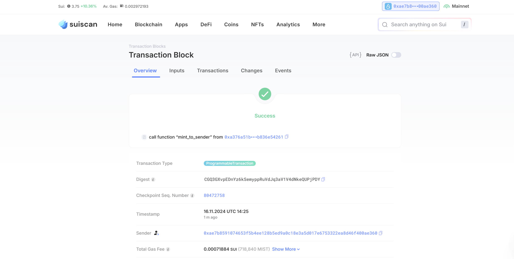

## 基本信息
- Sui钱包地址: `0xae7b8591074653f5b4ee128b5ed9a0c18e3a5d017e6753322ea8d46f400ae360`
> 首次参与需要完成第一个任务注册好钱包地址才被合并，并且后续学习奖励会打入这个地址
- github: `ctianming`

## 个人简介
- 工作经验: x年
- 技术栈: `Rust` `golang` `solidity` `C` `js` `希望可以再加个move`
- 成都信息工程大学区块链工程大三学生，原生web3学习者&开发者，希望寻找实习和工作机会
- 联系方式: 
    - tg: `Amyseer Destiny` 
    - qq: `3340237090`
    - 微信: `yu18209854584`
    - 邮箱: `saber66ccff@gmail.com`

## 任务

##   01 hello move  
- [x] Sui cli version: sui 1.37.1-homebrew
- [x] Sui钱包截图: 
- [x] package id: 0x66b06f293cefd4f3dfd242c6909943bdee46c5f62f22b429f84e3ff061b1b1d7  
- [x] package id 在 scan上的查看截图:

##   02 move coin
- [x] My Coin package id : 0x2a6acc6295f89f9b4c8b93fd84dfe29f010e9fd279265d93d8ab51fd3fb5338d
- [x] Faucet package id : 0x2a6acc6295f89f9b4c8b93fd84dfe29f010e9fd279265d93d8ab51fd3fb5338d
- [x] 转账 `My Coin` hash:BgEW2PdHCWZgc8H4GTYRvVt6R2osSDcCQmFjd3CYXPz1
- [x] `Faucet Coin` address1 mint hash:2KvaaNNBrzaqysYfhYCHUjUyRBerB9cMRMueLoNuPW4f
- [x] `Faucet Coin` address2 mint hash:2K1Pzkd4txHh1WqsyskekFvbCRhs3eW4LLVWTA3xQ4S9

##   03 move NFT
- [x] nft package id :0xa376a51b344ba611df52a26df951a20366223f9d973245a4b35a22b836e54261
- [x] nft object id : 0x67a7ab0bfa731986a69d05e4aceaf268b8aaecaa5a84191ba6dc36397ebe8c07
- [x] 转账 nft  hash:DDAFPPgM9MroQmAc1yFezMAUmYvgFgKBvhJM2eRQ6xJ9
- [x] scan上的NFT截图:

##   04 Move Game
- [x] game package id :0xed3a81bb858d2b3807b2ad29597c637b7972dacd60a5120b9a0e92f9c0164087
- [x] deposit Coin hash:HfvskSw7kM9PjxdFqxLaVJdEHrTTJTnBuVVLhxXiF9Zf
- [x] withdraw `Coin` hash:BntB66wAyoP2ZMvAZUzHgNBbvXsatA3kvJ2eNncPgTbM
- [x] play game hash:4ZBZBzcqpFX99GM2zExSFXgxM84X4Gw8n8xTYSg8ytMx

##   05 Move Swap
- [x] swap package id :0x2ef63206c65f457cb14db4806f101958336ac4503675b04fd7120c7c33680ece
- [x] call swap CoinA-> CoinB  hash :EmpHg9SsXB2S1m27JLQu3nsn3e8DKS4Cio739K7YRYRc
- [x] call swap CoinB-> CoinA  hash :GZKdW1LguJ3yJqjvcP4WHjc3p25iPmZsyBbm3QWXSx5Z

##   06 Dapp-kit SDK PTB
- [] save hash :

##   07 Move CTF Check In
- [] CLI call 截图 : 
- [] flag hash :

##   08 Move CTF Lets Move
- [] proof : 
- [] flag hash :
