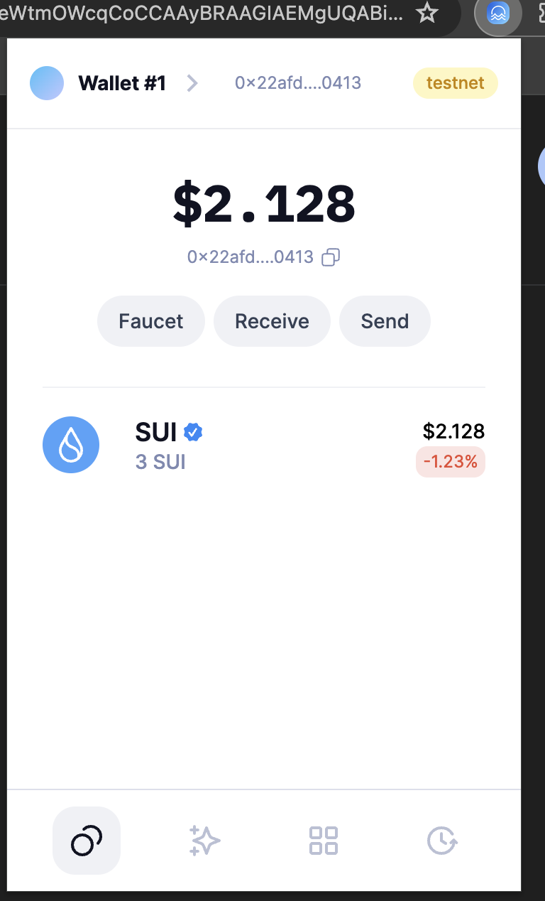

## 基本信息
- Sui钱包地址: `0x22afda5cb84de5deac0a2a15b4b0accfe73066482741ccd17acb9ba0c7e00413`
> 首次参与需要完成第一个任务注册好钱包地址才被合并，并且后续学习奖励会打入这个地址
- github: `cuijiawei123`
https://github.com/cuijiawei123
## 个人简介
- 工作经验: 5年
- 技术栈: `react` `vue` `java` ` javascript`
> 重要提示 请认真写自己的简介
- 多年web2开发经验，对Move特别感兴趣，想通过Move入门区块链
- 联系方式: tg: `xxx` 

## 任务

##   01 hello move  
- [✅] Sui cli version:
- [✅] Sui钱包截图: 
- [✅] package id: 0x20521456b6639027bc908f050fef6293473ccc952c2db2cc974824506ae3a451
- [✅] package id 在 scan上的查看截图:

##   02 move coin
- [] My Coin package id : 0x24cff64767f0d2fb8414f46a1a50a66cb70fe3eba3d88e12018f947be0720a58
- [] Faucet package id : 0x85b1dbc2eb7888905a704a3c66d5fc38b9d0f2a4da19a2de76494b0de1ac12dc0x85b1dbc2eb7888905a704a3c66d5fc38b9d0f2a4da19a2de76494b0de1ac12dc
- [] 转账 `My Coin` hash: https://suiscan.xyz/testnet/tx/5MaSpJHujniTgA9PUxCB2vXqgQiLkf8do3U5X1F3w7xf
- [] `Faucet Coin` address1 mint hash: nk75c33mk3B2Esi7RqTyyjBJVpNXfqAg4EMDfEAAnmC
- [] `Faucet Coin` address2 mint hash: 84wK2a3ipACH3gYSFePAHgDmC1M8qSxJ67rb3y7pCKar

##   03 move NFT
- [] nft package id :0xbf66e72c16353edc64c3fa3251fbf91e3e77a8ed808e0a5ce82c2a54aa6a955f
- [] nft object id : 0xd9bf34d46eb38e8d9ffda6365ccac86ea2f92b2d033193d10c5c1e92c15d148c
- [] 转账 nft  hash:
7qkAXBiVRfuhDwcpDoiMkxifbzvF4XwghsHGbFBjgpUv

##   04 Move Game
- [] game package id :
- [] deposit Coin hash:
- [] withdraw `Coin` hash:
- [] play game hash:

##   05 Move Swap
- [] swap package id :
- [] call swap CoinA-> CoinB  hash :
- [] call swap CoinB-> CoinA  hash :

##   06 Dapp-kit SDK PTB
- [] save hash :
