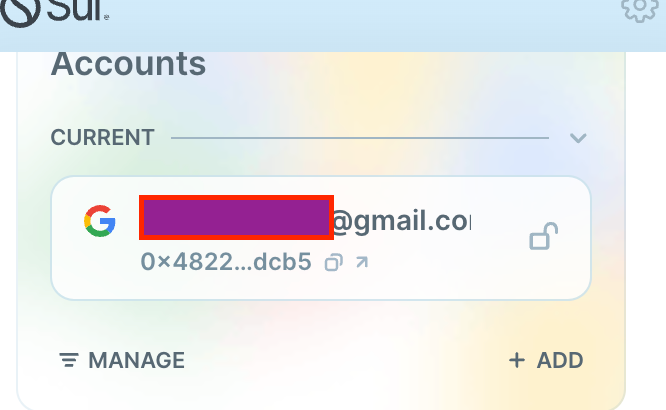
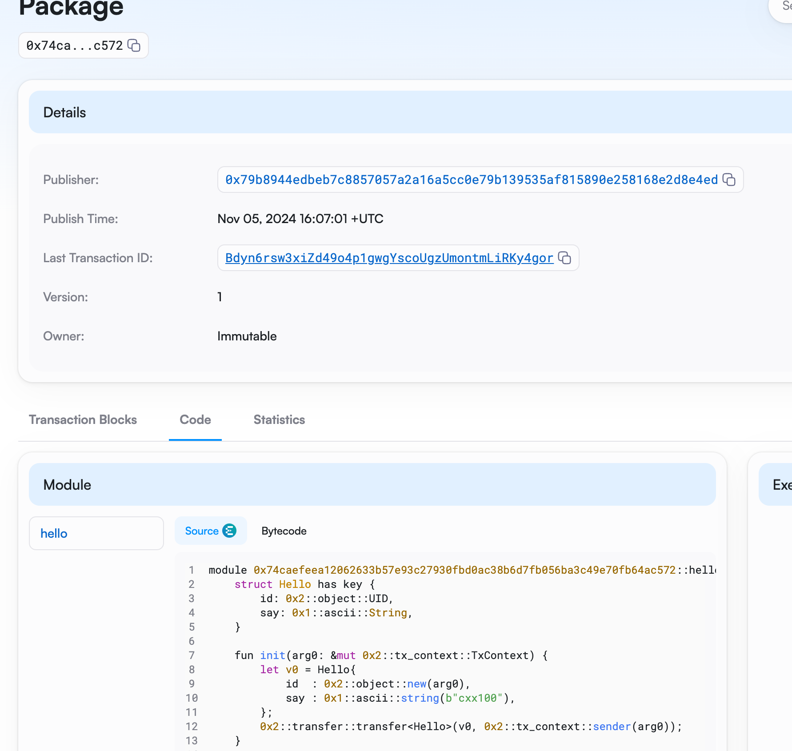

## 基本信息

- Sui 钱包地址: `0x4822a176ef30567b8ee9e8d9f26732b4d16b365afa64ff4a38eae8231112dcb5`
- github: `cxx100`

## 个人简介

- 工作经验: 5 年
- 技术栈: `Java`
- 之前做的是电商的后端开发，然后有尝试通过 Defi 赚点生活费，想要更加了解区块链，想深入链上操作
- 联系方式: tg: `jacklitalk`

## 任务

## 01 hello move

- [x] Sui cli version: sui 1.37.1-homebrew
- [x] Sui 钱包截图: 
- [x] package id:0x74caefeea12062633b57e93c27930fbd0ac38b6d7fb056ba3c49e70fb64ac572
- [x] package id 在 scan 上的查看截图:

## 02 move coin

- [] My Coin package id :
- [] Faucet package id :
- [] 转账 `My Coin` hash:
- [] `Faucet Coin` address1 mint hash:
- [] `Faucet Coin` address2 mint hash:

## 03 move NFT

- [] nft package id :
- [] nft object id :
- [] 转账 nft hash:
- [] scan 上的 NFT 截图:

## 04 Move Game

- [] game package id :
- [] deposit Coin hash:
- [] withdraw `Coin` hash:
- [] play game hash:

## 05 Move Swap

- [] swap package id :
- [] call swap CoinA-> CoinB hash :
- [] call swap CoinB-> CoinA hash :

## 06 Dapp-kit SDK PTB

- [] save hash :

## 07 Move CTF Check In

- [] CLI call 截图 : 
- [] flag hash :

## 08 Move CTF Lets Move

- [] proof :
- [] flag hash :
