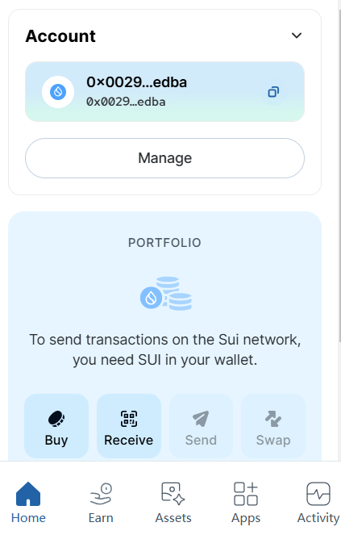
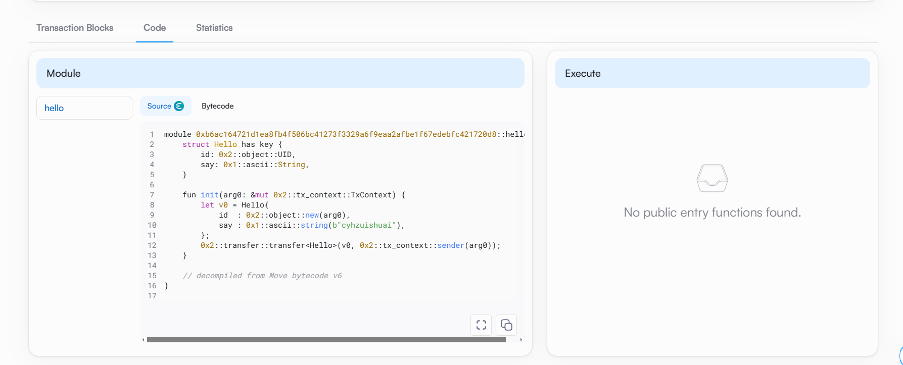
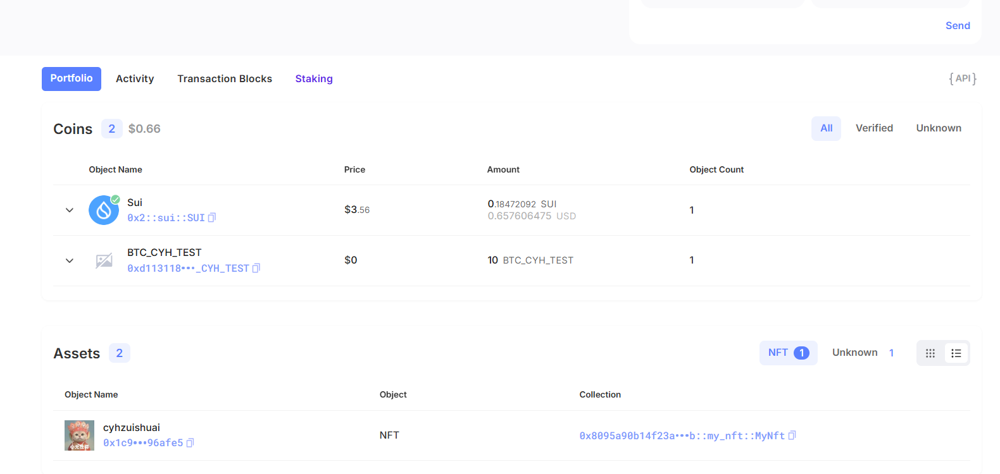

## 基本信息
- Sui钱包地址: `0x8cdacb19088787b58ecd65ed3d88aa46008bcd9ca4b0ae8461d8e5ceab0856d7`
> 首次参与需要完成第一个任务注册好钱包地址才被合并，并且后续学习奖励会打入这个地址
- github: `cyhzuishuai`

## 个人简介
- 工作经验: 2年
- 技术栈: `python` `solidity` `go`
> 重要提示 请认真写自己的简介
- 对Move特别感兴趣，想通过Move入门区块链
- 联系方式: tg: `ciphercyh` 

## 任务

##   01 hello move  
- [x] Sui cli version:sui 1.40.1-5ff708baf2b6
- [x] Sui钱包截图: 
- [x] package id: 0xb6ac164721d1ea8fb4f506bc41273f3329a6f9eaa2afbe1f67edebfc421720d8
- [x] package id 在 scan上的查看截图:

##   02 move coin
- [x] My Coin package id : 0xd113118ef846c2d85dda904ad01ea0fe33194681fd54ba759020f41dbd121f14
- [x] Faucet package id : 0xd113118ef846c2d85dda904ad01ea0fe33194681fd54ba759020f41dbd121f14
- [x] 转账 `My Coin` hash: D2bjiyGr1t4TKhZUFMaR3D12Jcup1EYjQF3ZsiNgGURs
- [x] `Faucet Coin` address1 mint hash: FxyCwBHLNziALQckvLuv2UmBvXDrDvNm2YUJrXpLuFiq
- [x] `Faucet Coin` address2 mint hash: FcyQM3Sa2cunDym89RUV5zALd6BU1rW2UZHyJSozoWY9

##   03 move NFT
- [x] nft package id : 0x8095a90b14f23a43618ed863af87ac683ce8b604cc2db118312a0ec34478022b
- [x] nft object id(我自己的) : 0x1c9b0c3497c6303e2b63301a257859bfeed5bedd3b2782854aa994a2f496afe5
- [x] 转账 nft 到别人的地址hash(0x7b8e0864967427679b4e129f79dc332a885c6087ec9e187b53451a9006ee15f2):  ESo5bXKSvvmTchXYrjkSot8zDSxq2fuJFVuGeynXX42f
- [x] scan上的NFT截图:

##   04 Move Game
- [] game package id :
- [] deposit Coin hash:
- [] withdraw `Coin` hash:
- [] play game hash:

##   05 Move Swap
- [] swap package id :
- [] call swap CoinA-> CoinB  hash :
- [] call swap CoinB-> CoinA  hash :

##   06 Dapp-kit SDK PTB
- [] save hash :

##   07 Move CTF Check In
- [] CLI call 截图 : 
- [] flag hash :

##   08 Move CTF Lets Move
- [] proof : 
- [] flag hash :

