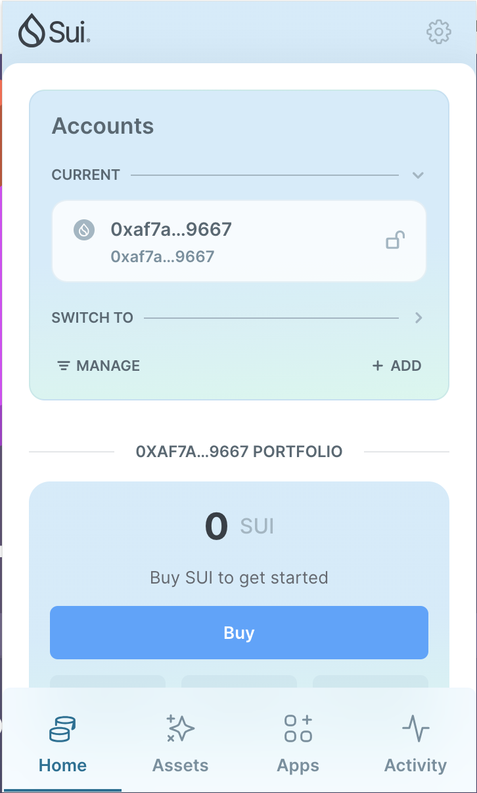
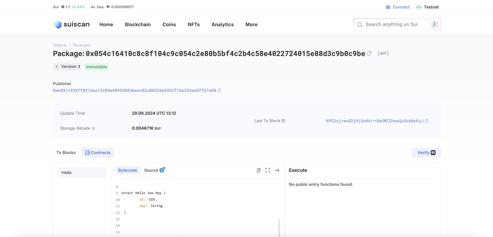

## 基本信息
- Sui钱包地址: `0xaf7ab16d293c25e5cb134e1222b056927a6455a528e21426eed0f947ccc49667`
> 首次参与需要完成第一个任务注册好钱包地址才被合并，并且后续学习奖励会打入这个地址
- github: `dadi2023`

## 个人简介
- 工作经验: 7年
- 技术栈: `python`
> 重要提示 请认真写自己的简介
- 多年web2产品经理经验，自学了python对SUI感兴趣,希望通过Move入门区块链
- 联系方式: tg: `https://t.me/pdsdkd` 

## 任务

##   01 hello move  
- [x] Sui cli version:sui 1.34.0-homebrew
- [x] Sui钱包截图: 
- [x] package id: 0x054c16410c8c8f104c9c054c2e80b5bf4c2b4c58e4022724015e88d3c9b0c9be
- [x] package id 在 scan上的查看截图:

##   02 move coin
- [x] My Coin package id : 0xd6a7de2dce3c26e01bb2ccd097959727742a920bbadae05a5fbd2a5bcf88a41b::listencoin::LISTENCOIN
- [x] Faucet package id : 0xd6a7de2dce3c26e01bb2ccd097959727742a920bbadae05a5fbd2a5bcf88a41b::readcoin::READCOIN
- [x] 转账 `My Coin` hash:AiQA4oKKkasnJ38Jyn4CpLPEPvbU3Y6HLixqP7tWukth
- [x] `Faucet Coin` address1 mint hash:Gic7tvUzfS4VZwxGKfQcZQUY3kQ4uvXQu5Fno9nMm2GX
- [x] `Faucet Coin` address2 mint hash:5wBU7YRoE1F8wx8SEx5srpaF3YssbLWRXNDrjzf36iAS

##   03 move NFT
- [] nft package id :
- [] nft object id : 
- [] 转账 nft  hash:
- [] scan上的NFT截图:

##   04 Move Game
- [] game package id :
- [] deposit Coin hash:
- [] withdraw `Coin` hash:
- [] play game hash:

##   05 Move Swap
- [] swap package id :
- [] call swap CoinA-> CoinB  hash :
- [] call swap CoinB-> CoinA  hash :

##   06 Dapp-kit SDK PTB
- [] save hash :

##   07 Move CTF Check In
- [] CLI call 截图 : 
- [] flag hash :

##   08 Move CTF Lets Move
- [] proof : 
- [] flag hash :
