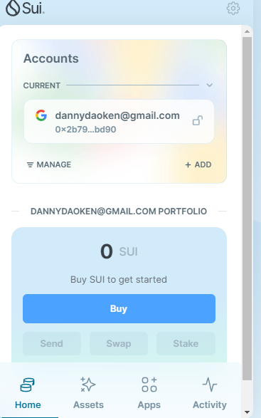
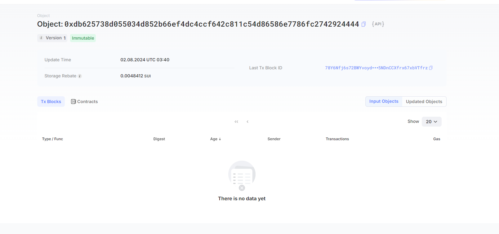
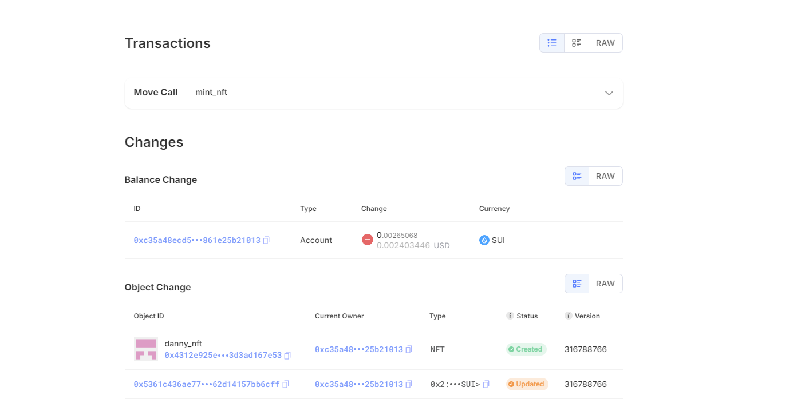

## 基本信息
- Sui钱包地址: `0x2b7945fd143df1abf61be25bb1da566af1a8582156bd779e879aa2261395bd90`
> 首次参与需要完成第一个任务注册好钱包地址才被合并，并且后续学习奖励会打入这个地址
- github: `https://github.com/dannydaoken`

## 个人简介
- 工作经验: 10年
- 技术栈: `java`
> 重要提示 请认真写自己的简介
- 不会solidity，想直接学习move掌握智能合约
- 联系方式: tg: `https://t.me/danny_ken_jun` 

## 任务

##   01 hello move  
- [] Sui cli version: sui 1.30.1
- [] Sui钱包截图: 
- [] package id: 0xdb625738d055034d852b66ef4dc4ccf642c811c54d86586e7786fc2742924444
- [] package id 在 scan上的查看截图:

##   02 move coin
- [] My Coin package id : 0xbcbc8381eeef3f674433761d77f90b40e1d97957e997addbba24614b096871cf
- [] Faucet package id : 0xbcbc8381eeef3f674433761d77f90b40e1d97957e997addbba24614b096871cf
- [] 转账 `My Coin` hash: FFv6TfrJVRAcqcb32cAu51HE8oX2m6ZawVw8cjc94oF7
- [] `Faucet Coin` address1 mint hash: AGtPZ6ihK8pHbKKrcB62vztTAAR5HBXvctXXVsTDocah
- [] `Faucet Coin` address2 mint hash: DYic9jdot1cPFYsgA9zghi4xB3eSiuBqqqjtmjzXxMHZ

##   03 move NFT
- [] nft package id : 0xbfdfac99613211507919e79fe86ca00d7d958bda1a3a16358c9d4caec986e871
- [] nft object id : 0x4312e925e3282a1387330b6c6c94252b2d99a55d037de28add8da3d3ad167e53
- [] 转账 nft  hash: 7R3ops1jgegFmgWC3wubF4JqDxxrsrrPpoYe27MjE4uT
- [] scan上的NFT截图:

##   04 Move Game
- [x] game package id : 0x9e7a2e19bca806c704904e64d08ac625385ada045ecbe8cf7b8ddd69f103ad7f
- [x] deposit Coin hash: 3qYWureG1hK4d3QnhgqdXZ19yzMCiRSPA4zZXxmoX4eQ
- [x] withdraw `Coin` hash: 8GP2PhV7RdsDfjwXi1ymsxFuSK8BshRKJYXdwcyAzcZD
- [x] play game hash: 3GoaMa4t2CZZiREZgHtmDAZgeHFcKbr7YX4DwzAakV5w

##   05 Move Swap
- [x] swap package id : 0x1ecf730ec28c14bb71ecd63a4549d90992b074511d083381ef96e12296c8e315
- [x] call swap CoinA-> CoinB  hash :  1KXApCWP64R2f8HQu2vr5EqK3VXEkyqvcdTeYT7K98U
- [x] call swap CoinB-> CoinA  hash :  FThPxv8JApmzD7WShkor3N5vFrgFxmRSF1CwBDzQXVHP

