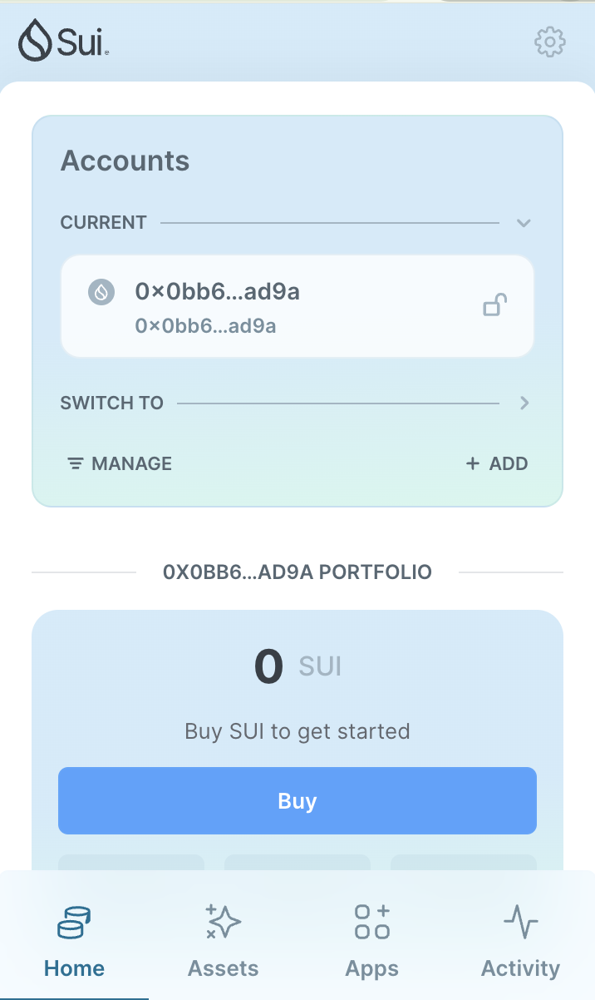
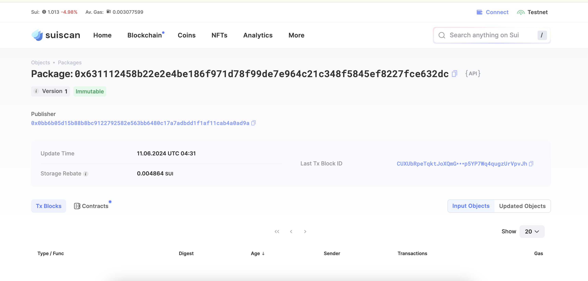

@@ -0,0 +1,28 @@
## 基本信息

- Sui钱包地址: 0x0bb6b05d15b88b8bc9122792582e563bb6480c17a7adbdd1f1af11cab4a0ad9a 

  > 首次参与需要完成第一个任务注册好钱包地址才被合并，并且后续学习奖励会打入这个地址
- github: dashjay

## 个人简介

- 工作经验: 3年
- 技术栈: Golang/Rust
- 刚接触虚拟货币，希望通过move的学习，和大家一起探索Sui的世界
- 联系方式: dashjwz@gmail.com

## 任务

## 01 hello move

- [x] Sui cli version:  1.27.0
- [x] package id: 0x631112458b22e2e4be186f971d78f99de7e964c21c348f5845ef8227fce632dc 
- [x] Sui钱包截图: 
- [x] package id 在 scan上的查看截图:

## 07 move ctf check in

- [x] Transaction Digest: 3Qt32aA6eGCnXdot2FwHCP9cRjZz7VkYEruM4qMPKqxs

## 08 move lets move

- [x] Transaction Digest: 6QhTXMafiwrhdEUEda9Qmyhe3xVRatxw8WqPQMWbhTd1
