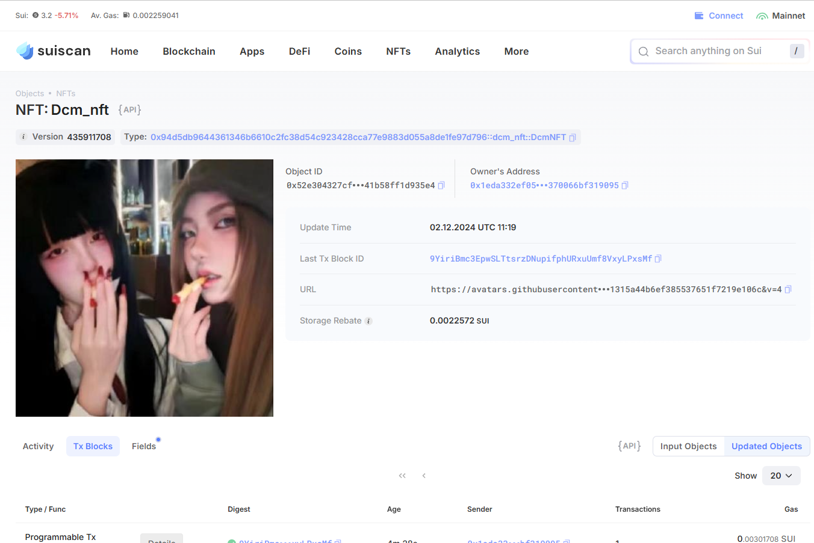
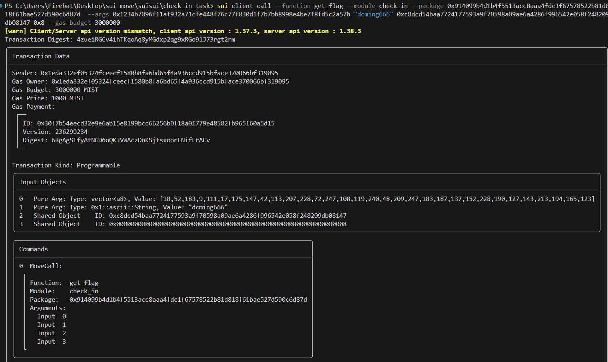

## 基本信息
- Sui钱包地址: `0x1eda332ef05324fceecf1580b8fa6bd65f4a936ccd915bface370066bf319095`
- github: `dcming666`

## 个人简介
- 工作经验: 0年
- 技术栈: `js`
- 想学一门web3开发语言
- 联系方式: github: `dcming666` 

## 任务

##   01 hello move  
- [✓] Sui cli version: sui 1.37.3
- [✓] Sui钱包截图: 
- [✓] package id: 4LeqmaVy5KViW8EeZo9MV2KXJnfB49JzoP1YSXLDxfx9
- [✓] package id 在 scan上的查看截图:

##   02 move coin
- [✓] My Coin package id : 0x72a68fa0606318516b8f5963e428c4e30840dd0116c7a84580809c287241c03a
- [✓] Faucet package id : 0x9071812b707beb845e3e6a2e0f84b5de10ac7503c2bab4f0554178b6b0243397
- [✓] 转账 `My Coin` hash: HuXmrWPX5M3HRNFNfCXkT3yPbsB9xHb3tQLcZxrEFLnL
- [✓] `Faucet Coin` address1 mint hash: Cx3VCRZJ7ef8g8Qy3xAeNKHuXHdtYTmfypakwv54muuS
- [✓] `Faucet Coin` address2 mint hash: 4pczbQS7nfWtEDzSchDFtQB1Q2iQ5c5WEsCuKrHiNZi7

##   03 move NFT
- [✓] nft package id : 0x94d5db9644361346b6610c2fc38d54c923428cca77e9883d055a8de1fe97d796
- [✓] nft object id : 0x52e304327cf27c97b0e88d1898b47a0b1223124593ff50b38541b58ff1d935e4
- [✓] 转账 nft  hash: 6nyuhYqyQxBmckhq4gEvd1xNVojjwVxecTkvawaGsqio
- [✓] scan上的NFT截图:

##   04 Move Game
- [✓] game package id : 0xe883f5887c5c9ab953c169ce25712c876dc8f9487e9b04b9a8f5dbe5fba07504
- [✓] deposit Coin hash: 2q9YRUAkq91jQNdmYfJoux9Mwbcfh7gebUmDqbmYjSJU
- [✓] withdraw `Coin` hash: GqxDtzzVkojHLAfryPy22Vc3AC4xGi1APcVFTnnbikJf
- [✓] play game hash: Ga5FrinJk83DChdJMuakEJrk7zz56odpFxa8yDovT8xy

##   05 Move Swap
- [✓] swap package id : 0x0e8c09f84e480691fe801ff12c27335c36abf817311ca8ee36367c0c9f8bf4be
- [✓] call swap CoinA-> CoinB  hash : AHr6fV3tHu1rQurSstwAMEX8zhRJirbYJwL3DYNsBioB
- [✓] call swap CoinB-> CoinA  hash : Hq8fH8nbfy5Km84WNjKKAkgESHXksAzTpCjtXSbgMmVH

##   06 Dapp-kit SDK PTB
- [] save hash :

##   07 Move CTF Check In
- [✓] CLI call 截图 : 
- [✓] flag hash : 4zueiRGCv4ihTKqoAq8yMGdxp2qg9xRGo91J73rgt2rm

##   08 Move CTF Lets Move
- [] proof : 
- [] flag hash :
