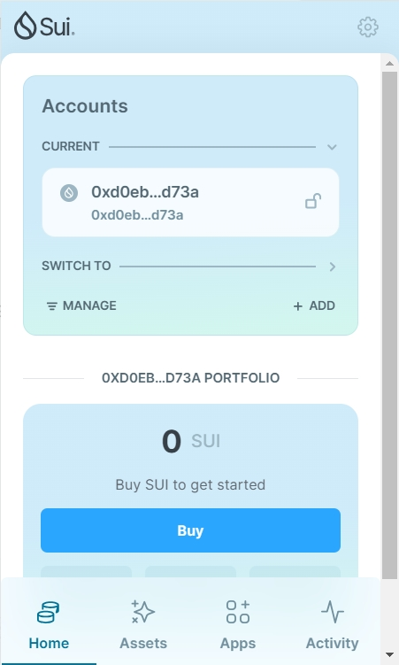
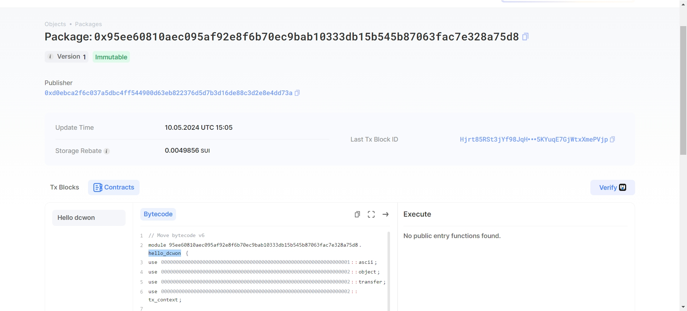
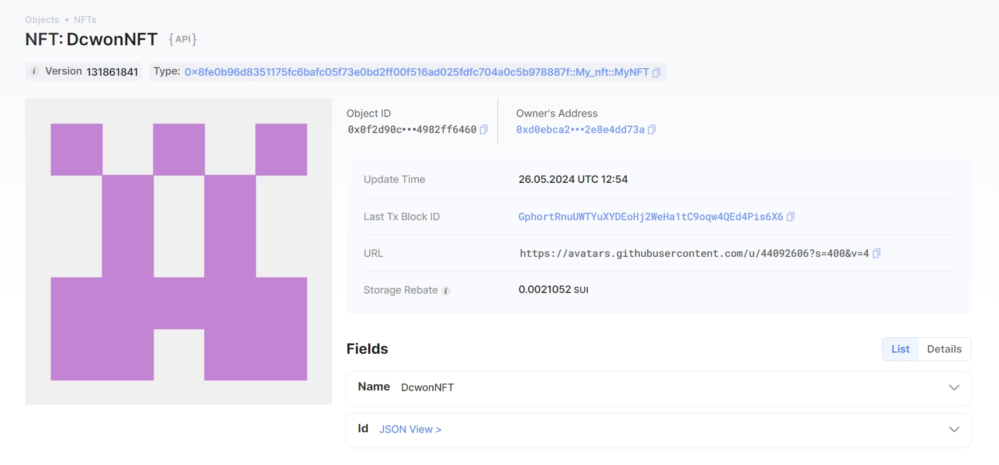

## 基本信息
- Sui钱包地址: `0x93934fc70366e97fbcc30f2d83e5ee7c3661ecfe6b661025542436d1faba1791`
> 首次参与需要完成第一个任务注册好钱包地址才被合并，并且后续学习奖励会打入这个地址
- github: `dcwon`

## 个人简介
- 工作经验: 5年
- 技术栈: `Java` `C/C++` `Rust`
- 多年Android开发经验，对Move特别感兴趣，想通过Move入门区块链
- 联系方式: e-mail: `dc_wgxxx@163.com` 

## 任务

##   01 hello move  
- [] Sui cli version: `sui 1.24.1`
- [] Sui钱包截图: 
- [] package id: 0x95ee60810aec095af92e8f6b70ec9bab10333db15b545b87063fac7e328a75d8
- [] package id 在 scan上的查看截图:

##   02 move coin
- [] My Coin package id : 0x2d41c67a9fd9d5e4a3e5dd917545bf36770b858a763155cc6a0f94adbd2471a0
- [] Faucet package id : 0x0e603bb721b3b1c12aeb5e7e0240c9ff5e2779092e0961455ee93669c78123d0
- [] 转账 `My Coin` hash:7XrqUakSgfztNLFTo8zhByn328DmrsWufPvzSuoxqUez
- [] `Faucet Coin` address1 mint hash:BSiPtLhDa7YCyBCxRTEXzuU66s6sezmiUV4K8gvmufcC
- [] `Faucet Coin` address2 mint hash:C3d7kw6mVgioWSfSaYa1Q7LYVhKMs7yxGvnTnd5Y92nx

##   03 move NFT
- [] nft package id : 0x8fe0b96d8351175fc6bafc05f73e0bd2ff00f516ad025fdfc704a0c5b978887f
- [] nft object id : 0x0f2d90c0961a0cbd7e93a94346bf602f9463591c03858f7b8cdbe34982ff6460
- [] 转账 nft  hash: 8AicjVUeveheHDRo2r9b21xZJmNTucHZcf8Dusi4u6bC
- [] scan上的NFT截图:

##   04 Move Game
- [] game package id : 0xf3cc86549f161364ac7c7f3180199cc4bd95e638154e7b15bfa8d0c885147e68
- [] deposit Coin hash: HJUyq88vC1seWq6PwRu8kV9UmZjjBcU6okNwbaaUv4BG
- [] withdraw `Coin` hash: Ffnd1XZzVR2MV4s11w3AuSvAShsvjaRn13LusZmMdH6n
- [] play game hash: 2xxgX8Faaqys9qLpY1Nk9cjM7GVs3eSMkrFbPDcAwJgu

##   05 Move Swap
- [] swap package id : 0x7ec6c9645e1b43f2944ba4d2467d82b4f5c9ab57dda54987d84faf1ca0f9a3a2
- [] call swap CoinA-> CoinB  hash : CE7vgTpR4ncNFMG7VQhBuDRoJ6UCKuRiqRLKqTmCvFUP
- [] call swap CoinB-> CoinA  hash : 9cciH4LuKXuhNWp8KYj9WC94MMihpeBWA6upBsSJxdep

##   06 SDK PTB
- [] save hash :
