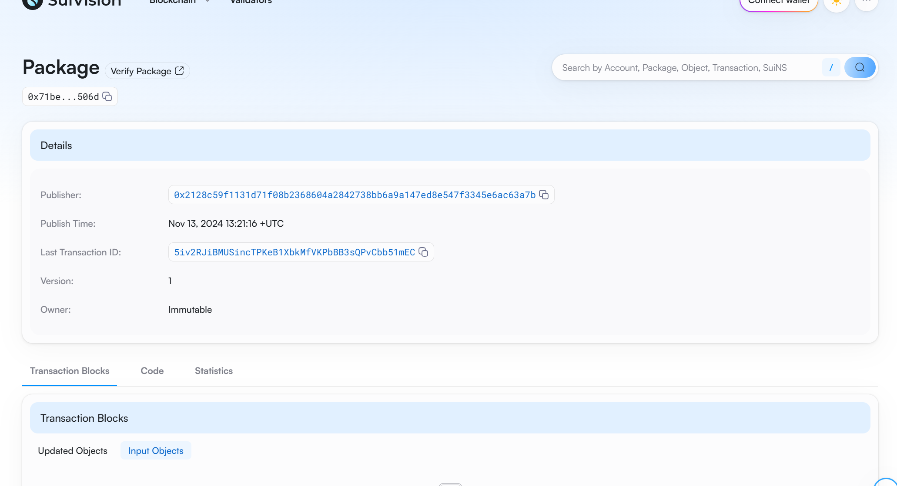

## 基本信息
- Sui钱包地址: `0xfa9c575285d874e7ab35be6e344c8f3a8f27323f2c3ecde09a5e2b13ac0a1bd0`
> 首次参与需要完成第一个任务注册好钱包地址才被合并，并且后续学习奖励会打入这个地址
- github: `ddybhm`

## 个人简介
- 工作经验: 0年
- 技术栈: `Solidity` `C++`
> 重要提示 请认真写自己的简介
- 目前为在校学生，对Move特别感兴趣，想通过Move入门区块链
- 联系方式: WeChat: `观后感` 

## 任务

##   01 hello move  
- [X] Sui cli version:sui 1.36.2-3ada97c109cc
- [X] Sui钱包截图: 
- [X] package id: 0x71be873917426d654c41bdc45539057d4c98a3cdfe3b3da5bac2d23d5000506d
- [X] package id 在 scan上的查看截图:

##   02 move coin
- [X] My Coin package id : 0x8bd76482295b430b7a679564c3a0802a63ea60441bc204f1f6b3bf69b8b20019
- [X] Faucet package id : 0xe942d2cd5d636c32851bd542340a9ca0ef08ae48306683aa7ed88e3169f46919
- [X] 转账 `My Coin` hash:5mHeJWdAPYu9q4iMh8ojQLonvd63ho4yBPKUbVYnLzvU
- [X] `Faucet Coin` address1 mint hash:GpdYaycKgzRuzjuXpMsD9rsATaLRJYuCh9Fp7nkJrzDY
- [X] `Faucet Coin` address2 mint hash:9v7DbrCuujz9XrcatqzcZ8QuRkrWTVE77HD8rJcR7XaH

##   03 move NFT
- [] nft package id :
- [] nft object id : 
- [] 转账 nft  hash:
- [] scan上的NFT截图:

##   04 Move Game
- [] game package id :
- [] deposit Coin hash:
- [] withdraw `Coin` hash:
- [] play game hash:

##   05 Move Swap
- [] swap package id :
- [] call swap CoinA-> CoinB  hash :
- [] call swap CoinB-> CoinA  hash :

##   06 Dapp-kit SDK PTB
- [] save hash :

##   07 Move CTF Check In
- [] CLI call 截图 : 
- [] flag hash :

##   08 Move CTF Lets Move
- [] proof : 
- [] flag hash :
