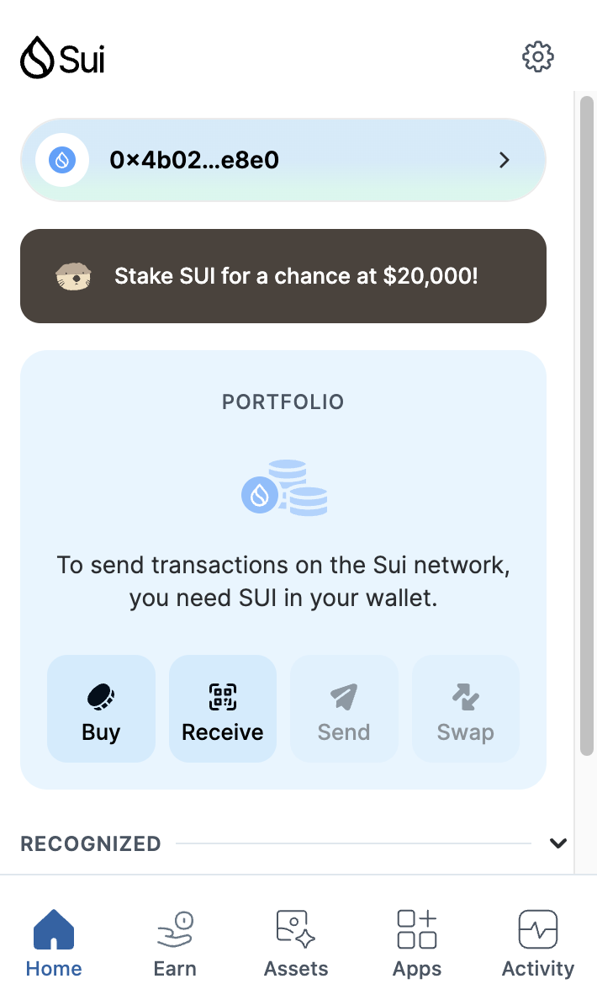

## 基本信息
- Sui钱包地址: `0x4b0223281a8fd7a88a3ef4e8e5aad3f550340ed57af78ed355bad595e1cce8e0`
> 首次参与需要完成第一个任务注册好钱包地址才被合并，并且后续学习奖励会打入这个地址
- github: `debugzhao`

## 个人简介
- 工作经验: 5年
- 技术栈: `Java` `Solidity` `Vue.js` `React.js`
> 重要提示 请认真写自己的简介
- web3新人，5年web2全栈开发经验，对Sui生态特别感兴趣，想通过本次共学了解sui生态，丝滑入门web3。
- 联系方式: tg: `https://t.me/CryptoTysonn` 

## 任务

##   01 hello move  
- [✔️] Sui cli version: sui 1.43.1-homebrew
- [✔️] Sui钱包截图: 
- [✔️] package id: 0xb2058857af533c68c27b7591563a28cf452c2c60050baf7d39e43e6ac3614be3
- [✔️] package id 在 scan上的查看截图: 

##   02 move coin
- [] My Coin package id : 
- [] Faucet package id : 
- [] 转账 `My Coin` hash:
- [] `Faucet Coin` address1 mint hash:
- [] `Faucet Coin` address2 mint hash:

##   03 move NFT
- [] nft package id :
- [] nft object id : 
- [] 转账 nft  hash:
- [] scan上的NFT截图:

##   04 Move Game
- [] game package id :
- [] deposit Coin hash:
- [] withdraw `Coin` hash:
- [] play game hash:

##   05 Move Swap
- [] swap package id :
- [] call swap CoinA-> CoinB  hash :
- [] call swap CoinB-> CoinA  hash :

##   06 Dapp-kit SDK PTB
- [] save hash :

##   07 Move CTF Check In
- [] CLI call 截图 : 
- [] flag hash :

##   08 Move CTF Lets Move
- [] proof : 
- [] flag hash :

