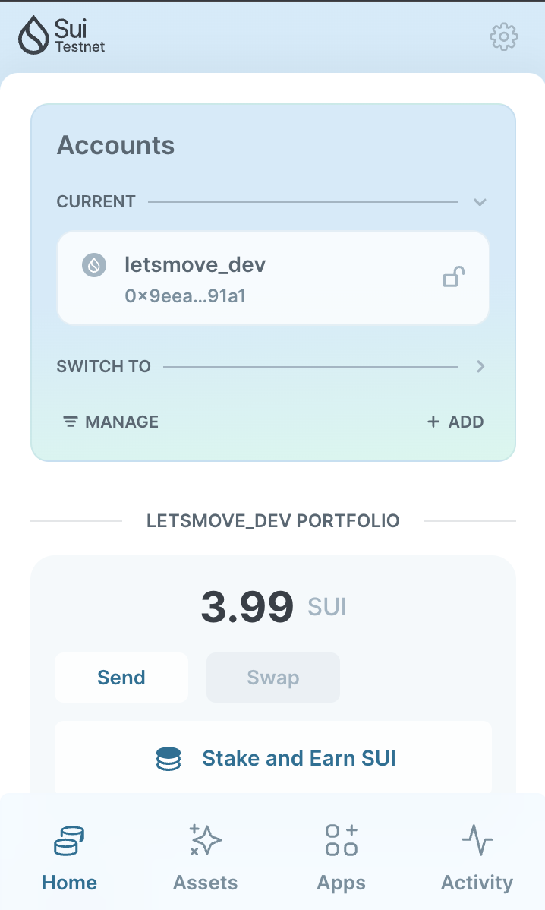
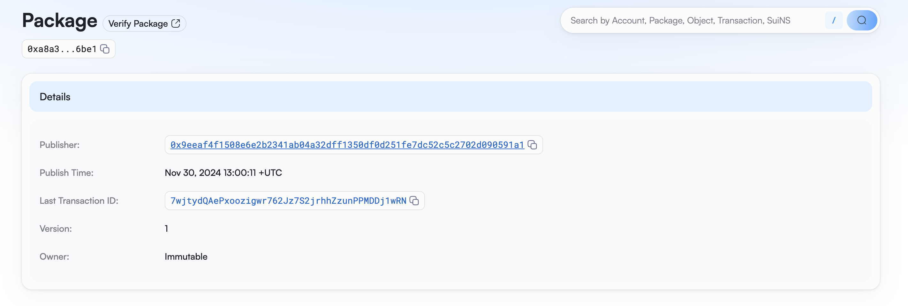

## 基本信息

- Sui钱包地址: `0x9eeaf4f1508e6e2b2341ab04a32dff1350df0d251fe7dc52c5c2702d090591a1`

> 首次参与需要完成第一个任务注册好钱包地址才被合并，并且后续学习奖励会打入这个地址

- github: `destec`

## 个人简介

- 工作经验: 7年
- 技术栈: `TypeScript` `Rust`

> 重要提示 请认真写自己的简介

- 多年 web2/web3 开发经验，对 Move 感兴趣，希望尝试 Move 开发合约
- 联系方式: tg: `https://t.me/zeroxzach`

## 任务

## 01 hello move

- [x] Sui cli version: sui 1.38.2-homebrew
- [x] Sui钱包截图: 
- [x] package id: 0xa8a3da4000d285dde381a8fd689fb4c6ec6f05933ebb84128c8cb9dfd90b6be1
- [x] package id 在 scan上的查看截图:

## 02 move coin

- [] My Coin package id :
- [] Faucet package id :
- [] 转账 `My Coin` hash:
- [] `Faucet Coin` address1 mint hash:
- [] `Faucet Coin` address2 mint hash:

## 03 move NFT

- [] nft package id :
- [] nft object id :
- [] 转账 nft hash:
- [] scan上的NFT截图:

## 04 Move Game

- [] game package id :
- [] deposit Coin hash:
- [] withdraw `Coin` hash:
- [] play game hash:

## 05 Move Swap

- [] swap package id :
- [] call swap CoinA-> CoinB hash :
- [] call swap CoinB-> CoinA hash :

## 06 Dapp-kit SDK PTB

- [] save hash :

## 07 Move CTF Check In

- [] CLI call 截图 : 
- [] flag hash :

## 08 Move CTF Lets Move

- [] proof :
- [] flag hash :

