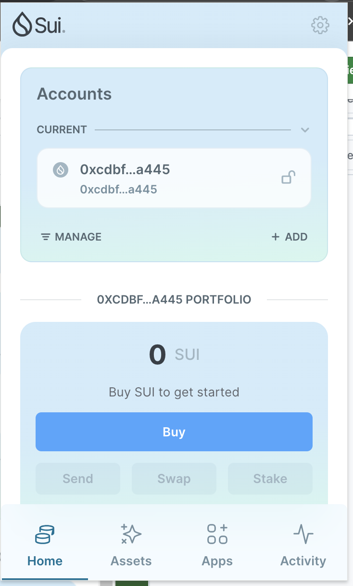
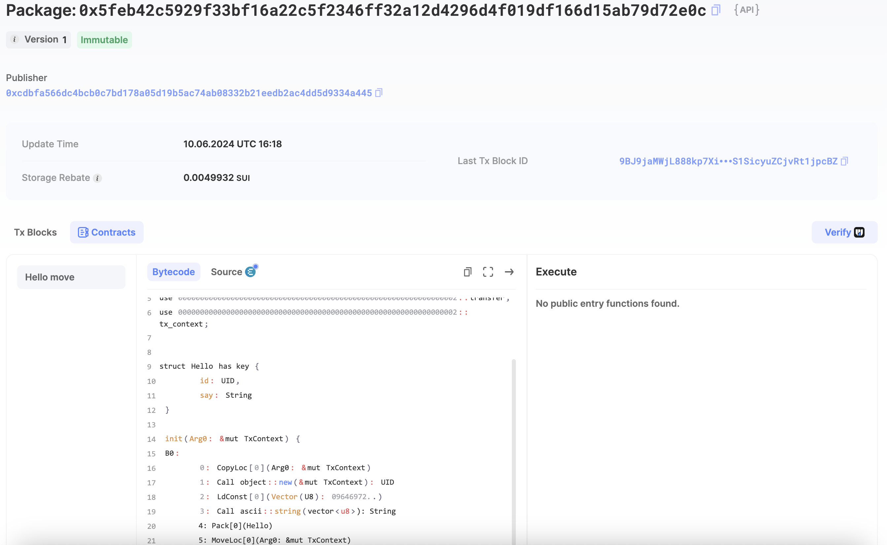
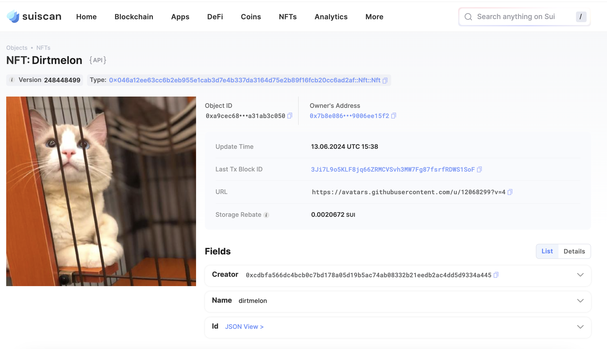
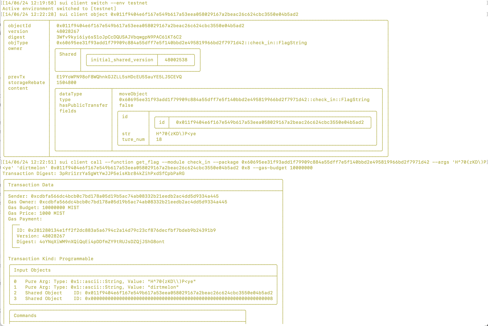

## 基本信息
- Sui钱包地址: 0xcdbfa566dc4bcb0c7bd178a05d19b5ac74ab08332b21eedb2ac4dd5d9334a445
- github: dirtmelon

## 个人简介
- 工作经验: 9 年
- 技术栈: Objective-C/Swift/Ruby
- iOS 开发者， Web3 入门中，日常套利。
- 联系方式: 0xffdirtmelon@gmail.com

## 任务

##   01 hello move  
- [x] Sui cli version: 1.27.0
- [x] Sui钱包截图: 
- [x] package id: 0x5feb42c5929f33bf16a22c5f2346ff32a12d4296d4f019df166d15ab79d72e0c
- [x] package id 在 scan上的查看截图:

##   02 move coin
- [x] My Coin package id : 0x5c090a46e80a50d7b11675e523a9ecfddc45637e7b0e81368dcec9e866a705e5
- [x] Faucet package id : 0xcc716dac46ebe295b199151267e37d46249f6c59803c63a53d0e1623a87ecc5d
- [x] 转账 `My Coin` hash: FXhS3CnKZi9hwVq5qPWf8SWoAkoY85BzdzNPyyDmhBEW
- [x] `Faucet Coin` address1 mint hash: 3QoEoE2Vnz5ZPUkopKvrpMCoxxDCBkHWgnFnDy8fhzXg
- [x] `Faucet Coin` address2 mint hash: 56mHrAwM19ADF3w5QX2vMsRBk8K3Ck5qHumant4APoWK

##   03 move NFT
- [x] nft package id : 0x046a12ee63cc6b2eb955e1cab3d7e4b337da3164d75e2b89f16fcb20cc6ad2af
- [x] nft object id : 0x7cff0dcee42a9777ce68446fe99b5b7d4ca7b5f8bc65344e35b38e6ea9d0d3a8
- [x] 转账 nft  hash: 3Ji7L9o5KLF8jq66ZRMCVSvh3MW7Fg87fsrfRDWS1SoF
- [x] scan上的NFT截图:

##   04 Move Game
- [] game package id :
- [] deposit Coin hash:
- [] withdraw `Coin` hash:
- [] play game hash:

##   05 Move Swap
- [] swap package id :
- [] call swap CoinA-> CoinB  hash :
- [] call swap CoinB-> CoinA  hash :

##   06 Dapp-kit SDK PTB
- [] save hash :

##   07 Move CTF Check In
- [x] CLI call 截图 : 
- [x] flag hash : 3pRri1rrYaSgWtYwJJP5eisKbr84kZihPxdSfCpbPaRG

##   08 Move CTF Lets Move
- [x] proof : 61926947
- [x] flag hash : ctKRgSyz6qDgD8CBzNSdHchnpTWfHRyX4qHWWfi7zh6
