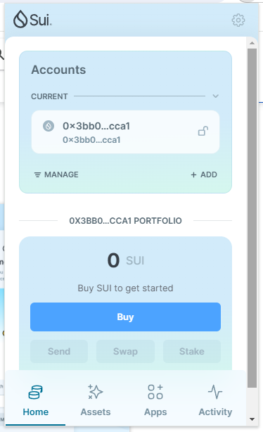
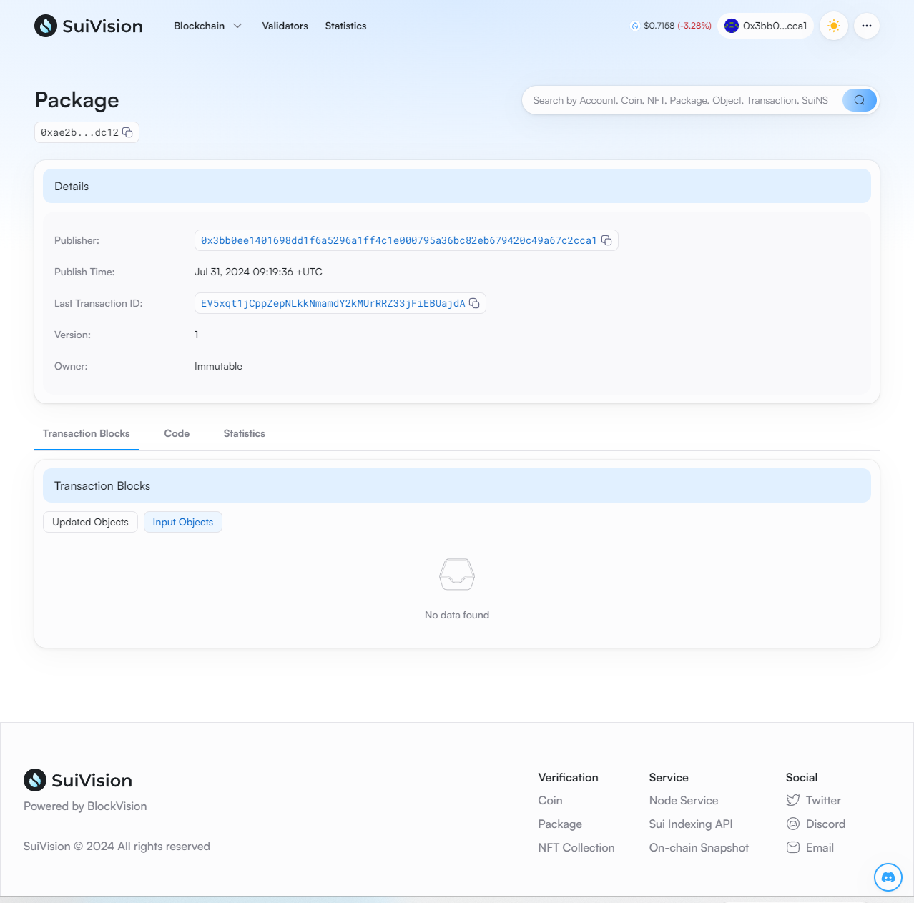
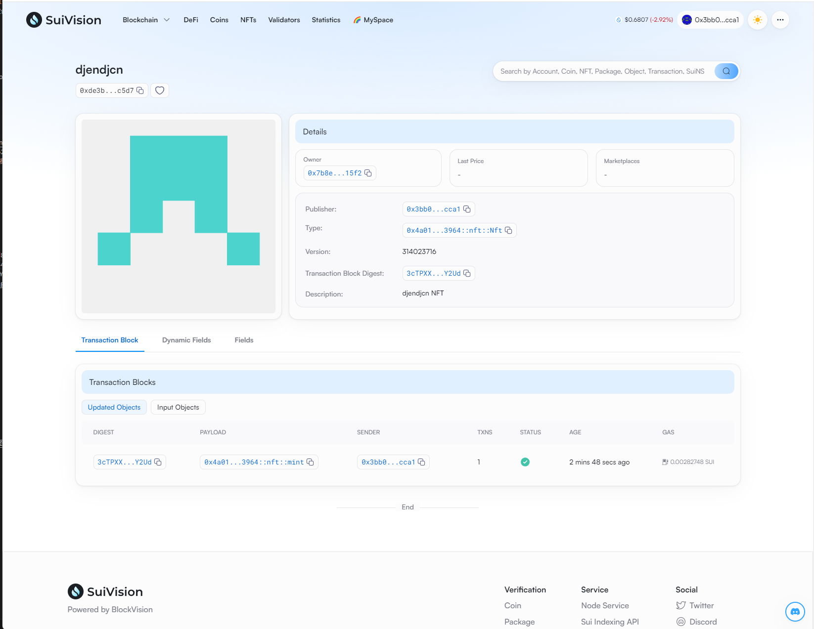

## 基本信息
- Sui钱包地址: `0x3bb0ee1401698dd1f6a5296a1ff4c1e000795a36bc82eb679420c49a67c2cca1`
> 首次参与需要完成第一个任务注册好钱包地址才被合并，并且后续学习奖励会打入这个地址
- github: `djendjcn`

## 个人简介
- 工作经验: 1年
- 技术栈: `JS` `Python`
> 重要提示 请认真写自己的简介
- 多年网页开发经验，对Move特别感兴趣，想通过Move入门区块链
- 联系方式: tg: `David_King429` 

## 任务

##   01 hello move  
- [x] Sui cli version: 1.30.1
- [x] Sui钱包截图: 
- [x] package id:  0xae2b1a9414b088c22fbc6270179da25f1c639454d9e3aa4eec84b0f7c8d6dc12 
- [x] package id 在 scan上的查看截图:

##   02 move coin
- [] My Coin package id : 
- [] Faucet package id : 
- [] 转账 `My Coin` hash:
- [] `Faucet Coin` address1 mint hash:
- [] `Faucet Coin` address2 mint hash:

##   03 move NFT
- [x] nft package id : 0x4a01e79477622269cd815af0093a442111fac8322c61515c61e14f1c3b4b3964
- [x] nft object id : 0xde3b558a2e26c2d72f544e354e32b180aa35dc329f0e351ff78d86a6908fc5d7
- [x] 转账 nft  hash: 3cTPXXNWCu1Yo91wNv9PvYrAwH94oztecVJ5KSkoY2Ud
- [x] scan上的NFT截图:

##   04 Move Game
- [] game package id :
- [] deposit Coin hash:
- [] withdraw `Coin` hash:
- [] play game hash:

##   05 Move Swap
- [] swap package id :
- [] call swap CoinA-> CoinB  hash :
- [] call swap CoinB-> CoinA  hash :

##   06 Dapp-kit SDK PTB
- [] save hash :

##   07 Move CTF Check In
- [x] CLI call 截图 : 
- [x] flag hash : JBtGSWCsHZ5vrmvamSVJZQsHobuNcJeAwTaHc2GnnkJw

##   08 Move CTF Lets Move
- [x] proof : t9tg4
- [x] flag hash : FiKFSf8Zeb7ADGe9JbxoR9qUg8CeK171eM5cQT1PnDYX