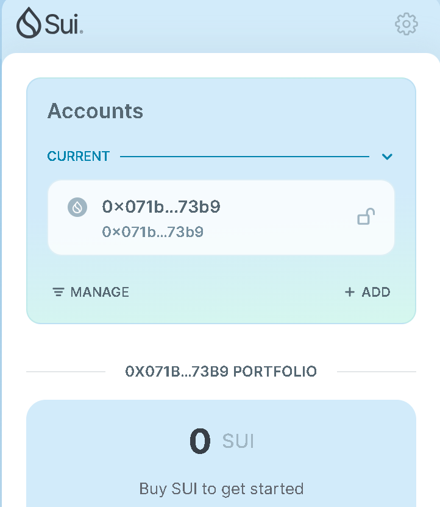
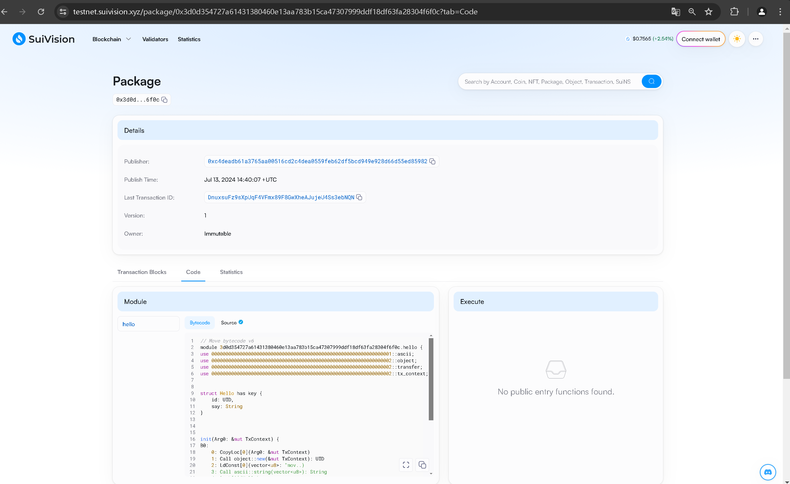

## 基本信息
- Sui钱包地址: `0x071bc8a5cdab2f25b5e26b35e9553205d966a5ee940118452c68f5d218f673b9`
> 首次参与需要完成第一个任务注册好钱包地址才被合并，并且后续学习奖励会打入这个地址
- github: `double-zhou`

## 个人简介
- 工作经验: 2年
- 技术栈: `Rust` `C++` `python` `java` `go` `move`
> 重要提示 请认真写自己的简介
- TYUT大二区块链工程专业学生、努力学习move相关知识ing
- 联系方式: qq: `2784772863`

## 任务

##   01 hello move  
- [x] Sui cli version:sui-client 1.27.0-e5f080922d56-dirty
- [x] Sui钱包截图: 
- [x] package id: 0x3d0d354727a61431380460e13aa783b15ca47307999ddf18df63fa28304f6f0c
- [x] package id 在 scan上的查看截图:

##   02 move coin
- [] My Coin package id : 
- [] Faucet package id : 
- [] 转账 `My Coin` hash:
- [] `Faucet Coin` address1 mint hash:
- [] `Faucet Coin` address2 mint hash:

##   03 move NFT
- [] nft package id :
- [] nft object id : 
- [] 转账 nft  hash:
- [] scan上的NFT截图:

##   04 Move Game
- [] game package id :
- [] deposit Coin hash:
- [] withdraw `Coin` hash:
- [] play game hash:

##   05 Move Swap
- [] swap package id :
- [] call swap CoinA-> CoinB  hash :
- [] call swap CoinB-> CoinA  hash :

##   06 Dapp-kit SDK PTB
- [] save hash :

##   07 Move CTF Check In
- [] CLI call 截图 : 
- [] flag hash :

##   08 Move CTF Lets Move
- [] proof : 
- [] flag hash :
