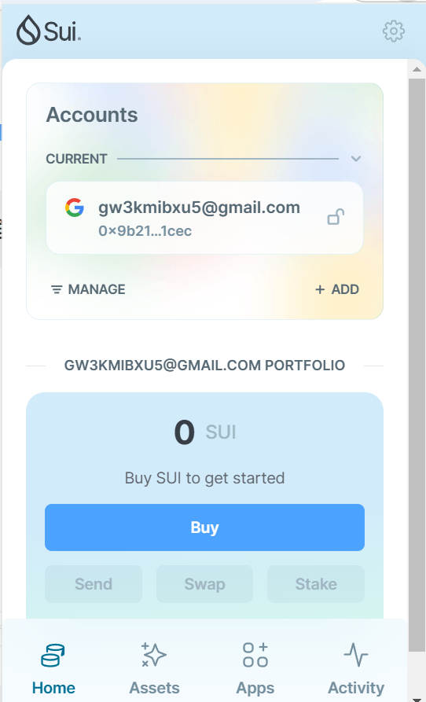
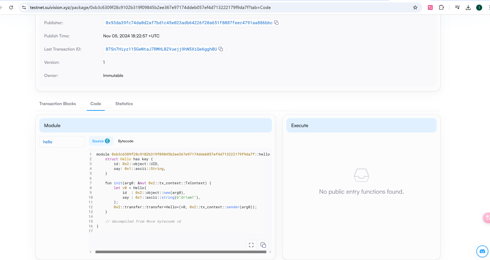
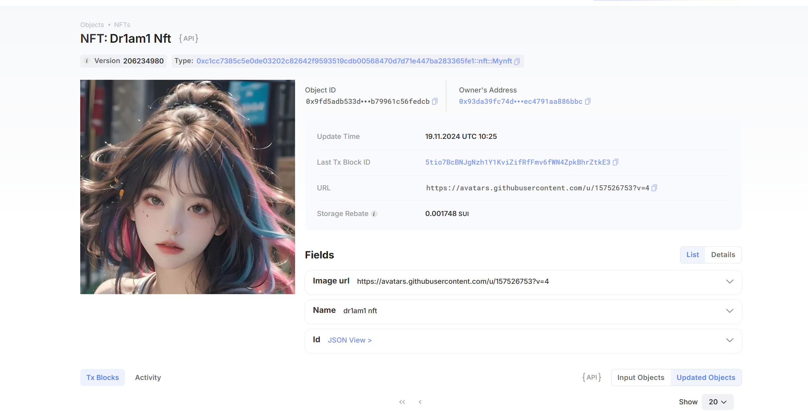

## 基本信息
- Sui钱包地址: `0x9b21534d94d552460fdbd54d254e610b4d4e4bdb54f3189953dc6db9d6391cec`
> 首次参与需要完成第一个任务注册好钱包地址才被合并，并且后续学习奖励会打入这个地址
- github: `dr1am1`

## 个人简介
- 工作经验: 无
- 技术栈: `python`
> 重要提示 请认真写自己的简介
- 无经验，对Move特别感兴趣，想通过Move入门区块链
- 联系方式: tg: `xxx` 

## 任务

##   01 hello move  
- [x] Sui cli version:sui 1.37.1-7839b9501066
- [x] Sui钱包截图: 
- [x] package id: 0xb3c6309f28c9102b319f09845b2ee367e97174ddeb057ef4d713222179f9da7f
- [x] package id 在 scan上的查看截图:

##   02 move coin
- [x] My Coin package id : 0x607b2ed5c2eaf2324b724faddcd279534975103a2abbbac54702a276d2fb79b6
- [x] Faucet package id : 0xf08f1248c39feda7e0cd2ee6b3a29218a5ae66af4da11fa7ddf341f770e033a7
- [x] 转账 `My Coin` hash:GcWET4aNwri7bbXReVmDgHS8rPEjUo4q52Nb3XUQnYVU
- [x] `Faucet Coin` address1 mint hash:4ChxZGyRhBghU8Yyjw6ywpbST4Uh6hXKNNiaMwEiNHnK
- [x] `Faucet Coin` address2 mint hash:7e7e2NAyEKc7W3U7iWy2eQ5ZfVjYpfFUam4uvNsxWfe5

##   03 move NFT
- [x] nft package id :0xf8fcd0bd4a3ebb6cb8fb23ad0e2085f81afdf9d1637060639bd883f98537b0ed
- [x] nft object id : 0x0b6ae6946c5c78bbb233ded46385f834880d97fe408c32197012d0b95a594d72
- [x] 转账 nft  hash:CskTCeBhVTBpuqK1EjvhZnZNhHn4ES3eLUNehQkhJTEy
- [x] scan上的NFT截图:

##   04 Move Game
- [x] game package id :0x62d09ebbdbdc28da1a756fb4b513067436e6448db09a1f0f5522da2af19a1dd5
- [x] deposit Coin hash:4zMWS5At7DyZsvdSndy7fNzPmhXfAQEfBKSbtsdXVYYu
- [x] withdraw `Coin` hash:53zsTT1o6VNdfgzG6v2ypBjSqgiG91f1Jz2QLQZYVR7t
- [x] play game hash:13uQyXWDov88JrAdvDfMFLQJ3Yk8SqXRrQY2aMjfrGhk

##   05 Move Swap
- [x] swap package id :0xe9e48d7743aaf44d44828ee1a50c70bb1ab48f1b4379d733ca9868fcfafc928f
- [x] call swap CoinA-> CoinB  hash :3y5manZ3QdNy5xWqwVib5Tb259sQFNPa1KvAYGdRVGk5
- [x] call swap CoinB-> CoinA  hash :7zaSKtBmfnQZ1yufoFHSnPu4xdZB8ZVz14it2CxySrkT

##   06 Dapp-kit SDK PTB
- [] save hash :

##   07 Move CTF Check In
- [] CLI call 截图 : 
- [] flag hash :

##   08 Move CTF Lets Move
- [] proof : 
- [] flag hash :
