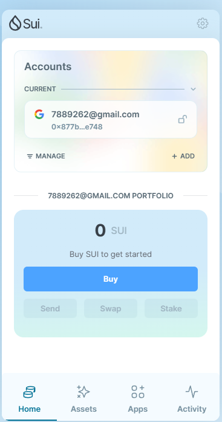
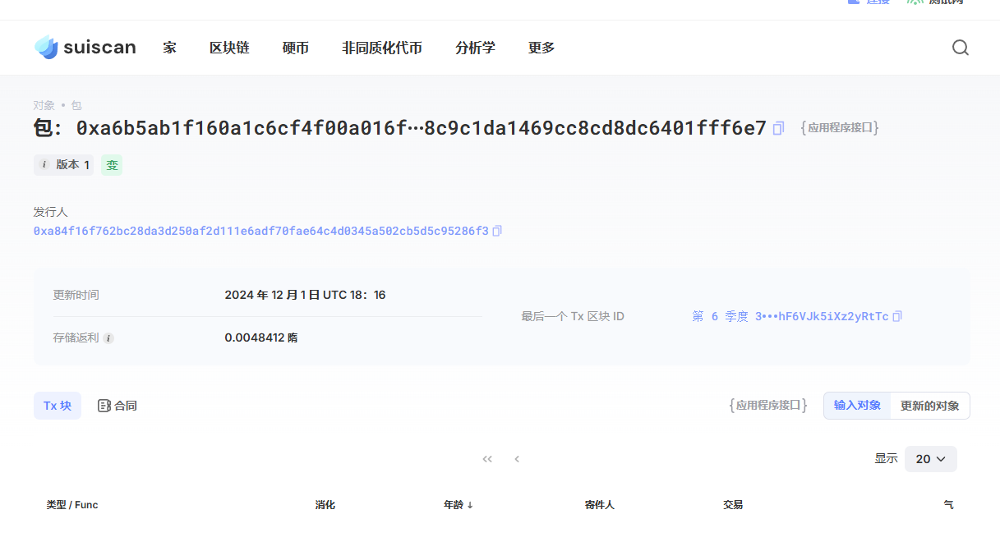

- 基本信息

  - Sui钱包地址: `0xa84f16f762bc28da3d250af2d111e6adf70fae64c4d0345a502cb5d5c95286f3`

  - github: `dravenlove`

  ## 个人简介
  - 工作经验: 3年
  - 技术栈: Erlang,Mysql,C++

  

  - 区块链爱好者，想通过Move理解区块链
  - 联系方式: tg: 'Drdraven'

  ## 任务

  ##   01 hello move  
  - [x] Sui cli version: sui 1.38.2-99fcadf4f738
  - [x] Sui钱包截图: 
  - [x] package id: 0xa6b5ab1f160a1c6cf4f00a016f7b10089848c9c1da1469cc8cd8dc6401fff6e7
  - [x] package id 在 scan上的查看截图:

  ##   02 move coin
  - [] My Coin package id : 
  - [] Faucet package id : 
  - [] 转账 `My Coin` hash:
  - [] `Faucet Coin` address1 mint hash:
  - [] `Faucet Coin` address2 mint hash:
  
  ##   03 move NFT
  - [] nft package id :
  - [] nft object id : 
  - [] 转账 nft  hash:
  - [] scan上的NFT截图:
  
  ##   04 Move Game
  - [] game package id :
  - [] deposit Coin hash:
  - [] withdraw `Coin` hash:
  - [] play game hash:
  
  ##   05 Move Swap
  - [] swap package id :
  - [] call swap CoinA-> CoinB  hash :
  - [] call swap CoinB-> CoinA  hash :
  
  ##   06 Dapp-kit SDK PTB
  - [] save hash :
  
  ##   07 Move CTF Check In
  - [] CLI call 截图 : 
  - [] flag hash :
  
  ##   08 Move CTF Lets Move
  - [] proof : 
  - [] flag hash :
