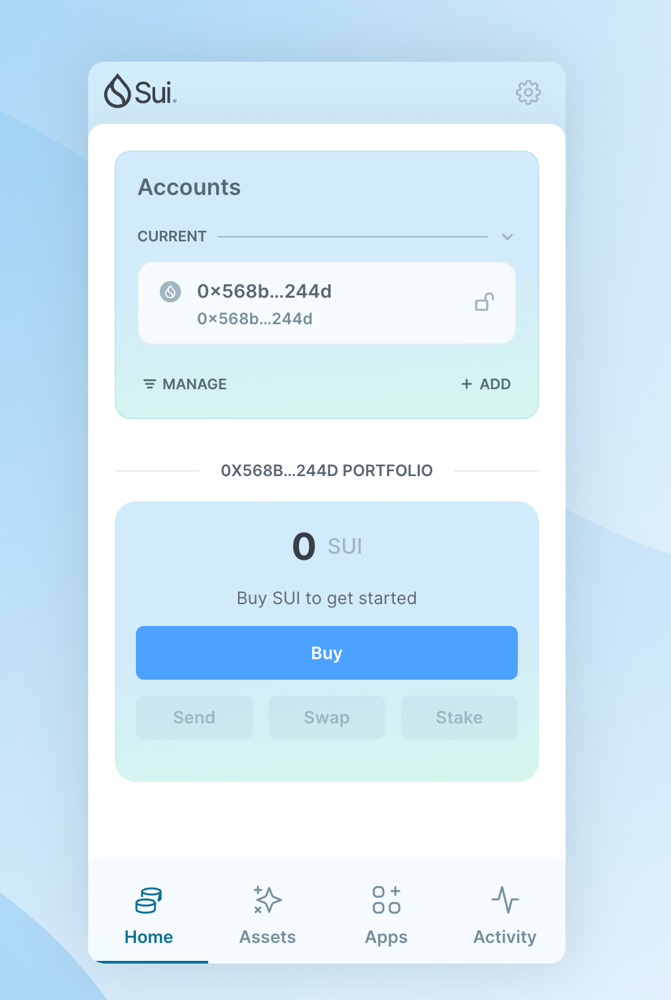
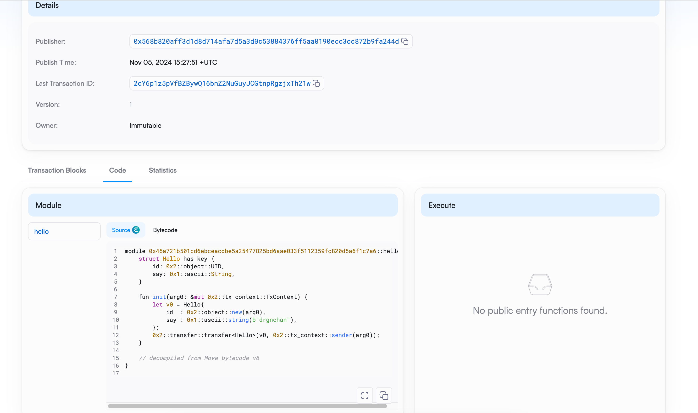

## 基本信息
- Sui钱包地址: `0x568b820aff3d1d8d714afa7d5a3d0c53884376ff5aa0190ecc3cc872b9fa244d`
> 首次参与需要完成第一个任务注册好钱包地址才被合并，并且后续学习奖励会打入这个地址
- github: `drgnchan`

## 个人简介
- 工作经验: 7年
- 技术栈: `Python` `Java`
> 重要提示 请认真写自己的简介
- 多年开发经验，爱好编程，爱好解决问题，爱好折腾。对web3感兴趣，希望能够学习更多的区块链知识
- 联系方式: tg: `coderrrr666` 

## 任务

##   01 hello move  
- [x] Sui cli version: 1.37.1-homebrew
- [x] Sui钱包截图: 
- [x] package id: 0x45a721b501cd6ebceacdbe5a25477825bd6aae033f5112359fc820d5a6f1c7a6
- [x] package id 在 scan上的查看截图:

##   02 move coin
- [x] My Coin package id : 0x20d74d3ad0700d3cc82d8cbe0466c8cf2221f8aaeb20c78c622c9f6dc7bd29e0
- [x] Faucet package id : 0x6c17ecf9a7714468c7c8620dcca817f78b3b4eaea057067ed6861eb01f8b8042
- [x] 转账 `My Coin` hash: 3vuYq8w57dhZtXdxcw4oWguFio8SdzGapcr86oJU1RYf
- [x] `Faucet Coin` address1 mint hash: 9vxvstpVn8C13EgJUFwRvGWShPkVUE6ykmrh3QWpDkHq
- [x] `Faucet Coin` address2 mint hash: Eg2yBtK3kfkEULvDxUVgCeQSrSCDV46F5HB8C7WRpzeC

##   03 move NFT
- [] nft package id :
- [] nft object id : 
- [] 转账 nft  hash:
- [] scan上的NFT截图:

##   04 Move Game
- [] game package id :
- [] deposit Coin hash:
- [] withdraw `Coin` hash:
- [] play game hash:

##   05 Move Swap
- [] swap package id :
- [] call swap CoinA-> CoinB  hash :
- [] call swap CoinB-> CoinA  hash :

##   06 Dapp-kit SDK PTB
- [] save hash :

##   07 Move CTF Check In
- [] CLI call 截图 : 
- [] flag hash :

##   08 Move CTF Lets Move
- [] proof : 
- [] flag hash :
