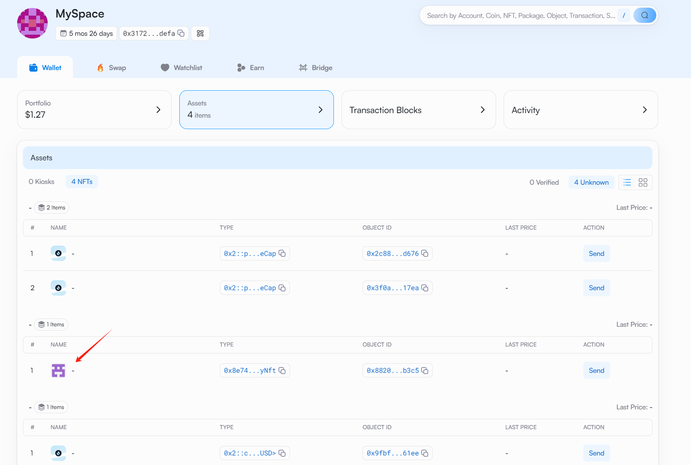

## 基本信息
- Sui钱包地址: `0x6412e68f927769001cf9dd0d4934f1b05f5a57db206bdd8f6dd75180cc00bb55`
> 首次参与需要完成第一个任务注册好钱包地址才被合并，并且后续学习奖励会打入这个地址
- github: `dryan86`

## 个人简介
- 工作经验: 13年
- 技术栈: `Rust` `C++` `Typescript` `react` `cocos creator`
> 重要提示 请认真写自己的简介
- 多年游戏前端开发经验，最近开始用react写前端网站，对Move特别感兴趣，想通过Move入门区块链
- 联系方式: tg: `https://t.me/nailio11` 

## 任务

##   01 hello move  
- [✓] Sui cli version: sui 1.45.0-3ef5cc5b5c90
- [✓] Sui钱包截图: 
- [✓] package id: 0x6a60bf25291db67718f6bf026901f6db0c0bf2ddd54aeb8d623051eec7c41a92
- [✓] package id 在 scan上的查看截图:

##   02 move coin
- [✓] My Coin package id : 0xe7194fd262ad3f6b8df3adf4817eeda0f2a230092934afcc1c41013e83212d4d
- [✓] Faucet package id : 0xe7194fd262ad3f6b8df3adf4817eeda0f2a230092934afcc1c41013e83212d4d
- [✓] 转账 `My Coin` hash: 8q6WZdNnCUeE8AzZNee1o7F3MrmLtQHyRx6gMyXgpSNq
- [✓] `Faucet Coin` address1 mint hash: CEui2ZDx6xHTqRjyvX69q7h6QdJ7in2wegVoi7k6tA4N
- [✓] `Faucet Coin` address2 mint hash: C7XscRAkjT1rXdeFnP4zGPSwpuH2KehQ71La2XhAnaHp

##   03 move NFT
- [✓] nft package id : 0x8e748e6679597f3aa53f34f526b2c5c26a55a4b0e79162a65c72c9020541d857
- [✓] nft object id : 0x8820c9868537667b2b79245d309584f109db9dd61aaae21db24499cd6d57b3c5
- [✓] 转账 nft  hash: HgwJMdCrWAooEchDgBgnoQZhYVXBuBaNNXWHZ3icuuhy
- [✓] scan上的NFT截图:

##   04 Move Game
- [✓] game package id : 0x618b181fa669616a2e3575e48e944fcad6012b31703ede147d290d1d652eac0f
- [✓] deposit Coin hash: CbXN1a3NFMVdjsyCFSevqpYiUExba3jyhwx5xFUr7w9
- [✓] withdraw `Coin` hash: 8sxhYADdtbxfbtGE6QGZHXZdm3jVDAX99Gf299vXZJgy
- [✓] play game hash: C5z6T7hRjiCaNmxg4t1rkJzfwWhvoUoH6NEXddNzsPyV

##   05 Move Swap
- [✓] swap package id : 0x70071999007b74942a03cc615266cdb7f320212d5b91b4ff2003c0455fdd4723
- [✓] call swap CoinA-> CoinB  hash : Ch3fKrhAcbQYuvvb7bhGaimY8vV8ucSq7vfBQmLF1fMn
- [✓] call swap CoinB-> CoinA  hash : 2JePRHhFwLRTCob6dGVy7D9fNaWJGSS4Zh3gmuHGojQN

##   06 Dapp-kit SDK PTB
- [] save hash :

##   07 Move CTF Check In
- [] CLI call 截图 : 
- [] flag hash :

##   08 Move CTF Lets Move
- [] proof : 
- [] flag hash :

