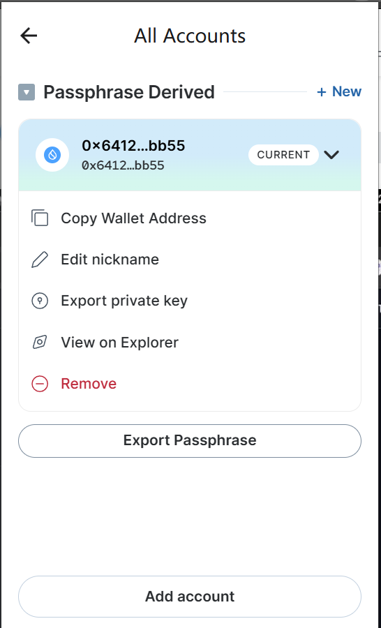
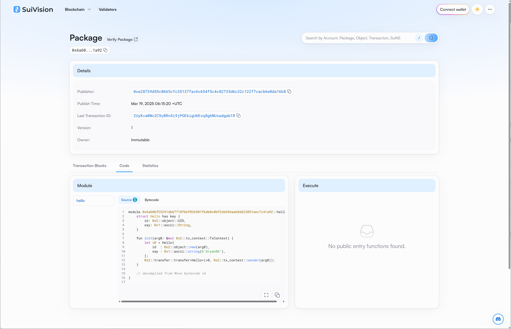

## 基本信息
- Sui钱包地址: `0x6412e68f927769001cf9dd0d4934f1b05f5a57db206bdd8f6dd75180cc00bb55`
> 首次参与需要完成第一个任务注册好钱包地址才被合并，并且后续学习奖励会打入这个地址
- github: `dryan86`

## 个人简介
- 工作经验: 13年
- 技术栈: `Rust` `C++` `Typescript` `react` `cocos creator`
> 重要提示 请认真写自己的简介
- 多年游戏前端开发经验，最近开始用react写前端网站，对Move特别感兴趣，想通过Move入门区块链
- 联系方式: tg: `https://t.me/nailio11` 

## 任务

##   01 hello move  
- [✓] Sui cli version: sui 1.45.0-3ef5cc5b5c90
- [✓] Sui钱包截图: 
- [✓] package id: 0x6a60bf25291db67718f6bf026901f6db0c0bf2ddd54aeb8d623051eec7c41a92
- [✓] package id 在 scan上的查看截图:

##   02 move coin
- [] My Coin package id : 
- [] Faucet package id : 
- [] 转账 `My Coin` hash:
- [] `Faucet Coin` address1 mint hash:
- [] `Faucet Coin` address2 mint hash:

##   03 move NFT
- [] nft package id :
- [] nft object id : 
- [] 转账 nft  hash:
- [] scan上的NFT截图:

##   04 Move Game
- [] game package id :
- [] deposit Coin hash:
- [] withdraw `Coin` hash:
- [] play game hash:

##   05 Move Swap
- [] swap package id :
- [] call swap CoinA-> CoinB  hash :
- [] call swap CoinB-> CoinA  hash :

##   06 Dapp-kit SDK PTB
- [] save hash :

##   07 Move CTF Check In
- [] CLI call 截图 : 
- [] flag hash :

##   08 Move CTF Lets Move
- [] proof : 
- [] flag hash :

