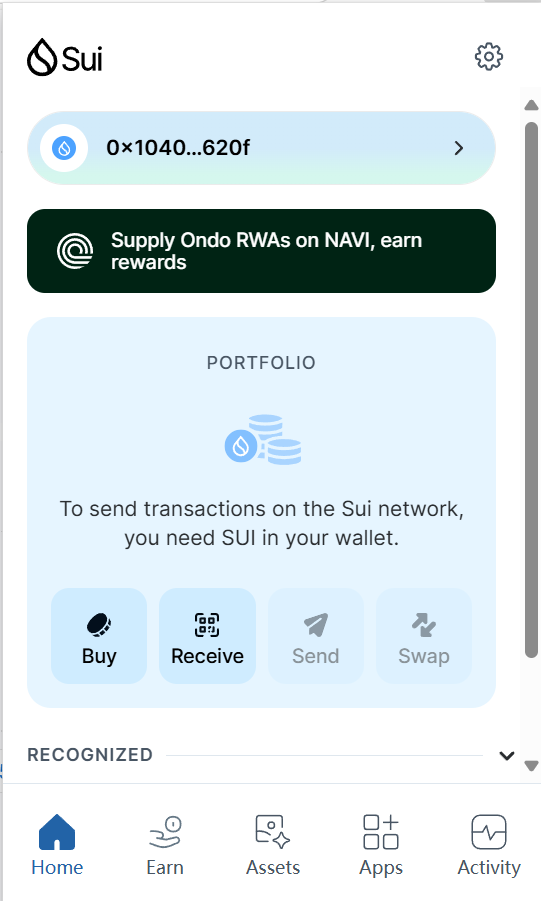
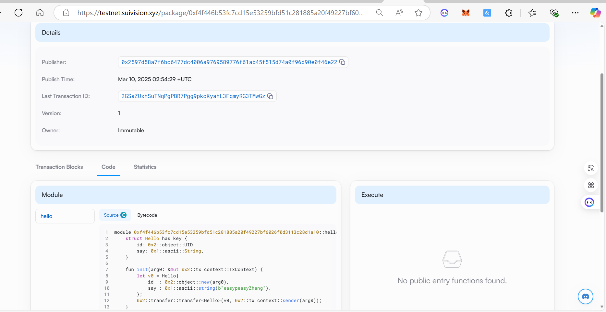

## 基本信息
- Sui钱包地址: `0x1040e95fbb3f032f9d72a071532bbd25b1cb797440c434011d7383bbacec620f`
> 首次参与需要完成第一个任务注册好钱包地址才被合并，并且后续学习奖励会打入这个地址
- github: `easypeasyZhang`

## 个人简介
- 工作经验: 1年
- 技术栈: `python` `Java` `aircgis`
> 重要提示 请认真写自己的简介
- 对Move特别感兴趣，想通过Move入门区块链
- 联系方式: tg: `17745159607` 

## 任务

##   01 hello move  
- [√] Sui cli version: 1.44.2-homebrew
- [√] Sui钱包截图: 
- [√] package id: 0xf4f446b53fc7cd15e53259bfd51c281885a20f49227bf6026f0d3113c28d1a10
- [√] package id 在 scan上的查看截图:

##   02 move coin
- [] My Coin package id : 
- [] Faucet package id : 
- [] 转账 `My Coin` hash:
- [] `Faucet Coin` address1 mint hash:
- [] `Faucet Coin` address2 mint hash:

##   03 move NFT
- [] nft package id : 
- [] nft object id : 
- [] 转账 nft  hash: 
- [] scan上的NFT截图:

##   04 Move Game
- [] game package id :
- [] deposit Coin hash:
- [] withdraw `Coin` hash:
- [] play game hash:

##   05 Move Swap
- [] swap package id :
- [] call swap CoinA-> CoinB  hash :
- [] call swap CoinB-> CoinA  hash :

##   06 Dapp-kit SDK PTB
- [] save hash :

##   07 Move CTF Check In
- [] CLI call 截图 : 
- [] flag hash :

##   08 Move CTF Lets Move
- [] proof : 
- [] flag hash :

