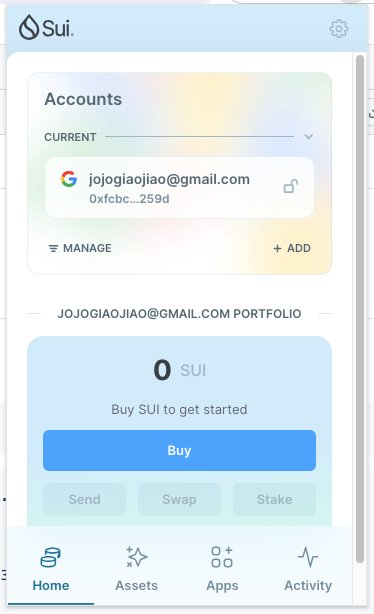
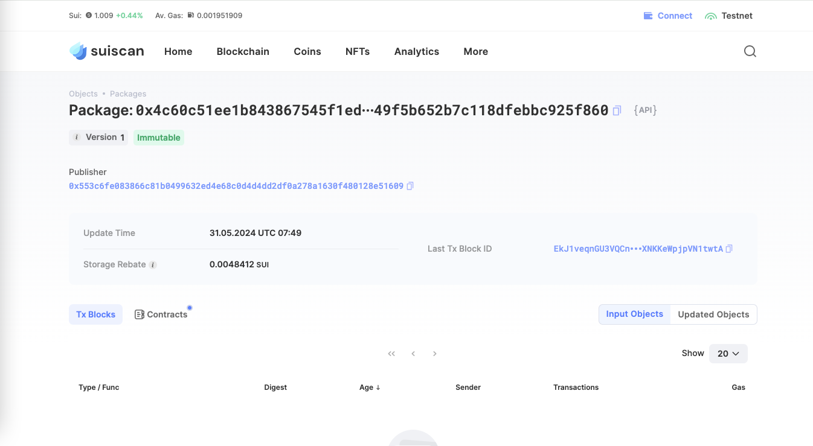
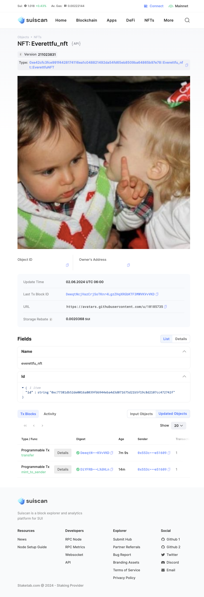

## 基本信息
- Sui钱包地址: `0xd42188ca0d0541b96b590cc3628319e498c5e777e26147da8b86a18d16f60d0f`
> 首次参与需要完成第一个任务注册好钱包地址才被合并，并且后续学习奖励会打入这个地址
- github: `everettfu`

## 个人简介
- 工作经验: 6年
- 技术栈: `Typescript` `React` `Rust`
> 重要提示 请认真写自己的简介
- 多年web2开发经验，对Move特别感兴趣，想通过Move入门区块链
- 联系方式: tg: `evere2t` 

## 任务

##   01 hello move  
- [] Sui cli version: 1.26.0-homebrew
- [] Sui钱包截图: 
- [] package id: 0x4c60c51ee1b843867545f1ed157d48988ab0949f5b652b7c118dfebbc925f860
- [] package id 在 scan上的查看截图:

##   02 move coin
- [] My Coin package id : 0xdb72c319d00dbffb1df12aef51e7ffca3a3254d986fc53e4ef410f0f452bb48f
- [] Faucet package id : 0xdb72c319d00dbffb1df12aef51e7ffca3a3254d986fc53e4ef410f0f452bb48f
- [] 转账 `My Coin` hash: 38AeAbWwz6APC3Gk2Cm7aHeDCdeZa4LDCpW5a4RAibAF
- [] `Faucet Coin` address1 mint hash: 0x78823689ce59d6d01ae2f8f210e96efe14c10cee8324f7dda25b9237849c97e6
- [] `Faucet Coin` address2 mint hash: 0xf7341f9a63e4a8720ba40130c30496d5804784141073b0b49533a8145b6b35f3

##   03 move NFT
- [] nft package id : 0xe42cfc3fce991f4428174116ea1c048821492da54fd65eb8509ba64865b97e78
- [] nft object id : 0xc77381db52de0016a8039fbb944eba4d3d071675d21b5f19c8d2107cc472742f
- [] 转账 nft  hash: DeeqtNcjVazCrjSoTKnr4LgzZHqXRGbKTF3MWVKVvVKD
- [] scan上的NFT截图:

##   04 Move Game
- [] game package id :
- [] deposit Coin hash:
- [] withdraw `Coin` hash:
- [] play game hash:

##   05 Move Swap
- [] swap package id :
- [] call swap CoinA-> CoinB  hash :
- [] call swap CoinB-> CoinA  hash :

##   06 Dapp-kit SDK PTB
- [] save hash :
