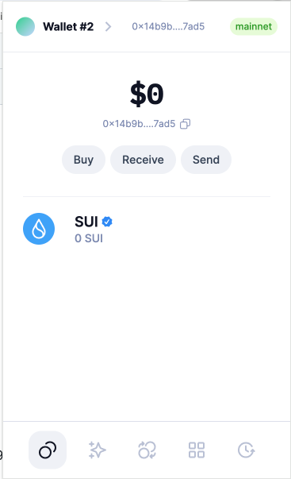
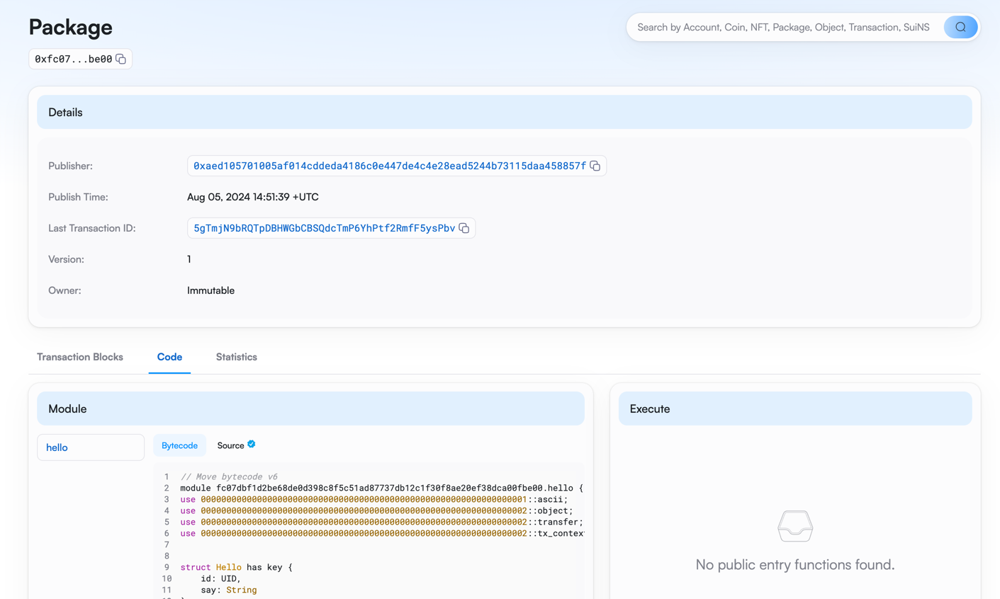
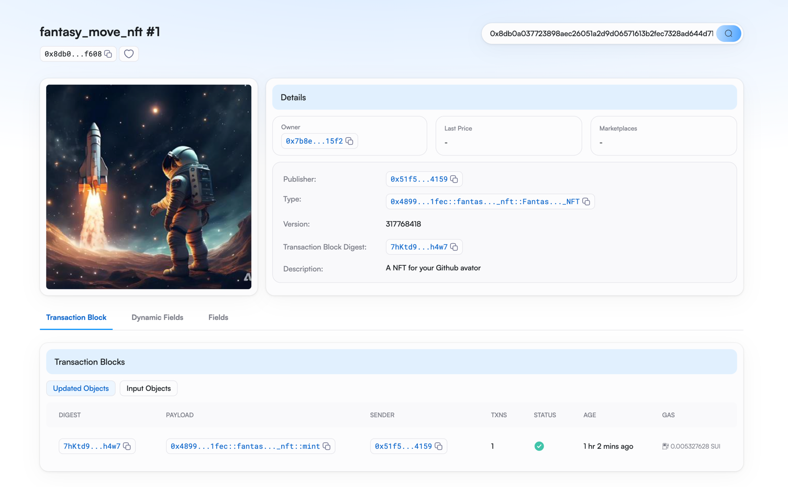
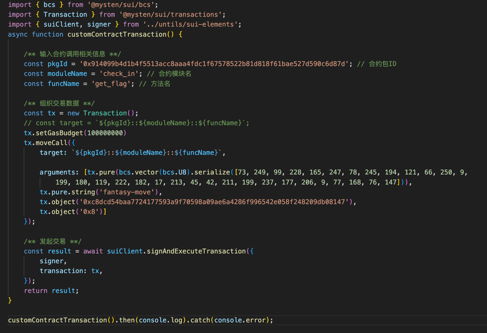

## 基本信息
- Sui钱包地址: `0x14b9b2f649cf06e8446a0c3fab430df2b3d0c7d150d0c298cf052464c50a7ad5`
> 首次参与需要完成第一个任务注册好钱包地址才被合并，并且后续学习奖励会打入这个地址
- github: `fantasy-move`

## 个人简介
- 工作经验: 10年
- 技术栈:  `java, js, python` 
- 全栈开发，特别想从事web3发展
- 联系方式: tg: ``

## 任务

##   01 hello move
- [] Sui cli version: sui 1.30.1-a4185da5659d
- [] Sui钱包截图: 
- [] package id: 0xfc07dbf1d2be68de0d398c8f5c51ad87737db12c1f30f8ae20ef38dca00fbe00
- [] package id 在 scan上的查看截图:

##   02 move coin
- [] My Coin package id : 0x0974a9bf85d2268c61cf4f03c8b0f29a262b743dd72bd1e17886deaed5dd5a2b
- [] Faucet package id : 0x398797282df10e8b79f10cf4d2d8c1090c70be652b76e6efda5ed9cef6dd126c
- [] 转账 `My Coin` hash: 9BchTHHAgCR27E8CYYJ6PZZSVV5EZGSjZ558iFxvDY3z
- [] `Faucet Coin` address1 mint hash: DHX2bgcLx7ZA6Pw78PePvEBQczYD6oLvQE6iJM3LPgdg
- [] `Faucet Coin` address2 mint hash: EXao7XJfpm3grXXjNs2i4EgLZ21B5gqEJESBgPoHWgKM

##   03 move NFT
- [] nft package id : 0x48996d932c68a52f5eb5d3ef7c1ccd88cf2c9e652d44bf00eee8f0c29f481fec
- [] nft object id : 0x3451396e76bb37b1875a9bac8074386016d5bff589d0071b0b4a2380e49f2eb9
- [] 转账 nft  hash: 7hKtd9DUf38SSQym6fJBQYPSBCX7hMPy5w28eBxzh4w7
- [] scan上的NFT截图: 

##   04 Move Game
- [] game package id : 0xdb5804b3ac41f8b1e9266cf2b70fade97114e24cd24886ad43a4ccd36fdae85b
- [] deposit Coin hash: 5q33v49BRawz7ddZXK5nGTJ2knX9kXD21GSYjysNWEkR
- [] withdraw `Coin` hash: DmPiU6j9A3HthRVrya3SY4HvMmwHaSn2zQpKL2WoXckt
- [] play game hash: 测试网[2rpXUd5pC6WZFZusUWENRPsJ6iU4wbXSESopg4xj3NuN](https://testnet.suivision.xyz/txblock/2rpXUd5pC6WZFZusUWENRPsJ6iU4wbXSESopg4xj3NuN)

##   05 Move Swap
- [] swap package id : 0xe4c8081458ea1a68fde7d7f049ce2bc53e0b864785e7203463a5d632fcaf7038
- [] call swap CoinA-> CoinB  hash : 3jKTy5DX23kwbLZw4TiTmg4PgcfQJvntsFVCu6D8nNR7
- [] call swap CoinB-> CoinA  hash : 9ij7sGkr4B7JrxHj7gTVPvhcgekzsVy3TumPuaNpmaPT

##   06 Dapp-kit SDK PTB
- [] save hash : AxWkMxRZ1AuPWKKMFEbrWiWZqWMfWzKevfjrSJcmFJoS

##   07 Move CTF Check In
- [] CLI call 截图 : 
- [] flag hash : GKAMe88qD4JKqAgJGgmrbf66QuNsTCtvSj6dNKvUS7F4

##   08 Move CTF Lets Move
- [] proof : [25,138,83,5,0,0,0,0]
- [] flag hash : 6tReFbfhieAqKG1jZrLYp6fujigPSKwBDcWs3wsioqzH
