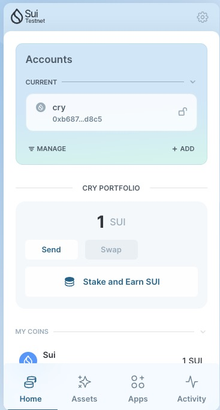
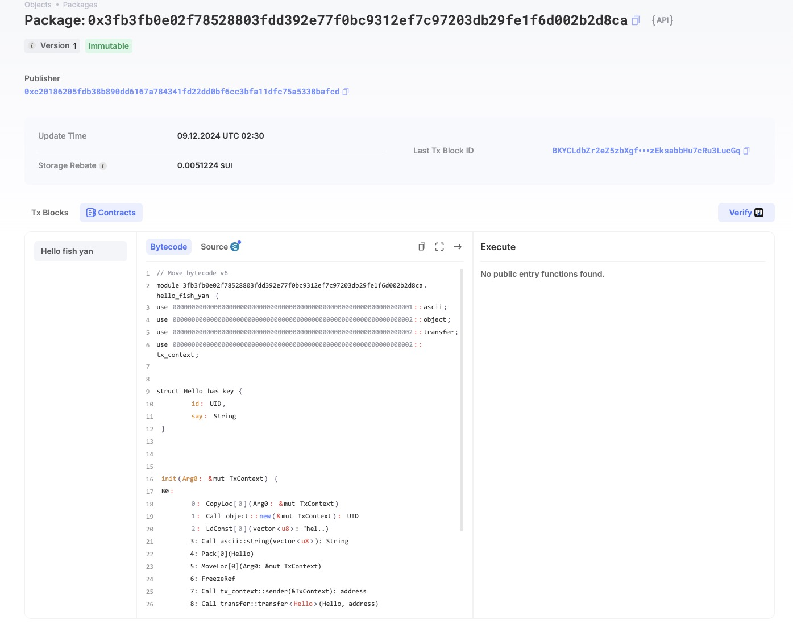
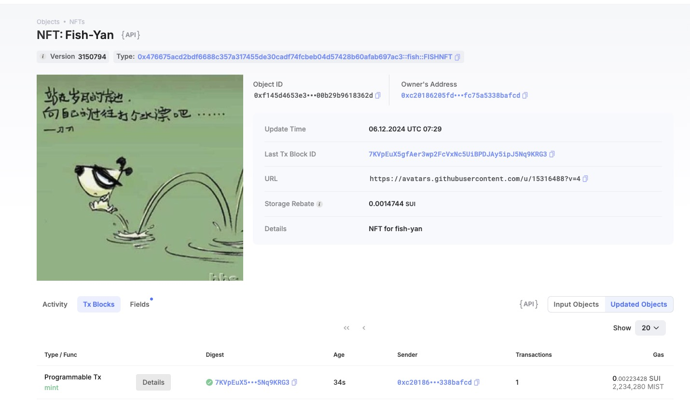

## 基本信息
- Sui钱包地址: `0xc20186205fdb38b890dd6167a784341fd22dd0bf6cc3bfa11dfc75a5338bafcd`
> 首次参与需要完成第一个任务注册好钱包地址才被合并，并且后续学习奖励会打入这个地址
- github: `fish-yan`

## 个人简介
- 工作经验: 10年
- 技术栈: `Swift` `Objective-c` `js`
> 重要提示 请认真写自己的简介
- 7年web2开发经验，3年web3钱包开发经验，对Move特别感兴趣，想通过Move入门区块链
- 联系方式: tg: `@fish_yan` 

## 任务

##   01 hello move  
- [] Sui cli version: sui 1.38.3-homebrew
- [] Sui钱包截图: 
- [] package id: `0x3fb3fb0e02f78528803fdd392e77f0bc9312ef7c97203db29fe1f6d002b2d8ca`
- [] package id 在 scan上的查看截图:

##   02 move coin
- [] My Coin package id : `0x8b356127915437d3a1f2b80e3209775e79aeb08d4a0c5bcfba36187913912726`
- [] Faucet package id : `0x46a5b42763675e5032e2e89bcb8ed0944d1e7b2e39138e784813178ec1a18e51`
- [] 转账 `My Coin` hash: `6eZihPMkGHR6i8gSJ9zPWzkt9VZdkBVxkFrG8yX7N7R6`
- [] `Faucet Coin` address1 mint hash: `4YCwXNb2ShaqN56GzRzcprzjM2Pv3xuKbFp22EyTfSM7`
- [] `Faucet Coin` address2 mint hash: `4tJT4mtby1YMvrACrbJ7NSjZKqqHKsUjUunLNnpocnWM`

##   03 move NFT
- [] nft package id : `0x476675acd2bdf6688c357a317455de30cadf74fcbeb04d57428b60afab697ac3`
- [] nft object id : `0xf145d4653e39feaaa09870ba6d0022085cb447a37bcf3f13f300b29b9618362d`
- [] 转账 nft  hash: `3xe4qKxdJ4MWc8NwF96STPnsJWiKNhTYpor2VrwUmAiA`
- [] scan上的NFT截图:

##   04 Move Game
- [] game package id : `0xd184632ebf05fa28b23e46ae5d6306c70a7badbe4a01a45896608e197ac8fe52`
- [] deposit Coin hash: `5figMDazXxpjEBAX7yit3M88JKBth7yqakv8Ak5wwrEz`
- [] withdraw `Coin` hash: `GzGU66rRJMXhSw4oS5bfDLfixbtGhHYhpgWCqSMyZSVD`
- [] play game hash: `DavFCciN4XLHrSW5SqWtgKMkccNFNjqwbL29qSWZqpyi`

##   05 Move Swap
- [] swap package id : `0x7426072f30841b586761b57a6578b2cd2019975f67176319545d55db0b09036e`
- [] call swap CoinA-> CoinB  hash : `8dM6cxz8atADhFBxkm78bqUmay8SxxMXyPTNG5KBJiBd`
- [] call swap CoinB-> CoinA  hash : `AWhuB4mH7ymkXRSRt7BDdKkcBSxZMKCU7xbGjxFktn2m`

##   06 Dapp-kit SDK PTB
- [] save hash :

##   07 Move CTF Check In
- [] CLI call 截图 : 
- [] flag hash :

##   08 Move CTF Lets Move
- [] proof : 
- [] flag hash :

