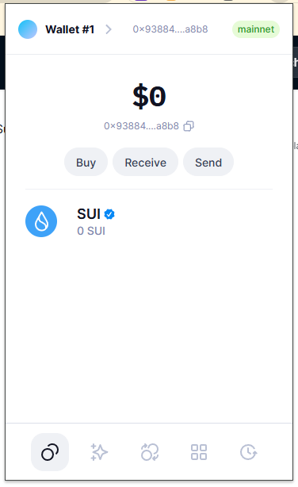
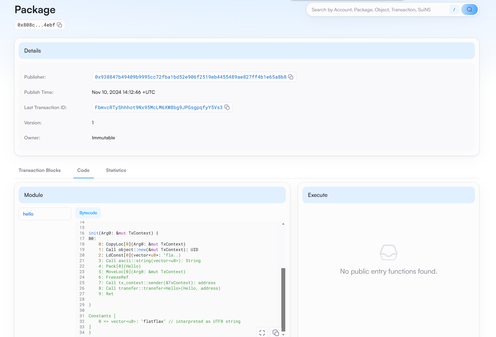
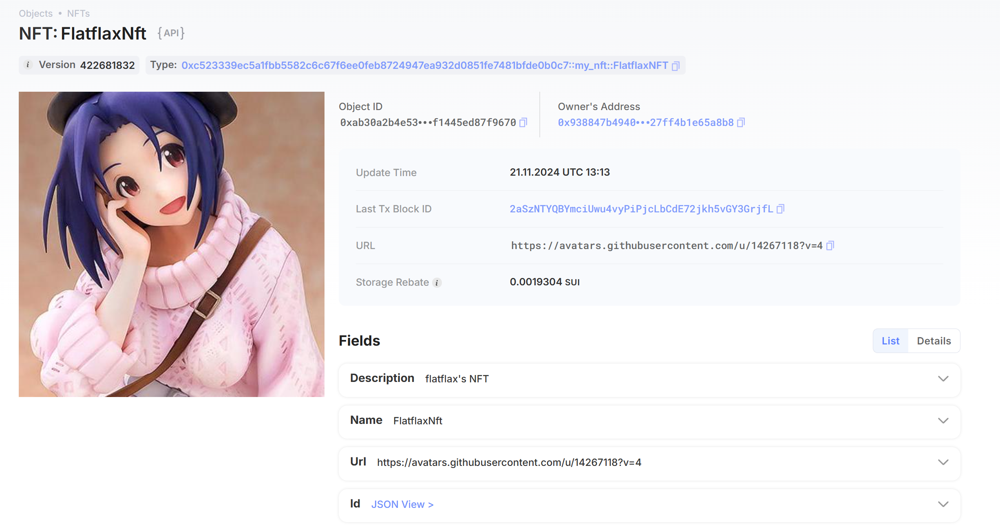

## 基本信息
- Sui钱包地址: `0x938847b49409b9995cc72fba1bd52e906f2519eb4455489ae827ff4b1e65a8b8`
> 首次参与需要完成第一个任务注册好钱包地址才被合并，并且后续学习奖励会打入这个地址
- github: `flatflax`

## 个人简介
- 工作经验: 5年
- 技术栈:  `python`
- 学习智能合约的相关内容
- 联系方式: github: `flatflax` 

## 任务

##   01 hello move  
- [✓] Sui cli version: sui 1.37.0-6646b75dd688
- [✓] Sui钱包截图: 
- [✓] package id: 0x808c08151f326aa453ccd40de9ae7b14e082e4375f4cfd5a80ede9d71d214ebf (发到devnet上了)
- [✓] package id 在 scan上的查看截图:

##   02 move coin
- [✓] My Coin package id : 0xea5e2369e8d9d502f4aca15d2c72ce4235610381d4a6238e2800ed617a5c28c1
- [✓] Faucet package id : 0xbfb4db281a9519bc902e519d9a5fe2cec8a7be41ce68bdf2e8cce63bbaeaf4df
- [✓] 转账 `My Coin` hash: 6PoWjtNCMU3qYkEuqQefSLJMT5KHXRBwQPgRESQAtBcW
- [✓] `Faucet Coin` address1 mint hash: E1trg5YyZcTpLAM8u6bMkmn7xQxbRapkFF4nckqS31k
- [✓] `Faucet Coin` address2 mint hash: Cgmd5mbH1Q99WPLGtRUCvGi2zjDs1RytSGR4U625vwkQ

##   03 move NFT
- [✓] nft package id : 0xc523339ec5a1fbb5582c6c67f6ee0feb8724947ea932d0851fe7481bfde0b0c7
- [✓] nft object id : 0xab30a2b4e5327d531619b609053cfd5ec861c599101b203d22f1445ed87f9670
- [✓] 转账 nft  hash: 2aSzNTYQBYmciUwu4vyPiPjcLbCdE72jkh5vGY3GrjfL
- [✓] scan上的NFT截图:

##   04 Move Game
- [✓] game package id :0xe9589c26b6c9e879a7f77c700ad02e8c084a7cbae4e8dc446db6cdb60dfe7073
- [✓] deposit Coin hash: EBsWTXRFJw1DM4pPg3hoKxMbtfoVeDkHzufNZSrxrfwS
- [✓] withdraw `Coin` hash: EbqmdVwTdBVGpngYQNsyc8H9D5TAyyS4GuYNY417uswT
- [✓] play game hash: G84JB8K1TBEQowPG1srqFLsWTQWANgrWThNjQYpjKaAz

##   05 Move Swap
- [✓] swap package id : 0x7fed720b4f9239aeaee760eeda592afa07fc3a5ec806b7b3ed132172b30b0a35
- [✓] call swap CoinA-> CoinB  hash :E29EEZFJCer4vH7Wht7yPr1drnSNbrEtKU9YMBSxBJMd
- [✓] call swap CoinB-> CoinA  hash :7bnqdQjufjw1fXdEKtfoEtJsETVHqQVJDZ5cjVUVk3wd

##   06 Dapp-kit SDK PTB
- [✓] save hash :85pd6XVVtoRQuAisJK7YiQpEVaoF9tby4boCFAApPwrs

##   07 Move CTF Check In
- [] CLI call 截图 : 
- [] flag hash :

##   08 Move CTF Lets Move
- [] proof : 
- [] flag hash :
