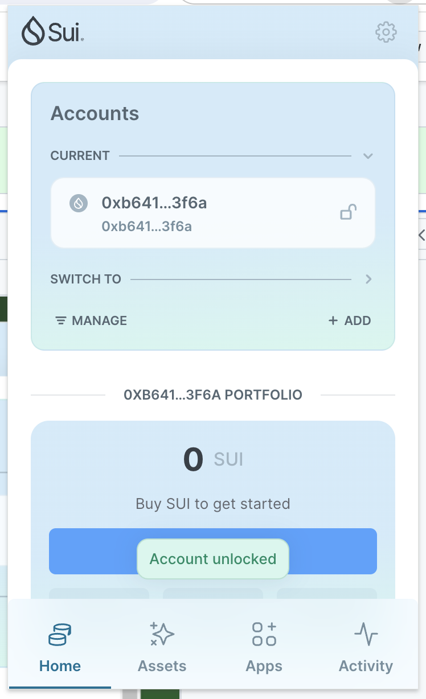
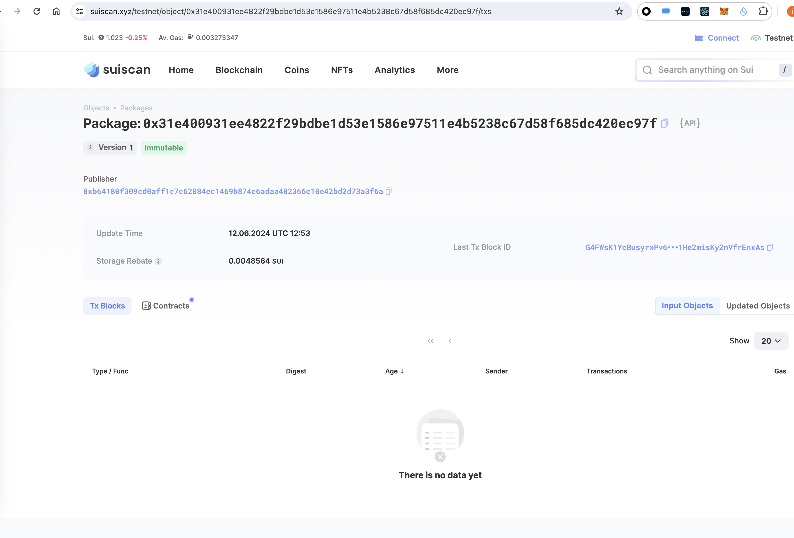
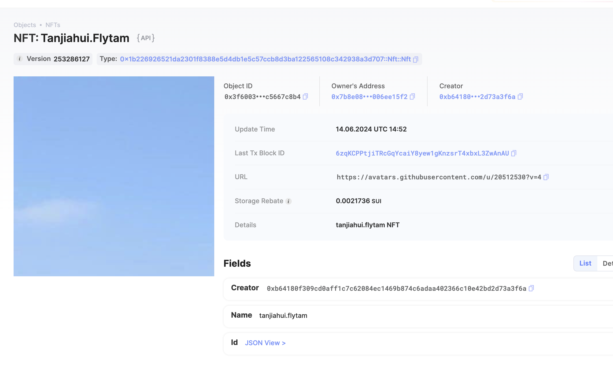
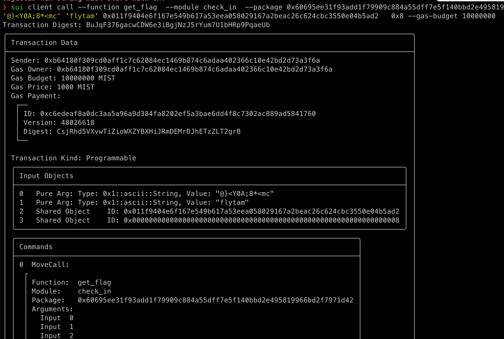

## 基本信息
- Sui钱包地址: `0xb64180f309cd0aff1c7c62084ec1469b874c6adaa402366c10e42bd2d73a3f6a`
> 首次参与需要完成第一个任务注册好钱包地址才被合并，并且后续学习奖励会打入这个地址
- github: `flytam`

## 个人简介
- 工作经验: 5年
- 技术栈: TypeScript/Node
> 重要提示 请认真写自己的简介
- 前端开发,目前在学习 web3 开发
- 联系方式: `tanjiahui2015@foxmail.com`

## 任务

##   01 hello move  
- [x] Sui cli version: 1.27.0-19df63a5441d
- [x] Sui钱包截图: 
- [x] package id: 0x31e400931ee4822f29bdbe1d53e1586e97511e4b5238c67d58f685dc420ec97f
- [x] package id 在 scan上的查看截图:

##   02 move coin
- [x] My Coin package id : 0xe16f7b9c3ddd885d7f0c7c39858515f6c5d9ac0e8f266cfad71ca8cf4370aa1e
- [x] Faucet package id : 0x8e6c8ca1d22ddc708c82e5793e7c7aa8fb6e23827df7ad0d74469e4646a040e7
- [x] 转账 `My Coin` hash: D9hssEkGPpx2Q3yYP1TQq3RNDEA27BGRu3H2QTzQFygD
- [x] `Faucet Coin` address1 mint hash: 75rsWhYTzYd9KFuy5W9A56iGdsrxFLpXfzkNgTseiCyv
- [x] `Faucet Coin` address2 mint hash: 7Y1C9sskxXkioi14ZPcFy4SapknFkP2E7CvZY2M84Ei2

##   03 move NFT
- [x] nft package id : 0x1b226926521da2301f8388e5d4db1e5c57ccb8d3ba122565108c342938a3d707
- [x] nft object id : 0x0934ff3bd9058caf8d65d99907e73aa77458e6a5e111173ba42aa28709010c1a
- [x] 转账 nft  hash: 6zqKCPPtjiTRcGqYcaiY8yew1gKnzsrT4xbxL3ZwAnAU
- [x] scan上的NFT截图:

##   04 Move Game
- [] game package id :
- [] deposit Coin hash:
- [] withdraw `Coin` hash:
- [] play game hash:

##   05 Move Swap
- [] swap package id :
- [] call swap CoinA-> CoinB  hash :
- [] call swap CoinB-> CoinA  hash :

##   06 Dapp-kit SDK PTB
- [] save hash :

##   07 Move CTF Check In
- [x] CLI call 截图 : 
- [x] flag hash : BuJqF376gacwCDW6e3iBgjNzJ5rYum7U1bHRp9PqaeUb

##   08 Move CTF Lets Move
- [x] proof : 59457696
- [x] flag hash : 35wfMug2Qqa47EKahjbTwDuyC9s78X9KrXGU76WHWWYS
