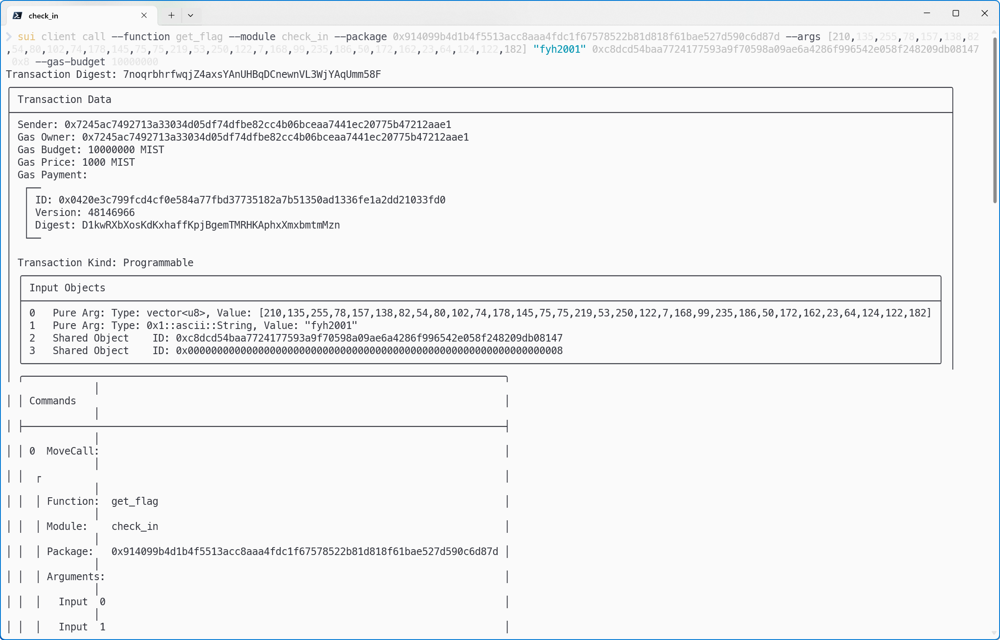

## 基本信息
- Sui钱包地址: `0x7245ac7492713a33034d05df74dfbe82cc4b06bceaa7441ec20775b47212aae1`
> 首次参与需要完成第一个任务注册好钱包地址才被合并，并且后续学习奖励会打入这个地址
- github: `fyh2001`

## 个人简介
- 工作经验: 5年
- 技术栈: `Rust` `java` `python` `go`
- 多年web2开发经验，对Move特别感兴趣，想通过Move入门区块链
- 联系方式: email: `325936216@qq.com` 

## 任务

##   01 hello move  
- [x] package id: 0x5f395f211f7f43a4cba1c44c236cb2648cb7681c6b907b1f5d8571fba79d9031

##   02 move coin
- [x] My Coin package id : 0x21fe0d4c77778143b3c2111ff1d443b0e8baf09272bdb723f156e72962f56be8
- [x] Faucet package id :  0x5c1cc812361e8334abc1e018b3739c304f1ea3bf93cc45193b3fa1bf04ffb751
- [x] 转账 `My Coin` hash: GJy44YjzRrLwdFCdCnasiDA4buQp7VjqhJs5BHWwg3GJ

##   03 move NFT
- [] nft package id :
- [] nft object id : 
- [] 转账 nft  hash:

##   04 Move Game
- [] game package id :
- [] call game hash:

##   05 Move Swap
- [] swap package id :
- [] call swap hash:

##   06 SDK PTB
- [] save hash :

##   07 Move CTF Check In
- [x] CLI call 截图: 
- [x] flag hash: 7noqrbhrfwqjZ4axsYAnUHBqDCnewnVL3WjYAqUmm58F

##   08 Move CTF Lets Move
- [x] CLI call 截图: 
- [x] Transaction block: 4uwn6yeqnMULa8ZFckWQX7aHTvek3aGFRx42Yr3nHnwU
