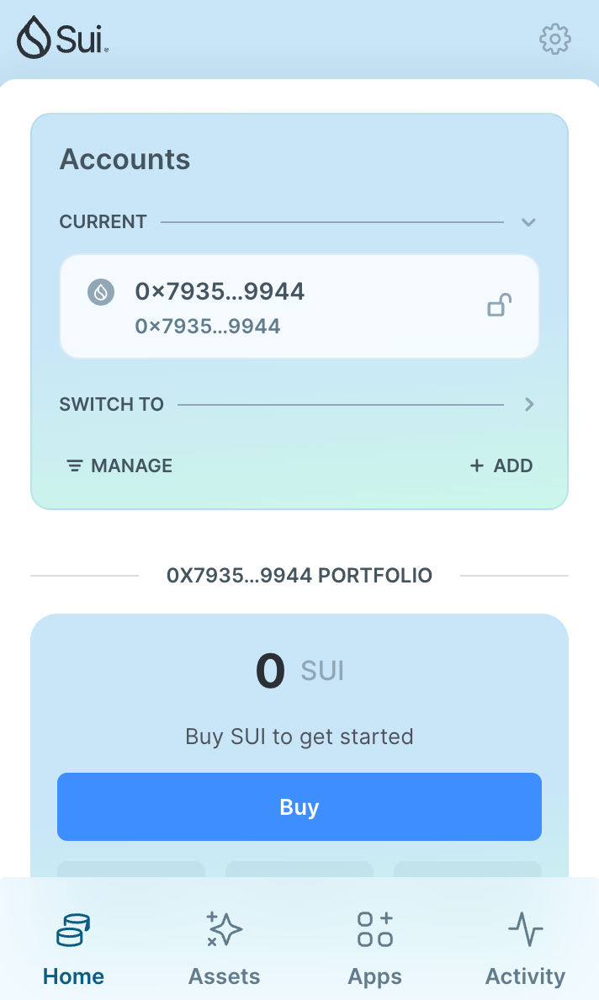
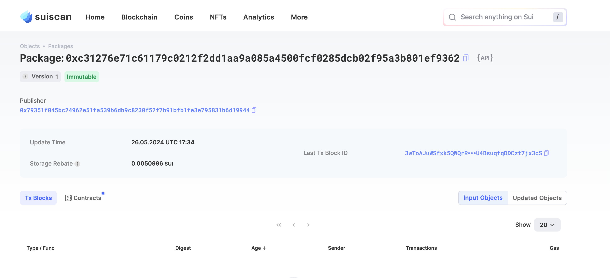

## 基本信息
- Sui钱包地址: `0x79351f045bc24962e51fa539b6db9c8230f52f7b91bfb1fe3e795831b6d19944`
> 首次参与需要完成第一个任务注册好钱包地址才被合并，并且后续学习奖励会打入这个地址
- github: `fyj1230`

## 个人简介
- 工作经验: 2年
- 技术栈: `C#`
> 重要提示 请认真写自己的简介
- 码农🧑‍💻，想通过Move入门区块链
- 联系方式: tg: `oneforfanns` 

## 任务

##   01 hello move  
- [x] Sui cli version: 1.25.1
- [x] Sui钱包截图: 
- [x] package id:  0xc31276e71c61179c0212f2dd1aa9a085a4500fcf0285dcb02f95a3b801ef9362  
- [x] package id 在 scan上的查看截图:

##   02 move coin
- [x] My Coin package id : 0xb55889372046c7044dc483b777c70eb215808c44bf64453938758942933de6d9     
- [x] Faucet package id :  0xb55889372046c7044dc483b777c70eb215808c44bf64453938758942933de6d9
- [x] 转账 `My Coin` hash: 6j8dnzmXQM61pSKfnGKq3seytPyRzNEMrB6MRpJVNfuy
- [x] `Faucet Coin` address1 mint hash: 3bX18AJ7cMjybbJMw3tHNszvkHaexRhhvhyQVX2vKyTP
- [x] `Faucet Coin` address2 mint hash:  6eeDatrKve2VtmB2QifDNCPe6MViphCA3BSSxtYwUnzW

##   03 move NFT
- [x] nft package id : 0x449752fde6a5ac6742e186c9c7ed98cac142b129750e0c053bdfe04dc917203c    
- [x] nft object id :  0x6eca257e6258d7ddfd85c84d19f7a04ecf24078a06e24c342223b43d028084df    
- [x] 转账 nft  hash: B6w5J6NygjGkmhCdY5pr84t8WzqAYoBKakWTLTZpPdyq
- [x] scan上的NFT截图:

##   04 Move Game
- [x] game package id : 0xc8db55d6147b27a33e2a64b23062feec3f563e35e006e1e1fd9ad4a5a5ab7a99 
- [x] deposit Coin hash: 3vKz4FXkcdRLxkd9MhLsbWduXRuxUs7vFKHaMMZBUmm4
- [x] withdraw `Coin` hash: Bt4iaikKpvbQSQ5Nf9MdfHzrqFLLR93BcSUhF8BwBRyR
- [x] play game hash: 8VPc2w7YKfLwrRJ5senXWN3uMY4VJS6k7umo4Xz38ZRf 

##   05 Move Swap
- [x] swap package id : 0x34c13155276a9ccee1638abc1c25b259e4ce32d3917249386908a115d85f8f2f   
- [x] call swap CoinA-> CoinB  hash : 3ezfN4unn4ML4HKTzX2thGsYdaS1GxDnrbF4QtVHn59W
- [x] call swap CoinB-> CoinA  hash : BJKPPqXRKunM5Ndsqw8H8EcherP8fJMVWgVuPPFiB4sA

##   06 Dapp-kit SDK PTB
- [x] save hash : 7vHD9XctZ6kcfapUmFaCZ8CHpcsRFUY8HKTo2zjzMx1Y
