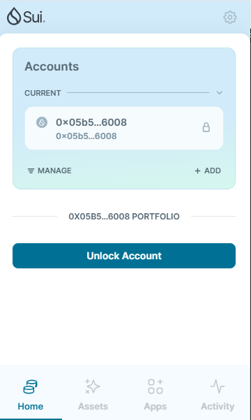
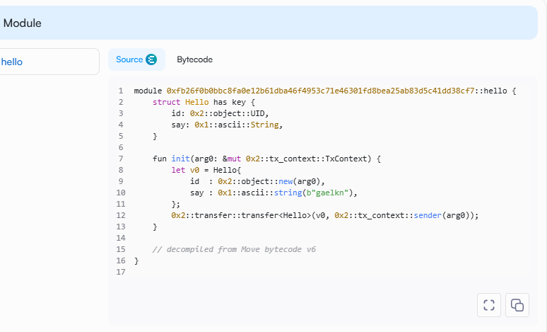

## 基本信息
- Sui钱包地址: `0x05b58250990e8f941c15aa4e5e986c3960540df63598f7d8786b3b6179876008`
- github: `gaelkn`

## 个人简介
- 工作经验: 3年
- 技术栈: `java`
> 多年 web2 开发经验，对 Move 特别感兴趣，想通过 Move 入门区块链
- 
- 联系方式: tg: `tomjerry325` 

## 任务

##   01 hello move  
- [] Sui cli version: sui 1.36.2
- [] Sui钱包截图: 
- [] package id: 0xfb26f0b0bbc8fa0e12b61dba46f4953c71e46301fd8bea25ab83d5c41dd38cf7
- [] package id 在 scan上的查看截图:

##   02 move coin
- [] My Coin package id : 
- [] Faucet package id : 
- [] 转账 `My Coin` hash:
- [] `Faucet Coin` address1 mint hash:
- [] `Faucet Coin` address2 mint hash:

##   03 move NFT
- [] nft package id :
- [] nft object id : 
- [] 转账 nft  hash:
- [] scan上的NFT截图:

##   04 Move Game
- [] game package id :
- [] deposit Coin hash:
- [] withdraw `Coin` hash:
- [] play game hash:

##   05 Move Swap
- [] swap package id :
- [] call swap CoinA-> CoinB  hash :
- [] call swap CoinB-> CoinA  hash :

##   06 Dapp-kit SDK PTB
- [] save hash :

##   07 Move CTF Check In
- [] CLI call 截图 : 
- [] flag hash :

##   08 Move CTF Lets Move
- [] proof : 
- [] flag hash :
