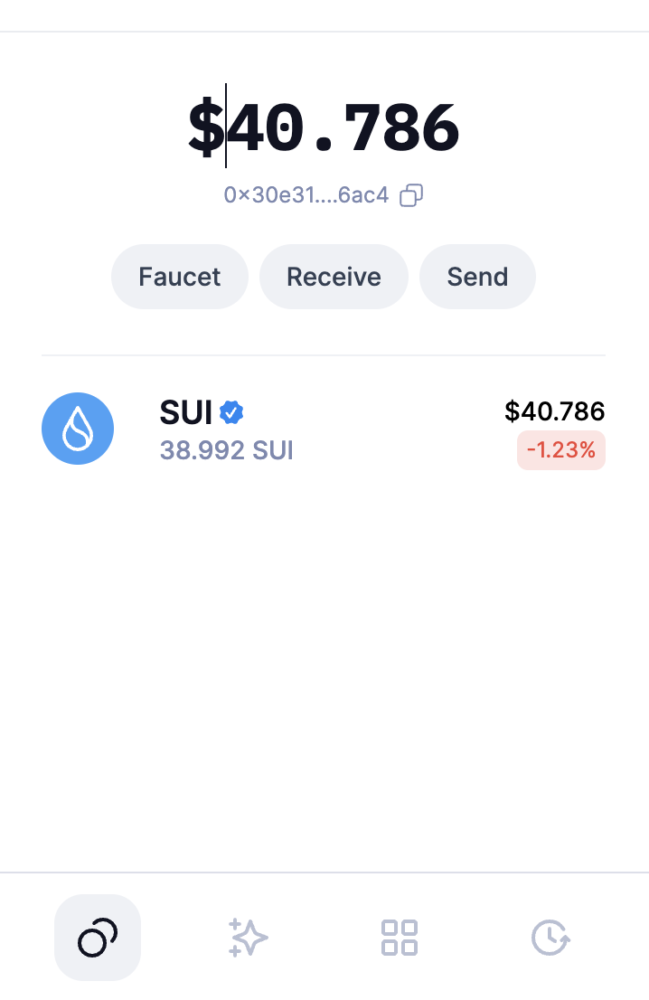
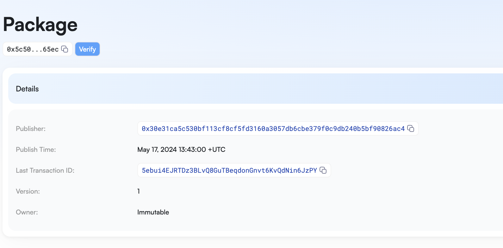
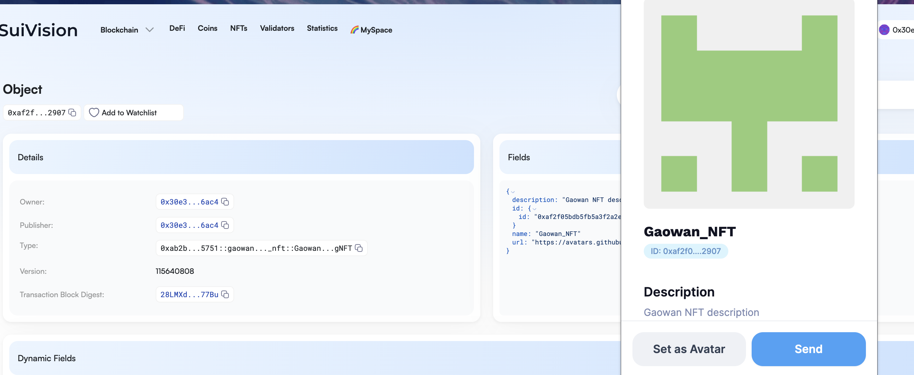

## 基本信息
- Sui钱包地址: `0x30e31ca5c530bf113cf8cf5fd3160a3057db6cbe379f0c9db240b5bf90826ac4`
> 首次参与需要完成第一个任务注册好钱包地址才被合并，并且后续学习奖励会打入这个地址
- github: `https://github.com/gaowanlang`

## 个人简介
- 工作经验: 2年
- 技术栈: `js`
> 重要提示 请认真写自己的简介
- 不会solidity，想直接学习move掌握智能合约
- 联系方式: tg: `https://t.me/golyu123` 

## 任务

##   01 hello move  
- [] Sui cli version: 1.25.0
- [] Sui钱包截图: 
- [] package id: 0x5c5098d9eac255501d1591856fa25d3931b323478cc766332b9e4b3667e465ec
- [] package id 在 scan上的查看截图:

##   02 move coin
- [] My Coin package id : 0xf5fc96c2d88805b5b04194ea78b4fedca229a7a50d32e17321455527dcc63901
- [] Faucet package id : 0x18eb8e4ac6178a710e897fccc8eec709a27b3b79ecfa1912667e267e1e06fab8
- [] 转账 `My Coin` hash: 5mnD6CHgmb1zugZR2xv1cSUDwoT3Zqbiip48HvXn4qw9
- [] `Faucet Coin` address1 mint hash: CSzwTwSk8ZhMA2KM57h76Qn4gowFzZ6tbredDyrCS9na
- [] `Faucet Coin` address2 mint hash: GUZH1Le4QeJVSQKsZ3aGMeKCyzqVo9PhEQTEN6sMRuEz

##   03 move NFT
- [] nft package id : 0xab2b8527cafe2d9b40f3246f57d764404e7bde55c82c40a54469ba87ba9c5751
- [] nft object id : 0xaf2f05bdb5fb5a3f2a2e66d60cc98850896d5eb262bd7aadff1064e9da7e2907
- [] 转账 nft  hash: 9rDHfGxbwRb489sz7wQViZHM2c7gxFRQPB3T1LSBBeEv
- [] scan上的NFT截图:

##   04 Move Game
- [] game package id : 0xf32bef3fefbeac8b45fa27a8b4ae47fd4d657f1a7cc7eae7d1e05e8c7e3f3db5
- [] deposit Coin hash: HtTDaKP1HAoBEegzvZJX95h6VJ4w4UAFVHHnLQkt57FN
- [] withdraw `Coin` hash: 3xVk9XGzdZbpx9JrNLKwPtAd8bmGReKV6vHmecGb3p9i
- [] play game hash: 8u9PTGY7pdMUKQsHfZyqUWLnpHb1bZYLP74DQyC5cTdw

##   05 Move Swap
- [] swap package id : 0x8ba53154852e9c089be8f48f60738f7b55b4a701afe02bfb4422695847c222db
- [] call swap CoinA-> CoinB  hash : 26vHF418E1iuovaJmgYVv2Ahs6D2exDfdzQoekPoqQRP
- [] call swap CoinB-> CoinA  hash : 2xzh3AbyWns9UbNZUG6CeCsd5uiQqNBCfUme5AYhGY6Y

##   06 SDK PTB
- [] save hash : A5njipF22AQJP3dRgmHQB6KPJfpZM7hfgXw5qB1Xdx8S
