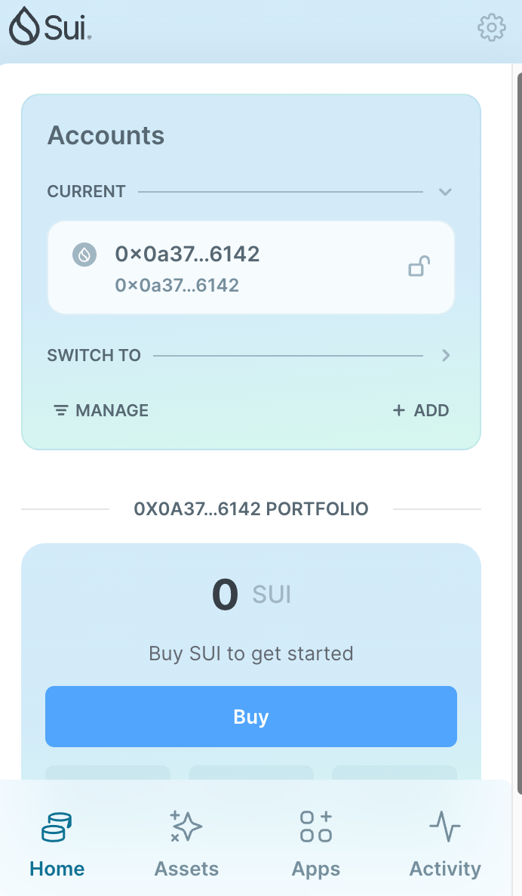

## 基本信息
- Sui钱包地址: `0x0a37322a124093add8695e4e7f155461295e7f92b0d871b8d025d1335cbb6142`
> 首次参与需要完成第一个任务注册好钱包地址才被合并，并且后续学习奖励会打入这个地址
- github: `geekbuf`

## 个人简介
- 工作经验: 10年
- 技术栈: `java` `python` `.Net` `PHP` `NodeJS`
> 重要提示 请认真写自己的简介
- 多年web2开发经验，有Solidity开发经验，想试下Rust阵营的Move开发
- 联系方式: tg: `https://t.me/geekbuf` 

## 任务

##   01 hello move  
- [✓] Sui cli version: sui 1.37.1-homebrew
- [✓] Sui钱包截图: 
- [✓] package id: 0x9c6e5f1c306d1423ac0bd2042acffdfa3d87a4d8136c5260c341be2c396b9bcd
- [✓] package id 在 scan上的查看截图:

##   02 move coin
- [] My Coin package id : 
- [] Faucet package id : 
- [] 转账 `My Coin` hash:
- [] `Faucet Coin` address1 mint hash:
- [] `Faucet Coin` address2 mint hash:

##   03 move NFT
- [] nft package id :
- [] nft object id : 
- [] 转账 nft  hash:
- [] scan上的NFT截图:

##   04 Move Game
- [] game package id :
- [] deposit Coin hash:
- [] withdraw `Coin` hash:
- [] play game hash:

##   05 Move Swap
- [] swap package id :
- [] call swap CoinA-> CoinB  hash :
- [] call swap CoinB-> CoinA  hash :

##   06 Dapp-kit SDK PTB
- [] save hash :

##   07 Move CTF Check In
- [] CLI call 截图 : 
- [] flag hash :

##   08 Move CTF Lets Move
- [] proof : 
- [] flag hash :
